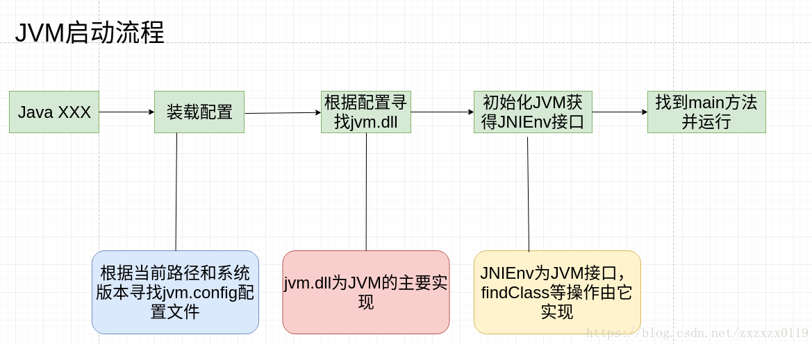
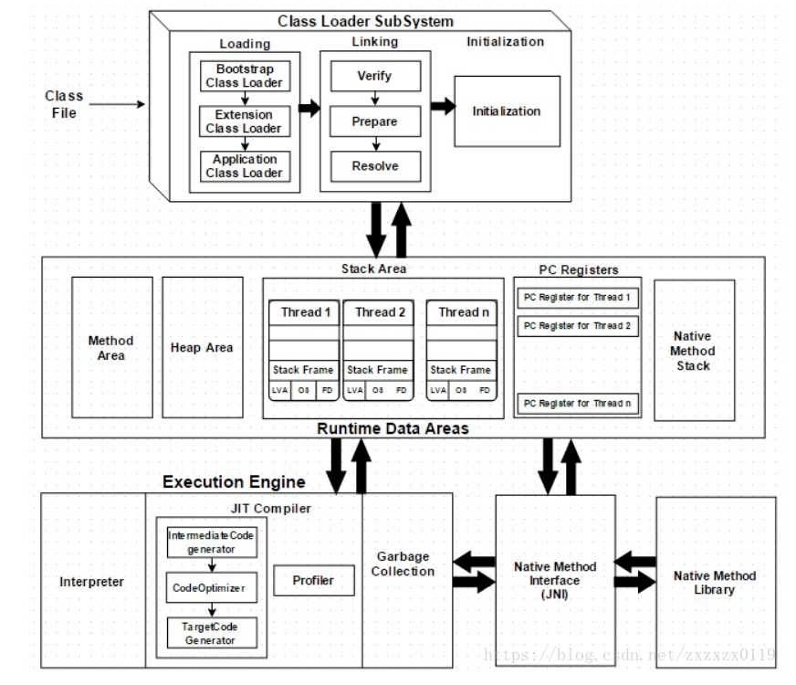
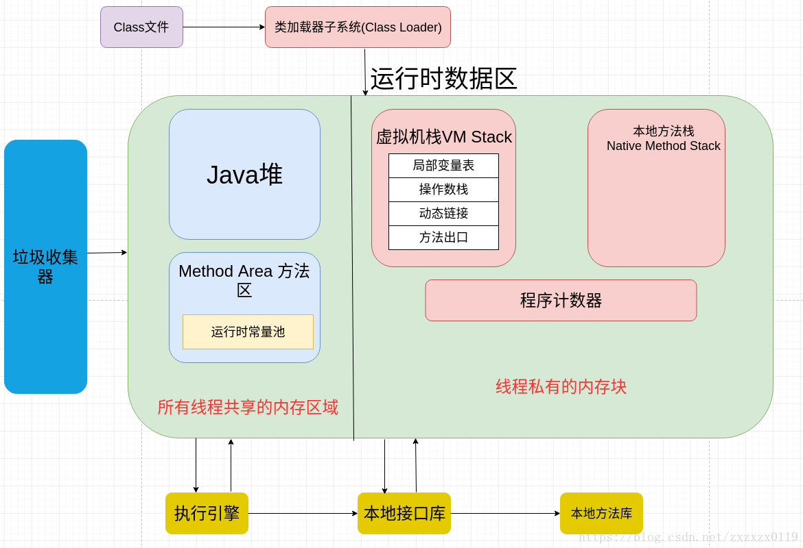
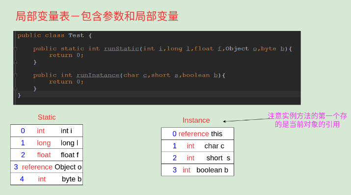
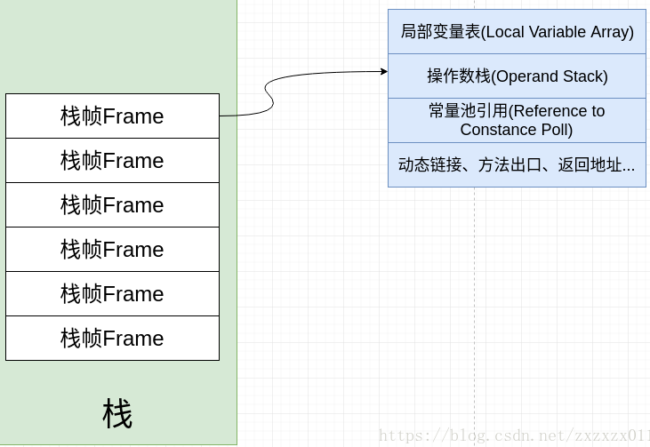
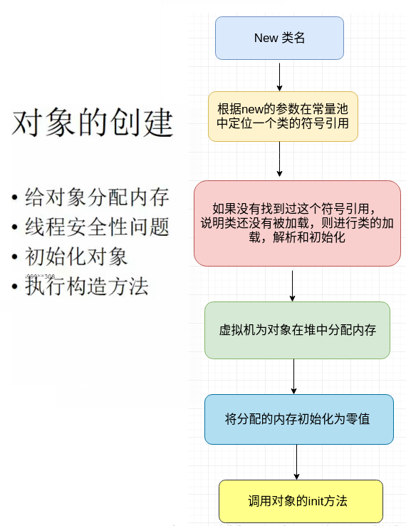

# JVM总结(一) - 内存区域与内存管理

 - 一、JVM启动以及JVM体系概述
     - 1、JVM启动流程
     - 2、JVM体系结构
 - 二、运行时数据区总体概括
    - 1、程序计数器
    - 2、Java虚拟机栈
    - 3、本地方法栈
    - 4、Java堆
    - 5、方法区
    - 6、运行时常量池
    - 7、直接内存
 - 三、对象相关
    - 1、对象创建
    - 2、对象的内存布局
    - 3、对象的访问定位

***
## 一、JVM启动以及JVM体系概述
概括: 
* Java有**Java编译器和Java虚拟机**，编译器将Java源代码转换为`.class`文件，虚拟机加载并运行`.class`文件。
* Java 的开发遵循“一次编写到处乱跑”理念，它运行在 VM（虚拟机）上。

### 1、JVM启动流程

JVM工作原理和特点主要是指操作系统装入JVM，是通过`jdk`中`java.exe`来完成,通过下面4步来完成JVM环境: 

* 创建JVM装载环境和配置；
* 装载`JVM.dll`；
* 初始化`JVM.dll`并挂界到`JNIENV`(JNI调用接口)实例；
* 调用`JNIEnv`实例装载并处理class类。



### 2、JVM体系结构 

JVM体系主要是两个JVM的内部体系结构，分为三个子系统和两大组件，分别是：

* **类装载器（ClassLoader）子系统、执行引擎子系统和GC子系统**；
* 组件是**内存运行数据区域**和**本地接口**。

**详细的结构: ([图片来源以及详细解释](https://zhuanlan.zhihu.com/p/28347393))**

> https://zhuanlan.zhihu.com/p/28347393



## 二、运行时数据区总体概括

<font color = green>运行时数据区:

* 经过编译生成的字节码文件（class文件），由 `class loader`（类加载子系统）加载后交给执行引擎执行。
* 在执行引擎执行的过程中产生的数据会存储在一块内存区域。这块内存区域就是运行时区域。

运行时数据区总体框架图: 



总体概括

* 堆:  存放Java 对象， **线程之间共享**的；
* 栈: 方法运行，每一个方法对应一个栈帧，每一个线程对应一个栈；每个栈由包括 **操作数、局部变量表、指向运行时常量池的引用，方法返回地址、附加位区**；所以是**线程不共享** (这个就是栈的宽度)(而栈的深度就是栈帧的个数)；
* 方法区 (静态区) : 被虚拟机加载的**类信息、静态 (static) 变量，常量 (final) ，即时编译器编译后的代码等数据。**运行常量池是方法区的一部分，class文件除了有类的版本、字段、接口、方法等描述信息之外，还有一项信息常量池保存缩译期生成的字面量和符号引用。 **线程之间共享的。**

* 程序计数器: 指出某一个时候执行某一个指令、执行完毕之后要返回的位置，当执行的Java方法的时候，这里保存的当前执行的地址，如果执行的是本地方法，那么程序计数器为空。**线程不共享**。

**划分线程共享和线程独占和线程共享的原因:**

先熟悉一下一个一般性的 Java 程序的工作过程。

* 一个 Java 源程序文件，会被编译为字节码文件(以 class 为扩展名) ，每个java程序都需要运行在自己的JVM上；

* 然后告知 JVM 程序的运行入口，再被 JVM 通过字节码解释器加载运行。那么程序开始运行后，都是如何涉及到各内存区域的呢?
* 概括地说来，JVM初始运行的时候都会分配好 `Method Area` (方法区) 和`Heap` (堆) ，而JVM 每遇到一个线程，就为其分配一个 `Program Counter Register` (程序计数器) ，`VM Stack` (虚拟机栈) 和`Native Method Stack` (本地方法栈) ， 当线程终止时，三者(虚拟机栈，本地方法栈和程序计数器) 所占用的内存宝间也会被释放掉。这也是为什么我们把内存区域分为线程共享和非线程共享的原因，**非线程共享的那三个区域的生命周周期与所属线程相同，而线程共享的区域与JAVA程序运行的生命周期相同，**所以这也是系统垃圾回收的场所只发生在**线程共享的区域** (实际上对大部分虚拟机来说发生在Heap上) 的原因。

### 1、程序计数器  

*  程序计数器是一块较小的内存区域，它可以看做是**当前线程所执行的字节码的行号指示器；**
*  程序计数器处于**线程独占区**(每一个线程都有一个独立的程序计数器)，各计数器不影响；
*  如果线程正在执行的是一个Java方法，这个计数器记录的是**正在执行的虚拟机的字节码指令的地址**，如果线程正在执行的是一个本地Native方法，则计数器值为空；
*  此内存区域是唯一一个在Java虚拟机规范没有规定任何OutOfMemoryError的区域;

### 2、Java虚拟机栈

* Java虚拟机栈描述的是**Java方法执行的动态内存模型；**
* 栈帧: 每个方法执行都会创建一个栈帧，伴随着方法从创建到执行完成，**用于存储局部变量表，操作数栈，动态链接，方法出口等；**
* 局部变量表 : `a.`存放编译期可知的各种基本数据类型，引用类型，returnAddress类型；`b.`局部变量表的内存空间在编译器完成分配，当进入一个方法时，这个方法需要在栈桢中分配多少内存是固定的，在方法运行期间不会改变局部变量表的大小；
* 也会有StackOverFlowError (线程请求的栈深度大于虚拟机允许的深度)，OutOfMemoryError(没有足够的内存) ;




> **局部变量表存放了编译期可知的各种基本数据类型 (boolean、byte、char、short、int、**
> **float、long、double)、对象引用 〈reference 类型**，它不等同于对象本身，可能是一个指向对
> 象起始地址的引用指针，也可能是指向一个代表对象的句柄或其他与此对象相关的位置) 和
> TeturnAddress 类型〈指向了一条字节码指令的地址)。
>
> 其中 64 位长度的 long 和 double 类型的数据会占用 2 个局部变量空间 (Slot)，其余的数
> 据类型只占用 1个。局部变量表所需的内存空间在编译期间完成分配，当进入一个方法时，
> 这个方法需要在帧中分配多大的局部变量空间是完全确定的，在方法运行期间不会改变局部
> 变量表的大小。
>
> 在 Java 虚拟机规范中，对这个区域规定了两种异常状况: 如果线程请求的栈深度大于虚
> 拟机所允许的深度，将抛出 StackOverowError 异常 ， 如果虚拟机栈可以动态扩展〈当前大
> 部分的 Java 虚拟机都可动态扩展，只不过 Java 虚拟机规范中也允许固定长度的虚拟机栈)，
> 如果扩展时无法申请到足够的内存，就会抛出 OutOftMemoryError 异常。

### 3、本地方法栈

本地方法栈 (Native Method Stack) 与虚拟机栈所发挥的作用是非常相似的: 

* 它们之间的区别不过是**虚拟机栈为虚拟机执行 Java 方法〈也就是字节码) 服务，而本地方法栈则为**

**虚拟机使用到的 Native 方法服务。**

* 在虚拟机规范中对本地方法栈中方法使用的语言、使用方式与数据结构并没有强制规定，因此具体的虚拟机可以自由实现它。甚至有的虚拟机。(璧如Sun HotSpot 虚拟机直接就把本地方法栈和虚拟机栈合二为一)。
* 与虚拟机栈一样，本地方法栈区域也会抛出 StackOverflowError 和 OutOfMemoryError 异常。

### 4、Java堆

* Java虚拟机所管理的内存中最大的一块区域，是被所有**线程共享**的一块区域；
* 几乎所有的对象实例都在这里分配内存(**所有的对象实例以及数组**)；
* Java堆是垃圾收集器管理的主要区域，**大部分收集器基于分代收集: 分为新生代和老生代**，甚至更加的细分为`Eden`空间，`From Survivor`空间，`To Survivor`空间，这样分配的目的是为了更好的回收内存和分配内存；
* Java堆可以处理物理上不连续，但是逻辑上连续的内存空间；现在的虚拟机可以通过Xms和
Xmx等来扩展大小；
* 如果堆中已经没有内存来分本实例，并且堆没法扩展，就会报出OutofMemoryError异常;


### 5、方法区

* 是线程共享区;
* 存储的是虚拟机**加载的类信息，常量，静态变量，即时编译器编译后的代码等数据**；
* 其中类信息包括: **类的版本，字段，方法，接口**等；
* 方法区 `!=` 永久代，HotSpot使用永久代实现方法区，这样HotSpot的垃圾收集器可以像管理Java推

一样来管理这块内存区域，省去专门为方法区编写内存管理代码的工作；

* 根据Java虚拟机规范的规定，当方法区无法满足内存分配需求时，将抛出OutOfMemoryError 异常。

> JDK6时，String等常量信息至于方法区，JDK7时，已经移动到堆；

> Java 虚拟机规范对方法区的限制非常宽松，除了和 Java 堆一样不需要连续的内存和可以选择固定大小或者可扩展外，**还可以选择不实现垃圾收集**。相对而言，垃圾收集行为在这个区域是比较少出现的，但并非数据进入了方法区就如永久代的名字一样“永久”存在了。这区域的内存回收目标主要是针对常量池的回收和对类型的印载，一般来说，这个区域的回收“成绩”比较难以令人满意，尤其是类型的印载，条件相当苛刻，但是这部分区域的回收确实是必要的。在 Sun 公司的 BUG 列表中，曾出现过的若干个严重的 BUG 就是由于低版本的 HotSpot 虚拟机对此区域未完全回收而导致内存汇漏。

>  关于元空间:  元空间的本质和永久代类似，都是对JVM规范中方法区的实现，不过元空间和永久代之间最大的差别在于: <font color = blue>**元空间并不在虚拟机中，而是使用本地内存**。因此，默认情况下，元空间的大小仅受本地内存限制。

### 6、方法区中的常量池

* 用于存放编译器生成的各种字面量和符号引用，这部分内容将在类加载后进入方法区

的运行时常量池中存放；

* 运行时常量池相对于Class文件常量池的另外一个重要特征是具备动态性，Java语言并不

要求常量一定只有编译器才能产生，运行期间也可能将新的常量放入池中，例如`intern()`。

* 常量池无法再申请到内存时，也会抛出OutOfMemoryError异常;

对`intern()`测试:

```java
public class StringTest {

    public static void main(String[] args) {
        String s1 = "abc";  //字节码常量
        String s2 = "abc";

        System.out.println(s1 == s2); // true

        String s3 = new String("abc"); //false

        System.out.println(s1 == s3);

        System.out.println(s1 == s3.intern()); //true   运行时常量

    }
}
```
上面的代码的内存分配如下:  


### 7、直接内存(不是运行时数据区域的一部分) 

直接内存 (Direct Memory) 并不是虚拟机运行时数据区的一部分，也不是Java虚拟机规范中定义的内存区域。但是这部分内存也被频繁地使用，而且也可能导致OutOfMemoryError 异常出现。

在JDK 1.4中新加入了NIO (New InputOutput) 类，引入了一种基于通道 (Channel)与缓冲区 (Buffer) 的 IO 方式，它可以使用 Native 函数库直接分配堆外内存，然后通过一个存储在 Java 堆中的 DirectByteBuffer 对象作为这块内存的引用进行操作。这样能在一些场景中显著提高性能，因为避免了在 Java 堆和 Native 堆中来回复制数据。

显然，**本机直接内存的分配不会受到 Java 堆大小的限制，但是，既然是内存，肯定还是会受到本机总内存〈包括 RAM 以及SWAP 区或者分页文件) 大小以及处理器寻址空间的限制**。服务器管理员在配置虚拟机参数时，会根据实际内存设置` -Xmx `等参数信息，但经常忽略直接内存，使得各个内存区域总和大于物理内存限制包括物理的和操作系统级的限制)，从而导致动态扩展时出现 OutOfMemoryError 异常。


  ## 三、对象相关

### 1、对象的创建过程
#### 1)、对象的内存分配


虚拟机在堆中分配内存有两种方式:   

 - <font color = red>指针碰撞

 - <font color = red>空闲列表


#### 2)、线程安全问题


#### 3)、初始化对象


#### 4)、调用对象的构造方法< init >


### 2、对象的内存布局

### 3、对象的访问定位

 - 句柄访问
 - 直接指针

**句柄访问:** 

**直接指针:** 

**各自的优势:** 

