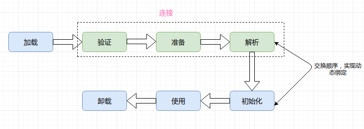

# JVM总结(三) - 类的文件结构和类加载机制

* [一、类加载时机](#一类加载时机)
  * [1、主动引用](#1主动引用)
  * [2、被动引用](#2被动引用)
* [二、类加载过程](#二类加载过程)
  * [1、加载](#1加载)
  * [2、验证](#2验证)
  * [3、准备](#3准备)
  * [4、解析](#4解析)
  * [5、初始化](#5初始化)
* [三、类加载器](#三类加载器)

## 一、类加载时机

类从被加载到虚拟机内存中开始，到旬载出内存为止，它的整个生命周期包括 : 加载 (Loading)、验 证(Verification)、准 备 (Preparation)、解 析 (Resolution)、初始化(Initialization)、使用(Using) 和卸载 (Unloading) 7 个阶段。其中验证、准备、解析 3 个部分统称为连接 (Linking)，这 7 个阶段的发生顺序如图 所示。



其中**解析过程在某些情况下可以在初始化阶段之后再开始**，这是为了支持 Java 的动态绑定。

这 7 个阶段中的：**加载、验证、准备、初始化、卸载**的顺序是固定的。但它们并不一定是严格同步串行执行，它们之间可能会有交叉，但总是以 “开始” 的顺序总是按部就班的。至于解析则有可能在初始化之后才开始，这是为了支持 Java 语言的运行时绑定（也称为动态绑定或晚期绑定）。

### 1、主动引用

 虚拟机规范中并没有强制约束何时进行加载，但是规范**严格规定了有且只有下列五种情况必须对类进行初始化**（加载、验证、准备都会随之发生）：

* 遇到` new`、`getstatic`、`putstatic`、`invokestatic` 这四条字节码指令时，如果类没有进行过初始化，则必须先触发其初始化。最常见的生成这 4 条指令的场景是：
  * **使用 new 关键字实例化对象的时候**；
  * 读取或设置一个类的静态字段（被 final 修饰、已在编译期把结果放入常量池的静态字段除外）的时候；
  * 以及**调用一个类的静态方法**的时候；
* 使用`java.lang.reflect `包的方法对类进行反射调用的时候，如果类没有进行初始化，则需要先触发其初始化；
* 当初始化一个类的时候，**如果发现其父类还没有进行过初始化，则需要先触发其父类的初始化**；
* 当虚拟机启动时，用户需要指定一个要执行的主类（包含 `main() `方法的那个类），虚拟机会先初始化这个主类；
* 当使用 JDK 1.7 的动态语言支持时，如果一个`java.lang.invoke.MethodHandle` 实例最后的解析结果为 `REF_getStatic, REF_putStatic, REF_invokeStatic `的方法句柄，并且这个方法句柄所对应的类没有进行过初始化，则需要先触发其初始化；

### 2、被动引用

以下三种情况是被动引用:

- 1、通过**子类引用父类的静态字段**，不会导致子类初始化。

测试:

```java
class SuperClass{
    static {
        System.out.println("SuperClass init...");
    }
    public static int val = 123;
}

class SubClass extends SuperClass{
    static {
        System.out.println("SubClass init...");
    }
}

public class Code_01_NoInitialization {
    public static void main(String[] args){
        System.out.println(SubClass.val); 
    }
}

```

输出:

```java
SuperClass init...
123
```

- 2、通过**数组定义来引用类**，不会触发此类的初始化。该过程会对数组类进行初始化，数组类是一个由虚拟机自动生成的、直接继承自 Object 的子类，其中包含了数组的属性和方法。

```java
SuperClass[] sca = new SuperClass[10];
```

- 3、**常量**在编译阶段会存入调用类的常量池中，本质上并没有直接引用到定义常量的类，因此不会触发定义常量的类的初始化。

```java
class ConstClass{
    static {
        System.out.println("ConstClass init...");
    }
    public final static String str = "hello world!";
}


public class Code_02_NoInitialization {
    public static void main(String[] args){
        System.out.println(ConstClass.str);
    }
}
```

输出:

```java
hello world!
```

## 二、类加载过程

包含了加载、验证、准备、解析和初始化这 5 个阶段（也就是类的生命周期的前5个阶段）。

### 1、加载

加载是类加载的一个阶段，不要混淆。

加载过程完成以下三件事：

- **通过一个类的全限定名来获取定义此类的二进制字节流**(这个就是类加载器做的事情)；
- 将这个**字节流所代表的静态存储结构转化为方法区的运行时存储结构**；
- 在内存中生成一个代表这个类的 **Class 对象**，作为方法区这个类的各种数据的访问入口；

加载源（即二进制字节流可以从以下方式中获取）：

- **文件**：从 ZIP 包读取，这很常见，最终成为日后 JAR、EAR、WAR 格式的基础。
- **网络**：从网络中获取，这种场景最典型的应用是 Applet。
- **计算生成一个二进制流**：运行时计算生成，这种场景使用得最多得就是动态代理技术，在 java.lang.reflect.Proxy 中，就是用了 ProxyGenerator.generateProxyClass 的代理类的二进制字节流。
- **由其他文件生成**：由其他文件生成，典型场景是 JSP 应用，即由 JSP 文件生成对应的 Class 类。
- **数据库**：从数据库读取，这种场景相对少见，例如有些中间件服务器（如 SAP Netweaver）可以选择把程序安装到数据库中来完成程序代码在集群间的分发。

### 2、验证

目的：确保 Class 文件的字节流中包含的信息符合当前虚拟机的要求，并且不会危害虚拟机自身的安全。

- 文件格式验证：验证字节流是否符合 Class 文件格式的规范，并且能被当前版本的虚拟机处理。
  - 是否以 0xCAFEBABE 开头，前四个字节为魔数；
  - 版本号是否合理，如：JDK1.8（52.0）、JDK1.7（51.0）；
  - 常量池中的常量是否有不被支持的类型；
- 元数据验证：对字节码描述的信息进行语义分析，以保证其描述的信息符合 Java 语言规范的要求。
  - 是否有父类-(除了Object类之外，所有的类都应该有父类)；
  - 继承了 final 类？;
  - 非抽象类实现了所有的抽象方法；
- 字节码验证（很复杂）：通过数据流和控制流分析，确保程序语义是合法、符合逻辑的。
  - 运行检查；
  - 栈数据类型和操作码数据参数吻合；
  - 跳转指令指定到合理的位置；（保证不会跳转到方法体以外的字节码上）
- 符号引用验证：发生在虚拟机将符号引用转换为直接引用的时候，对类自身以外（常量池中的各种符号引用）的信息进行匹配性校验。
  - 常量池中描述类是否存在；
  - 访问的方法或字段是否存在且有足够的权限；

### 3、准备

准备阶段正式为**类变量分配内存并设置变量的初始值**。这些变量使用的内存都将在**方法区**中进行分配。类变量是被 static 修饰的变量，准备阶段为类变量分配内存并设置初始值，使用的是方法区的内存。

**实例变量不会在这阶段分配内存，它将会在对象实例化时随着对象一起分配在堆中**。注意，**实例化不是类加载的一个过程，类加载发生在所有实例化操作之前，并且类加载只进行一次，实例化可以进行多次**。

初始值一般为 0 值，例如下面的类变量 value 被初始化为 0 而不是 123，在初始化的 `<clinit>` 中才会被设置为1。

```java
public static int value = 123; // 只有在初始化的<clinit>中才会是123，在准备阶段只是0
```

有一个特例就是`final`型的，即`static final`型的变量会在准备的阶段就附上正确的值:

```java
public static final int value = 123; 
```

### 4、解析

解析阶段是虚拟机将常量池的**符号引用替换为直接引用**的过程:

- 类或接口的解析
- 字段解析
- 类方法解析
- 接口方法解析

**什么是符号引用和直接引用**？

- **符号引用**：符号引用是一组符号来描述所引用的目标对象，符号可以是任何形式的字面量，只要使用时能无歧义地定位到目标即可。符号引用与虚拟机实现的内存布局无关，引用的目标对象并不一定已经加载到内存中。
- **直接引用**：*直接引用可以是直接指向目标对象的指针*、相对偏移量或是一个能间接定位到目标的句柄。直接引用是与虚拟机内存布局实现相关的，同一个符号引用在不同虚拟机实例上翻译出来的直接引用一般不会相同，如果有了直接引用，那引用的目标必定已经在内存中存在。

符号引用就是字符串，这个字符串包含足够的信息，以供实际使用时可以找到相应的位置。你比如说某个方法的符号引用，如：“java/io/PrintStream.println:(Ljava/lang/String;)”。里面有类的信息，方法名，方法参数等信息。

当第一次运行时，要根据字符串的内容，到该类的方法表中搜索这个方法。运行一次之后，符号引用会被替换为直接引用，下次就不用搜索了。直接引用就是偏移量，通过偏移量虚拟机可以直接在该类的内存区域中找到方法字节码的起始位置。

### 5、初始化

**初始化阶段才真正开始执行类中定义的 Java 程序代码**。初始化阶段即虚拟机执行类构造器 `<clinit>()` 方法的过程。

在准备阶段，**类变量已经赋过一次系统要求的初始值，而在初始化阶段，根据程序员通过程序制定的主观计划去初始化类变量和其它资源**。

`<clinit>()` 方法具有以下特点：

* 是由编译器自动收集类中所有类变量的赋值动作和静态语句块中的语句合并产生的，编译器收集的顺序由语句在源文件中出现的顺序决定。特别注意的是，静态语句块只能访问到定义在它之前的类变量，定义在它之后的类变量只能赋值，不能访问。例如以下代码：

```java
public class Test {
    static {
        i = 0;                // 给变量赋值可以正常编译通过
        System.out.print(i);  // 这句编译器会提示“非法向前引用”
    }
    static int i = 1;
}
```

- 与类的构造函数（或者说实例构造器` <init>()`）不同，不需要显式的调用父类的构造器。虚拟机会自动保证在子类的 `<clinit>()` 方法运行之前，父类的 `<clinit>()` 方法已经执行结束。因此虚拟机中第一个执行` <clinit>() `方法的类肯定为 java.lang.Object。
- 由于父类的 `<clinit>()` 方法先执行，也就意味着父类中定义的静态语句块要优先于子类的变量赋值操作。例如以下代码：

```java
class Parent {
    public static int A = 1;
    static {
        A = 2;
    }
}

class Sub extends Parent {
    public static int B = A;
}

public class Test {
    public static void main(String[] args) {
        System.out.println(Sub.B);  // 2
    }
}
```

* `<clinit>()` 方法对于类或接口不是必须的，如果一个类中不包含静态语句块，也没有对类变量的赋值操作，编译器可以不为该类生成` <clinit>() `方法。
* 接口中不可以使用静态语句块，但仍然有类变量初始化的赋值操作，因此接口与类一样都会生成 `<clinit>() `方法。但接口与类不同的是，执行接口的 `<clinit>()` 方法不需要先执行父接口的 `<clinit>()` 方法。只有当父接口中定义的变量使用时，父接口才会初始化。另外，接口的实现类在初始化时也一样不会执行接口的 `<clinit>()` 方法。
* 虚拟机会保证一个类的 `<clinit>() `方法在多线程环境下被正确的加锁和同步，如果多个线程同时初始化一个类，只会有一个线程执行这个类的` <clinit>() `方法，其它线程都会阻塞等待，直到活动线程执行`<clinit>()` 方法完毕。如果在一个类的 `<clinit>()` 方法中有耗时的操作，就可能造成多个线程阻塞，在实际过程中此种阻塞很隐蔽。

## 三、类加载器


 