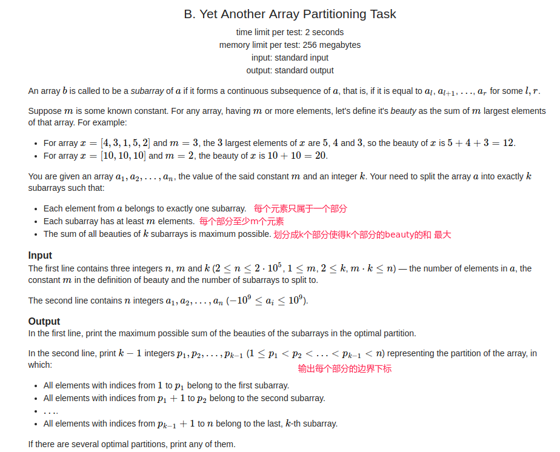
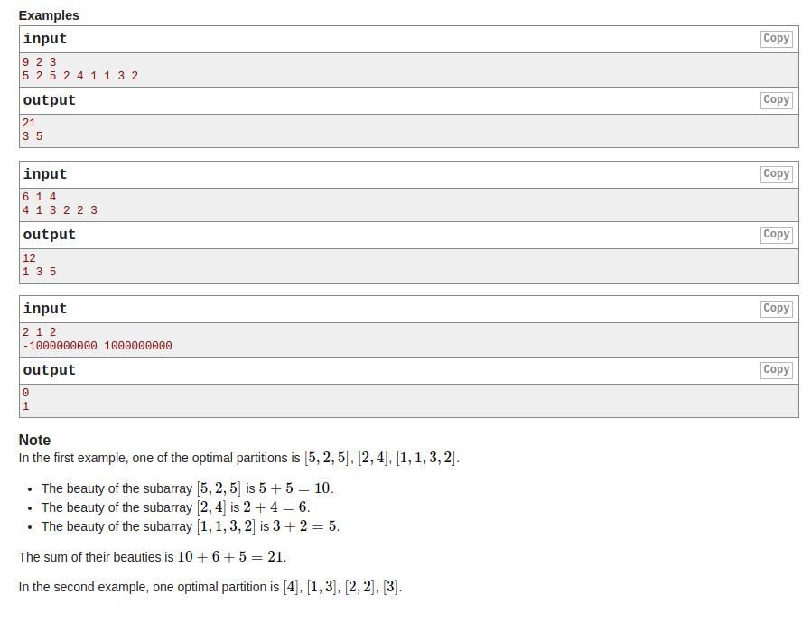

## Codeforces - 1114B. Yet Another Array Partitioning Task(贪心+索引)
#### [题目链接](https://codeforces.com/problemset/problem/1114/B)

> https://codeforces.com/problemset/problem/1114/B

#### 题目





#### 解析

很好的贪心题:

* **首先，我们至少需要取`m * k`个元素，且数组中最大的`m * k`个元素就是最大的`sum`，因为不管怎么样，我们都能取得到这`m * k`个元素，明白这一点很重要；**
* 知道了上面就很好做了，先记录一个每个元素在原来数组中对应的下标，然后对原来数组按照值降序排序，则前`m * k`个的和就是答案；
* 然后用一个`boolean`数组记录哪些元素使用了，然后遍历一遍原来的数组，构造出来即可，具体看代码；

代码:

```java
import java.io.*;
import java.util.*;

public class Main {

    static class Pair{
        int id;
        int val;
        Pair(int id, int val){
            this.id = id;
            this.val = val;
        }
    }

    public static void main(String[] args) {
        Scanner in = new Scanner(new BufferedInputStream(System.in));
        PrintStream out = System.out;
        int n = in.nextInt(), m = in.nextInt(), k = in.nextInt();
        int[] arr = new int[n];
        Pair[] pairs = new Pair[n];
        for(int i = 0; i < n; i++){
            arr[i] = in.nextInt();
            pairs[i] = new Pair(i, arr[i]);
        }
        Arrays.sort(pairs, (o1, o2) -> o2.val - o1.val);
        boolean[] toUse = new boolean[n];
        long sum = 0;
        for(int i = 0; i < m * k; i++){ // m * k <= n
            toUse[pairs[i].id] = true;
            sum += pairs[i].val;
        }
        out.println(sum); // max sum

        int cnt = 0, found = 0, pos = 0;
        int[] rid = new int[k - 1];
        for(int i = 0; i < n; i++){
            cnt += toUse[i] ? 1 : 0;
            if(cnt == m){
                rid[pos++] = i + 1;
                cnt = 0;
                found++;
                if(found == k - 1) break;
            }
        }
        for(int i = 0; i < k - 1; i++)
            out.print(rid[i] + " ");
        out.println();
    }
}

```

