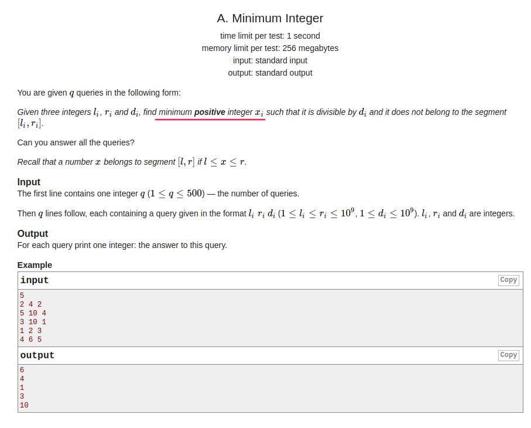

## Codeforces - 1101A. Minimum Integer(数学推理)
#### [题目链接](https://codeforces.com/problemset/problem/1101/A)

> https://codeforces.com/problemset/problem/1101/A

#### 题目

给你`q`代表`q`个查询，每个查询给你`l, r, d`，要你找到**最小**的不在`[l, r]`之间的能整除`d`的数。



#### 解析

一开始傻逼的去枚举，果断超时:

* 如果`d  < l || d > r`，直接输出`d`即可；
* 否则就是`l <= d <= r`，这种情况，就要找到第一个`>r`且`%d == 0`的数，这个数自己利用`d和r`就能退出来是`r + d - r % d`；

超时代码:
```java
import java.io.*;
import java.util.*;

public class Main {

    public static void main(String[] args) {
        Scanner in = new Scanner(new BufferedInputStream(System.in));
        PrintStream out = System.out;
        int Q = in.nextInt();
        for(int q = 0; q < Q; q++){ 
            int l = in.nextInt(), r = in.nextInt(), d = in.nextInt();
            if(d < l || d > r){ 
                out.println(d);
                continue;
            }
            int mul = d;
            for(; mul <= r; mul += d);
            out.println(mul);
        }
    }
}
```
推出来的公式:
```java
import java.io.*;
import java.util.*;

public class Main {

    public static void main(String[] args) {
        Scanner in = new Scanner(new BufferedInputStream(System.in));
        PrintStream out = System.out;
        int Q = in.nextInt();
        for(int q = 0; q < Q; q++){ 
            int l = in.nextInt(), r = in.nextInt(), d = in.nextInt();
            if(d < l || d > r){ 
                out.println(d);
                continue;
            }
            out.println(r + d - r%d);
        }
    }
}
```

