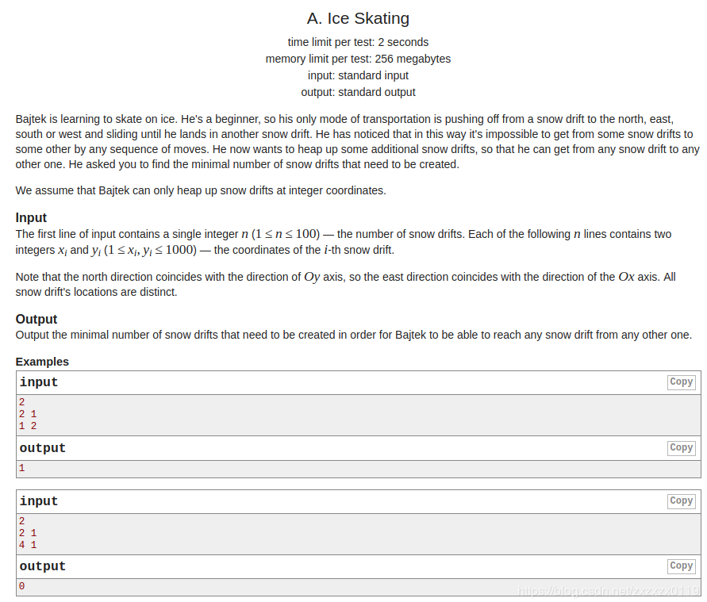
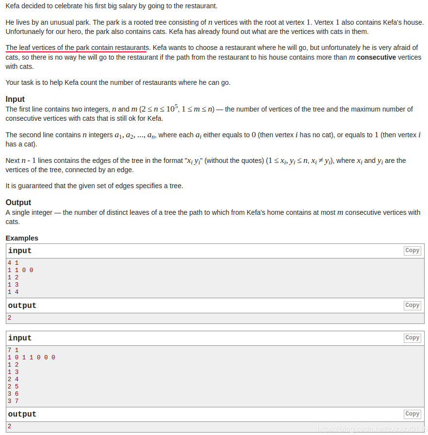
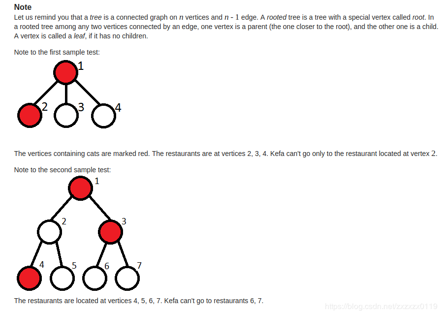
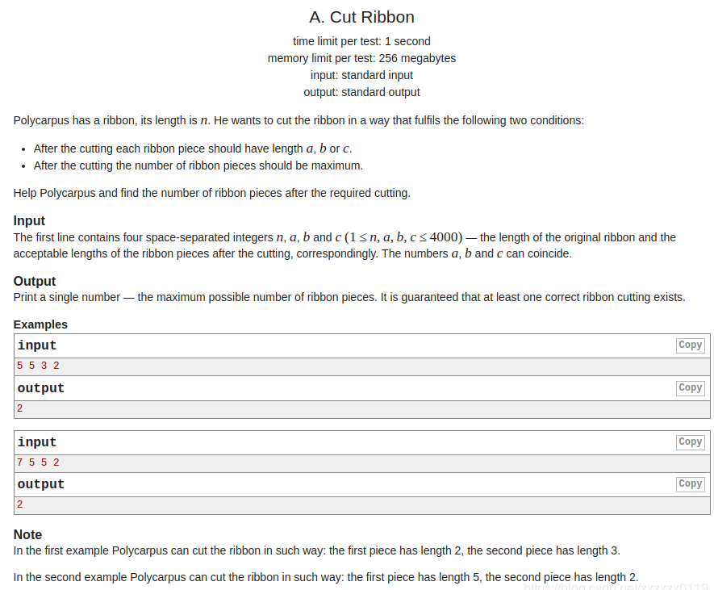
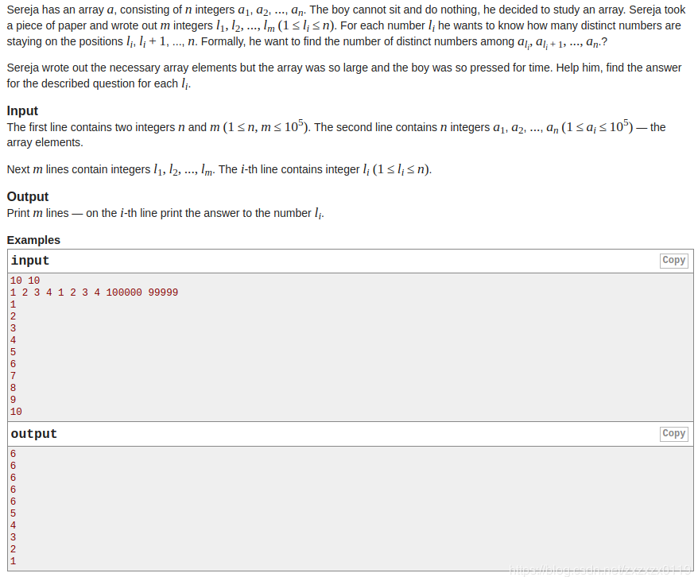

## Codeforces 217A & 580C & 189A & 368B
* [Codeforces - 217A - Ice Skating](#codeforces---217a---ice-skating)
* [Codeforces - 580C - Kefa and Park](#codeforces---580c---kefa-and-park)
* [Codeforces - 189A - Cur Ribbon](#codeforces---189a---cur-ribbon)
* [Codeforces - 368B - Sereja and Suffixes](#codeforces---368b---sereja-and-suffixes)

***
### <font color = red id = "1">Codeforces - 217A - Ice Skating
#### [题目链接](https://codeforces.com/problemset/problem/217/A)

> https://codeforces.com/problemset/problem/217/A

#### 题目大意 

给你一个`n`，以及在坐标轴上的`n`个坐标(把这些坐标看做是一些岛)， 一个人可以上、下、左、右的走，也就是说如果两个岛<font color = blue>横坐标或者纵坐标相等，它们就可以相互到达</font>，问你还需要添加多少个岛，可以使得任意两个岛可以相互到达。

#### 解析

* 先把所有能相互到达的每个整体求出来，使用`dfs`求出连通分量的个数；
* 然后需要添加的岛的个数就是<font color =red>连通分量个数-1</font>。因为两个部分肯定只需要添加一个岛就可以相互到达；

```java
import java.io.BufferedInputStream;
import java.util.Scanner;

public class Main {

    static class Coordinate {
        public int x, y;

        public Coordinate(int x, int y) {
            this.x = x;
            this.y = y;
        }
    }

    static boolean check(Coordinate c1, Coordinate c2) {
        return c1.x == c2.x || c1.y == c2.y;
    }

    static void dfs(int v, int n, boolean[] vis, Coordinate[] cds) {
        vis[v] = true;
        for (int i = 0; i < n; i++) {
            if (!vis[i] && check(cds[v], cds[i]))
                dfs(i, n, vis, cds);
        }
    }

    public static void main(String[] args) {
        Scanner cin = new Scanner(new BufferedInputStream(System.in));
        int n = cin.nextInt(), x, y;
        Coordinate[] cds = new Coordinate[n];
        for (int i = 0; i < n; i++) {
            x = cin.nextInt();
            y = cin.nextInt();
            cds[i] = new Coordinate(x, y);
        }
        boolean[] vis = new boolean[n];
        int count = 0;
        for (int i = 0; i < n; i++) {
            if (!vis[i]) {
                dfs(i, n, vis, cds);
                count++;
            }
        }
        System.out.println(count - 1);
    }
}

```

***
### <font color = red id = "2">Codeforces - 580C - Kefa and Park
#### [题目链接](https://codeforces.com/contest/580/problem/C)

> https://codeforces.com/contest/580/problem/C

#### 题目大意
题目是给你`n`、`m`，`n`代表这个图(一颗生成树)的顶点个数，然后下面一行`n`个数，代表这个顶点是否有`cat`，现在要从根节点`1`出发，去到叶子节点，但是中间不能有连续`m`个`cat`，问有多少中走法。


#### 解析
这题其实不难，但是一开始看错题目。。。以为是求能到达多少个不是`cat`的节点，结果`wa`很多次。

思路: 直接`dfs`：

* 记录一个当前以及有多少个连续的`cat`，如果遍历到当前节点，`cat`数目`>m`，就不需要继续`dfs`了；
* 然后判断一下是不是叶子节点即可；

```java
import java.io.*;
import java.util.*;

public class Main {

    static int n;
    static int m;
    static int res;
    // static int[] in;
    static boolean[] isCat;
    static boolean[] vis;
    static ArrayList<Integer> G[];

    static int calculate() {
        dfs(0, 0);
        return res;
    }

    static void dfs(int v, int curSum) {
        vis[v] = true;
        if (isCat[v])
            curSum += 1;
        if (curSum > m)
            return;
//        if(v != 0 && in[v] == 1) // is leaf and is not root(0)
//            res += 1;
        if (v != 0 && G[v].size() == 1)  // is leaf and is not root(0)
            res += 1;
        else {
            for (int i = 0; i < G[v].size(); i++)
                if (!vis[G[v].get(i)])
                    dfs(G[v].get(i), isCat[v] ? curSum : 0);
        }
    }


    public static void main(String[] args) {
        Scanner cin = new Scanner(new BufferedInputStream(System.in));
        PrintStream out = System.out;
        n = cin.nextInt();
        m = cin.nextInt();
        G = new ArrayList[n];
        isCat = new boolean[n];
        vis = new boolean[n];
        for (int i = 0; i < n; i++) {
            G[i] = new ArrayList<>();
            vis[i] = false;
        }
        res = 0;
        for (int i = 0; i < n; i++) {
            int num = cin.nextInt();
            isCat[i] = num == 1 ? true : false;
        }
        for (int i = 0; i < n - 1; i++) {
            int from = cin.nextInt();
            int to = cin.nextInt();
            G[from - 1].add(to - 1);
            G[to - 1].add(from - 1);
        }
        out.println(calculate());
    }
}

```

***
### <font color = red id = "3">Codeforces - 189A - Cur Ribbon
#### [题目链接](https://codeforces.com/problemset/problem/189/A)

> https://codeforces.com/problemset/problem/189/A

#### 题目大意

给你一段`n`长度的绳子，要你剪断它，但是剪出来的段只能是`a`、`b`、`c`三种长度，问你最多可以剪多少段。

#### 解析
简单的`dp`:  当前的`dp[n]`是前面已经剪出来的最大值加上自己的。
```java
import java.io.BufferedInputStream;
import java.util.Arrays;
import java.util.Scanner;

public class Main {

    static int a, b, c;
    static int[] dp;

    static int cal(int n){
        if(n < 0) //should be care 
            return Integer.MIN_VALUE;
        if(n == 0)
            return 0;
        if(dp[n] != -1)
            return dp[n];
        dp[n] = Math.max(cal(n-a), Math.max(cal(n-b), cal(n-c)))+1;
        return dp[n];
    }

    public static void main(String[] args){
        Scanner cin = new Scanner(new BufferedInputStream(System.in));
        int n = cin.nextInt();
        a = cin.nextInt();
        b = cin.nextInt();
        c = cin.nextInt();
        dp = new int[n+1];
        Arrays.fill(dp, -1);
        System.out.println(cal(n));
    }
}
```
不用记忆化的写法: 

```java
import java.io.BufferedInputStream;
import java.util.Scanner;

public class Main {

    public static void main(String[] args){
        Scanner cin = new Scanner(new BufferedInputStream(System.in));
        int n = cin.nextInt();
        int a = cin.nextInt();
        int b = cin.nextInt();
        int c = cin.nextInt();
        int[] dp = new int[n+1];
        dp[0] = 0;
        for(int i = 1; i <= n; i++){
            int max = Integer.MIN_VALUE;
            if(i - a >= 0)
                max = Math.max(max, dp[i-a]);
            if(i - b >= 0)
                max = Math.max(max, dp[i-b]);
            if(i - c >= 0)
                max = Math.max(max, dp[i-c]);
            dp[i] = max + 1;
        }
        System.out.println(dp[n]);
    }
}
```

***

### <font color = red id = "4">Codeforces - 368B - Sereja and Suffixes
#### [题目链接](https://codeforces.com/problemset/problem/368/B)

> https://codeforces.com/problemset/problem/368/B

#### 题目大意
给你两个数`n`、`m`，以及`n`个数的数组`a[]`，然后给你`m`个查询，每个查询输入一个数`l[i]`，问你在`a`数组中，`a[l[i]-1]~a[n-1]`位置有多少个不相同的数。

#### 解析
很简单的`dp`题，从后往前遍历，关键在于使用一个`boolean`数组当前遍历的数有没有出现过。`dp[i]`代表的是`i~n`之间有多少个不同的数。
```java
import java.io.BufferedInputStream;
import java.util.Scanner;

public class Main {
    public static void main(String[] args){
        Scanner cin = new Scanner(new BufferedInputStream(System.in));
        int n = cin.nextInt();
        int m = cin.nextInt();
        int[] a = new int[n];
        int[] l = new int[m+1];
        boolean[] isAppera = new boolean[500001];
        int[] dp = new int[n];
        for(int i = 0; i < n; i++)
            a[i] = cin.nextInt();
        for(int i = 0; i < m; i++)
            l[i] = cin.nextInt();
        dp[n-1] = 1;
        isAppera[a[n-1]] = true;
        for(int i = n-2; i >= 0; i--){
            dp[i] = !isAppera[a[i]] ? dp[i+1]+1 : dp[i+1];
            isAppera[a[i]] = true;
        }
        for(int i = 0; i < m; i++)
            System.out.println(dp[l[i]-1]);
    }
}

```

