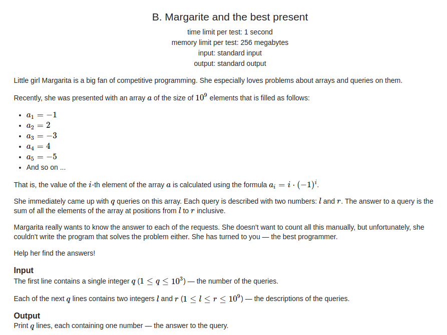
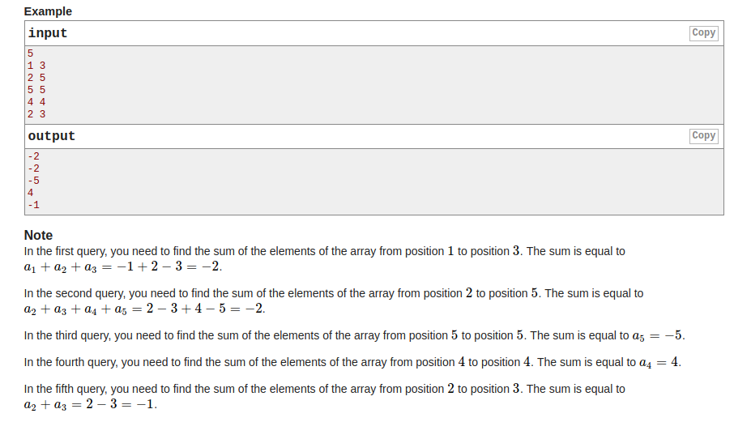

## Codeforce - 1080B. Margarite and the best present

#### [题目链接](http://codeforces.com/problemset/problem/1080/B)

> http://codeforces.com/problemset/problem/1080/B

#### 题目大意
给你一个数组，数组元素取值为<font color = red>**a<sub>i</sub> = i * (-1)<sup>i</sup>**</fonT>，给你两个数`l`、`r`，要你求出`arr[l ~ r]`的和。




#### 解析
* 方法一: 可以使用等差数列求和公式，先全部看做正数，求出所有看做正数的和，然后减去 `2 * 奇数的和`，但是要分四种情况看`l`、`r`的奇、偶情况；
* 方法二: 有一个规律，就是前后两个数相加或者是`1`，或者是`-1`，然后分情况讨论从奇数开始还是偶数开始即可。
```cpp
#include <bits/stdc++.h>

typedef long long ll;

// my solution
#if 0
int main(int argc, char const **argv)
{ 
    std::ios::sync_with_stdio(false);
    std::cin.tie(0);    
    ll T, l, r;
    for(std::cin >> T; T--; ){ 
        std::cin >> l >> r;
        // regard as 2 arithmetic progression, regard as all to positive number
        ll sumAll = (l+r)*(r-l+1)/2;
        ll sumNegative;
        if( (l&1) && (r&1) )
            sumNegative = (l+r)*( (r-l)/2 + 1)/2;
        else if( (l&1)==0 && (r&1) )
            sumNegative = (l+1+r)*( (r-(l+1))/2 + 1)/2;
        else if( (l&1) &&  (r&1)==0 ) 
            sumNegative = (l+r-1)*( (r-1-l)/2 + 1)/2;
        else 
            sumNegative = (l+1+r-1)*( (r-1-(l+1))/2 + 1)/2;

        std::cout << sumAll - 2*sumNegative << std::endl;
    }
    return 0;
}
#endif

// best way
int main(int argc, char const **argv)
{ 
    std::ios::sync_with_stdio(false);
    std::cin.tie(0);    
    ll T, l, r;
    for(std::cin >> T; T--; ){ 
        std::cin >> l >> r;
        ll sum, num = r - l + 1; // numbers 
        if(num & 1)  // odd
            sum = num == 1 ? ( l&1 ? -l : l) : ( l&1 ? -l-num/2 : l+num/2); 
        else  // even
            sum = l&1 ? num/2 : -num/2; 
        std::cout << sum << std::endl;
    }
    return 0;
}
```