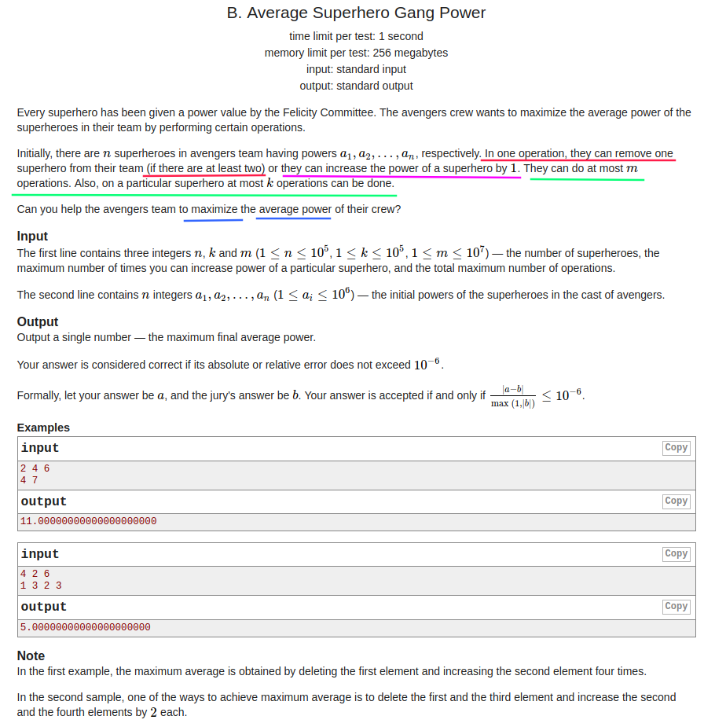

## Codeforeces - 1111B. Average Superhero Gang Power(超人的最大平均战斗力)
#### [题目链接]()
#### 题目



#### 解析

```java
import java.io.*;
import java.util.*;
import java.text.*;

public class Main {

    public static void main(String[] args){
        Scanner in = new Scanner(new BufferedInputStream(System.in));
        PrintStream out = System.out;
        int n = in.nextInt();
        long k = in.nextInt();
        long m = in.nextInt();
        int[] arr = new int[n];
        for(int i = 0; i < n; i++)
            arr[i] = in.nextInt();
        Arrays.sort(arr);
        long[] sums = new long[n + 1];
        for(int i = 0; i < n; i++)
            sums[i+1] = sums[i] + arr[i];
        double best = ((double)sums[n]) / n; // don't miss this 
        for(int add = 0; add <= m; add++){ 
            long todel = m - add;
            int realdel = (int)(Math.min(n - 1, todel)); // at least 1 member
            long realadd = (Math.min((n - realdel) * k, add)); // 如果add足够就加，如果add不够就只能加add个
            double cur = ((double)(sums[n] - sums[realdel] + realadd)) / (n - realdel); // not divide realadd
            if(cur > best)
                best = cur;
        }
        out.println(best);
    }
}

```


提供一开始的思路的代码(相当于贪心)，但是是错误的。

```java
import java.io.*;
import java.util.*;

public class Main {

    public static void main(String[] args){
        Scanner in = new Scanner(new BufferedInputStream(System.in));
        PrintStream out = System.out;
        int n = in.nextInt();
        int k = in.nextInt();
        int m = in.nextInt();
        int[] arr = new int[n];
        for(int i = 0; i < n; i++)
            arr[i] = in.nextInt();
        Arrays.sort(arr);
        double sum = 0;
        int num = 0;
        for(int i = 0; i < n; i++){ 
            if(m <= 0){ 
                num++;
                sum += arr[i];
                m--;
            }else{// m > 0 
                if(i != n-1 && arr[i] != arr[n-1])
                    m--;
                else {  
                    if(arr[i] == arr[n-1]){ 
                        sum += arr[i] * (n - i);
                        sum += m;
                        num += n - i;
                    }else { 
                        num++;
                        sum += m + arr[i];
                    }
                    break;
                }
            }
        }
        out.println(sum*1.0 / num);
    }
}

```

