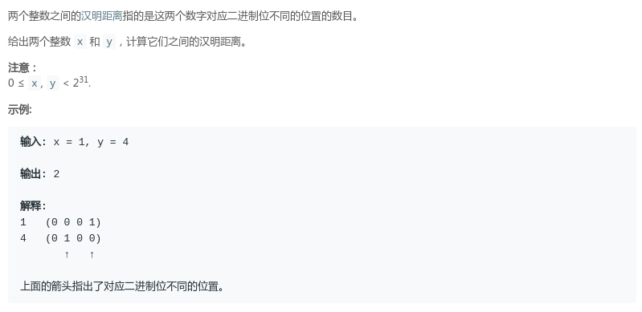

## LeetCode - 461. Hamming Distance(位运算)

 - 方法一
 - 方法二
 - 方法三

#### [题目链接](https://leetcode.com/problems/hamming-distance/description/)

> https://leetcode.com/problems/hamming-distance/description/

#### 题目
 


***
### 方法一
思路是: 

 - 由于题目给出的最大范围是<font color = red>0 ≤ x, y < 2<sup>31</sup></font>所以对应的二进制最多有`31`位，所以我们判断两个数的每一个二进制位相不相等即可。
 - 求出数的二进制的每一位操作就是不停的`/2`，具体看下面代码。

```java
class Solution {
    public int hammingDistance(int x, int y) {
        int res = 0;
        for (int i = 0; i < 32; i++) {
            if ((x & 1) != (y & 1)) res++;// x & 1 -->  x % 2 == 1
            x >>>= 1;  //x /= 2,  // >>>1(不带符号右移)、>>1(带符号右移)
            y >>>= 1;  //y /= 2
        }
        return res;
    }
}
```

***
### 方法二
第二种方法解题思路: 

 - 先求出两个数的异或值；
 - 这个值的二进制位如果是`1`表明两个数对应的二进制位不相等，否则相等。

```java
class Solution {
    public int hammingDistance(int x, int y) {
        int res = 0;
        int xor = x ^ y;
        while (xor > 0) {
            res += xor & 1;   // %2 == 1
            xor >>>= 1; // >>>1(不带符号右移)、>>1(带符号右移)
        }
        return res;
    }
}
```

***
### 方法三
方法三解题思路:  **这个也是先出两个数的异或值**。

然后关键在`xor &= (xor - 1);`这行代码功能。

<font color = red>**将`xor`的二进制值中，最后一个`1`置`0`，其它不变。即达到从`xor`的尾部，删除一个`1`的效果。**</font>

**例如  : <font color = blue>101101</font>** 
  &nbsp;&nbsp;&nbsp; `101101`
 & `101100`
=&nbsp;`101100`
**再如 :<font color = blue> 101100</font>**
  &nbsp;&nbsp;&nbsp;  `101100`
 & `101011`
=&nbsp;`101000`

<font color = red>所以程序就变成了可以删除多少个`1`，`res`就加多少次，也就是我们要的结果。</font>
```java
class Solution {
    public int hammingDistance(int x, int y) {
        int res = 0;
        int xor = x ^ y;
        while (xor != 0) {
            res++;
            xor &= (xor - 1);
        }
        return res;
    }
}
```
***
