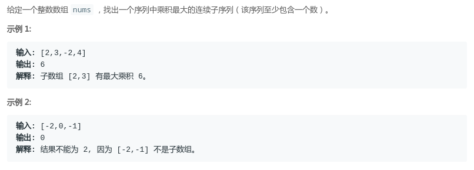

## LeetCode - 152. Maximum Product Subarray(子数组最大累乘积)
* 一维dp
* 滚动优化
* 递归版本

***
#### [题目链接](https://leetcode.com/problems/maximum-product-subarray/description/)

> https://leetcode.com/problems/maximum-product-subarray/description/

#### 题目

##### <font color = red>这题和[LeetCode - 53](https://blog.csdn.net/zxzxzx0119/article/details/81807083)类似。</font>
### 一维dp
使用一个一维数组记录以每个位置结尾的最大累乘积，再使用一个`res`变量(记录结果)，记录每一个位置结尾`ends[i]`的最大值。

如何快速求出所有以i位置结尾(`nums[i]`)的子数组的最大累乘积? 　**假设以`nums[i-1]`结尾的最大累乘积为`maxEnds[i-1]`，以`nums[i-1]`记为的最小累乘积为`minEnds[i-1]`，那么以`nums[i]`结尾的最大累乘积只有三种可能**

*  可能是` maxEnds[i-1] * nums[i]`，这个是显然的，因为记录前面的最大值，如`[3,4,5]`；
* 可能是 `minEnds[i-1] * nums[i]`，因为`minEnds[i-1]`和`nums[i]`都有可能是负数，如`[-2,-4]`；
* 也有可能是 `nums[i]`自己；

<font color = green>**则以这个结尾的最大值`maxEnds[i]`就是这三者中的最大的一个。 <font color = blue>而`minEnds[i]`的更新就是这三者中的最小的一个。**
```java
class Solution {

    public int maxProduct(int[] nums) {
        if (nums == null || nums.length == 0)
            return 0;
        int[] minEnds = new int[nums.length];
        int[] maxEnds = new int[nums.length];
        minEnds[0] = nums[0];
        maxEnds[0] = nums[0];
        int res = nums[0];
        for (int i = 1; i < nums.length; i++) {
            int max = nums[i] * maxEnds[i - 1];
            int min = nums[i] * minEnds[i - 1];
            maxEnds[i] = Math.max(max, Math.max(min, nums[i]));
            minEnds[i] = Math.min(min, Math.min(max, nums[i]));
            res = Math.max(maxEnds[i], res);
        }
        return res;
    }
}
```
***
### 滚动优化
这里的滚动优化就是<font color = red>当前位置只依赖前一个位置的最大和最小值，所以只需要两个变量即可。</font>
优化空间: 

```java
class Solution {
    public int maxProduct(int[] nums) {
        if (nums == null || nums.length == 0)
            return 0;
        int minEnd = nums[0];
        int maxEnd = nums[0];
        int res = nums[0];
        for (int i = 1; i < nums.length; i++) {
            int max = nums[i] * maxEnd;
            int min = nums[i] * minEnd;
            maxEnd = Math.max(max, Math.max(min, nums[i]));
            minEnd = Math.min(min, Math.min(max, nums[i]));
            res = Math.max(maxEnd, res);
        }
        return res;
    }
}
```
***
### 递归版本
能用`dp`的基本都能写出递归，能写出递归的都可以改`dp`；
但是这里要注意：
* 当从最后一个计算完之后，因为在`return`前记录的`res`，所以最后一个没有记录；
* 所以在调用完函数之后，存储返回值，再比较一下`last`和`res`的值，然后返回；
```java
class Solution {

    private int res;

    public int maxProduct(int[] nums) {
        if (nums == null || nums.length == 0)
            return 0;
        res = nums[0];
        int last = maxMul(nums, nums.length - 1); // 最后一个不要忘了比较
        res = Math.max(res, last);
        return res;
    }

    private int maxMul(int[] arr, int i) {
        if (i == 0)
            return arr[0];
        int preMax = maxMul(arr, i - 1);
        int preMin = minMul(arr, i - 1);
        res = Math.max(res, preMax);
        return Math.max(preMax * arr[i],
                Math.max(preMin * arr[i], arr[i])
        );
    }

    private int minMul(int[] arr, int i) {
        if (i == 0)
            return arr[0];
        int preMin = minMul(arr, i - 1);
        int preMax = maxMul(arr, i - 1);
        return Math.min(preMin * arr[i],
                Math.min(preMax * arr[i], arr[i])
        );
    }
}
```
递归改记忆化，记忆化代码可以通过，**不过在递归之后还要比较一次，注意细节:**

```java
class Solution {

    private int res;
    //记忆化
    private int[] maxEnds;
    private int[] minEnds;

    public int maxProduct(int[] nums) {
        if (nums == null || nums.length == 0)
            return 0;
        res = nums[0];
        maxEnds = new int[nums.length];
        Arrays.fill(maxEnds, Integer.MIN_VALUE);
        minEnds = new int[nums.length];
        Arrays.fill(minEnds, Integer.MAX_VALUE);
        int last = maxMul(nums, nums.length - 1); // 最后一个不要忘了比较
        res = Math.max(res, last);
        return res;
    }

    private int maxMul(int[] arr, int i) {
        if (i == 0)
            return arr[0];
        if (maxEnds[i] != Integer.MIN_VALUE)
            return maxEnds[i];
        int preMax = maxMul(arr, i - 1);
        int preMin = minMul(arr, i - 1);
        res = Math.max(res, preMax);
        maxEnds[i] = Math.max(preMax * arr[i],
                Math.max(preMin * arr[i], arr[i])
        );
        return maxEnds[i];
    }

    private int minMul(int[] arr, int i) {
        if (i == 0)
            return arr[0];
        if (minEnds[i] != Integer.MAX_VALUE)
            return minEnds[i];
        int preMin = minMul(arr, i - 1);
        int preMax = maxMul(arr, i - 1);
        minEnds[i] = Math.min(preMin * arr[i],
                Math.min(preMax * arr[i], arr[i])
        );
        return minEnds[i];
    }
}
```
也可以稍微改动一下，就不需要单独处理最后一个`last`了，在记忆化返回之前记录`res`的最大值: 

```java
class Solution {

    private int res;
    //记忆化
    private int[] maxEnds;
    private int[] minEnds;

    public int maxProduct(int[] nums) {
        if (nums == null || nums.length == 0)
            return 0;
        res = nums[0];
        maxEnds = new int[nums.length];
        Arrays.fill(maxEnds, Integer.MIN_VALUE);
        minEnds = new int[nums.length];
        Arrays.fill(minEnds, Integer.MAX_VALUE);

        maxMul(nums, nums.length - 1);

        return res;
    }

    private int maxMul(int[] arr, int i) {
        if (i == 0)
            return arr[0];
        if (maxEnds[i] != Integer.MIN_VALUE)
            return maxEnds[i];
        int preMax = maxMul(arr, i - 1);
        int preMin = minMul(arr, i - 1);
        maxEnds[i] = Math.max(preMax * arr[i],
                Math.max(preMin * arr[i], arr[i])
        );
        res = Math.max(res, maxEnds[i]);
        return maxEnds[i];
    }

    private int minMul(int[] arr, int i) {
        if (i == 0)
            return arr[0];
        if (minEnds[i] != Integer.MAX_VALUE)
            return minEnds[i];
        int preMin = minMul(arr, i - 1);
        int preMax = maxMul(arr, i - 1);
        minEnds[i] = Math.min(preMin * arr[i],
                Math.min(preMax * arr[i], arr[i])
        );
        return minEnds[i];
    }
}
```

