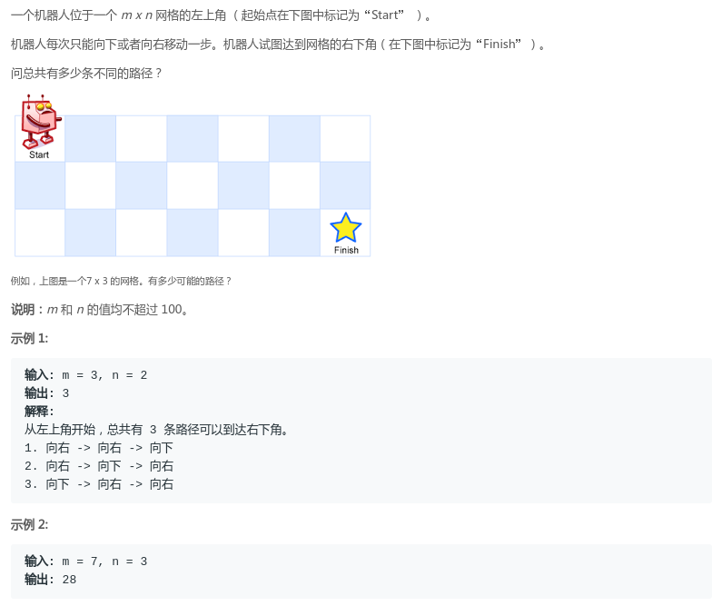
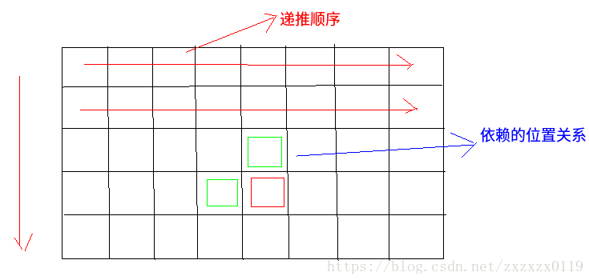
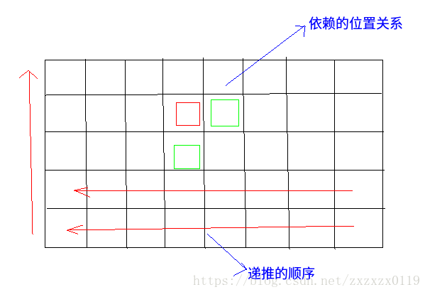

## LeetCode - 62. Unique Paths(不同的路径数量)(简单dp)
 - 递归
 - 记忆化
 - 二维dp
 - 空间优化

***
#### [题目链接](https://leetcode.com/problems/unique-paths/description/)

> https://leetcode.com/problems/unique-paths/description/

#### 题目



<font color = red>这个题目和[最小路径和问题](https://blog.csdn.net/zxzxzx0119/article/details/81227300)很类似。</font>
#### 递归
* **来到某个结点，因为只能往右边和下面走，所以一个位置`[i,j]`依赖的位置是`[i-1,j]`和`[i,j-1]`位置两个点之前的数量之和；**
 * 所以我们把`[i,j]`看做是<font color = red>终点</font>的话就得出下面的递归关系。


如果不记录重复子问题的话就会是`O(2^n)`；

```java
class Solution {

    public int uniquePaths(int m, int n) {
        return rec(m, n, m, n);
    }

    public int rec(int m, int n, int i, int j) {
        if (i == 1 && j == 1)  //左上角
            return 1;
        if (i == 1)  //第一行
            return rec(m, n, i, j - 1);
        if (j == 1)   //第一列
            return rec(m, n, i - 1, j);
        return rec(m, n, i - 1, j) + rec(m, n, i, j - 1);
    }
}
```
***

### 记忆化
上面的方法计算了很多的重复子问题，我们可以使用一个二维数组保存已经算过的子问题，一旦发现已经算过，就不再重复求解。

```java
class Solution {

    private int[][] dp;

    public int uniquePaths(int m, int n) {
        dp = new int[m + 1][n + 1];
        return rec(m, n, m, n);
    }

    public int rec(int m, int n, int i, int j) {
        if (i == 1 && j == 1)
            return 1;
        if (dp[i][j] != 0) //已经计算过
            return dp[i][j];
        if (i == 1)
            dp[i][j] = rec(m, n, i, j - 1);
        else if (j == 1)
            dp[i][j] = rec(m, n, i - 1, j);
        else
            dp[i][j] = rec(m, n, i - 1, j) + rec(m, n, i, j - 1);
        return dp[i][j];
    }
}
```
## 二维dp
递归改动态规划就是和递归相反的方向: 



如果是上面的递归改成动态规划就是:

```java
class Solution {
    public int uniquePaths(int m, int n) {
        int[][] dp = new int[m + 1][n + 1];
        dp[1][1] = 1;
        for (int j = 2; j <= n; j++) dp[1][j] = dp[1][j - 1]; //第一行
        for (int i = 2; i <= m; i++) dp[i][1] = dp[i - 1][1];
        for (int i = 2; i <= m; i++) {
            for (int j = 2; j <= n; j++) {
                dp[i][j] = dp[i][j - 1] + dp[i - 1][j];
            }
        }
        return dp[m][n];
    }
}

```

可以有两种写法，在于你<font color = red>看问题的角度:</font>


 - 第一种看问题的角度，把`[i,j]`看做是终点，那就是上面的递归关系；
 - 第二种看问题的角度，把`[i,j]`看做是起点，此时`[i,j]`总共的数量就是从`[i+1,j]`出发和从`[i,j+1]`出发的数量，那就是下面的递归关系；

就是说递归和动态规划也可以写成这样: 
```java
class Solution {
    public int uniquePaths(int m, int n) {
        return rec(m, n, 1, 1);
    }

    public int rec(int m, int n, int i, int j) {
        if (i == m && j == n)
            return 1;
        if (i == m)
            return rec(m, n, i, j + 1);
        if (j == n)
            return rec(m, n, i + 1, j);
        return rec(m, n, i + 1, j) + rec(m, n, i, j + 1);
    }
}
```
然后动态规划的顺序:



```java
class Solution {
    public int uniquePaths(int m, int n) {
        int[][] dp = new int[m + 1][n + 1];
        dp[m][n] = 1;
        for (int j = n - 1; j >= 1; j--) dp[m][j] = dp[m][j + 1];
        for (int i = m - 1; i >= 1; i--) dp[i][n] = dp[i + 1][n];
        for (int i = m - 1; i >= 1; i--) {
            for (int j = n - 1; j >= 1; j--) {
                dp[i][j] = dp[i][j + 1] + dp[i + 1][j];
            }
        }
        return dp[1][1];
    }
}

```
***
## 滚动优化
**滚动数组的优化就是其实你在算`dp[i][j]`的时候，你左边的`dp[i][j-1]`还是`dp[j-1]`，而你上面的`dp[i-1][j]`还是`dp[j] `(没有更新)，所以可以只需要一个数组，所以滚动优化决定的是你更新的顺序；**

```java
class Solution {
    public int uniquePaths(int m, int n) {
        int[] dp = new int[n + 1];
        for (int i = 1; i <= n; i++) dp[i] = 1;
        for (int i = 2; i <= m; i++) {
            for (int j = 2; j <= n; j++) {
                dp[j] = dp[j] + dp[j - 1];
            }
        }
        return dp[n];
    }
}

```
或者这样 (第二种): 

```java
class Solution {
    public int uniquePaths(int m, int n) {
        int[] dp = new int[n + 1];
        for (int i = 1; i <= n; i++) dp[i] = 1;
        for (int i = m - 1; i >= 1; i--) {
            for (int j = n - 1; j >= 1; j--) {
                dp[j] = dp[j] + dp[j + 1];
            }
        }
        return dp[1];
    }
}

```

