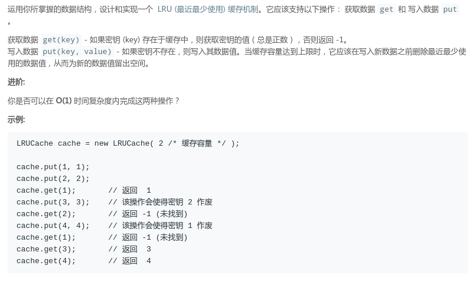
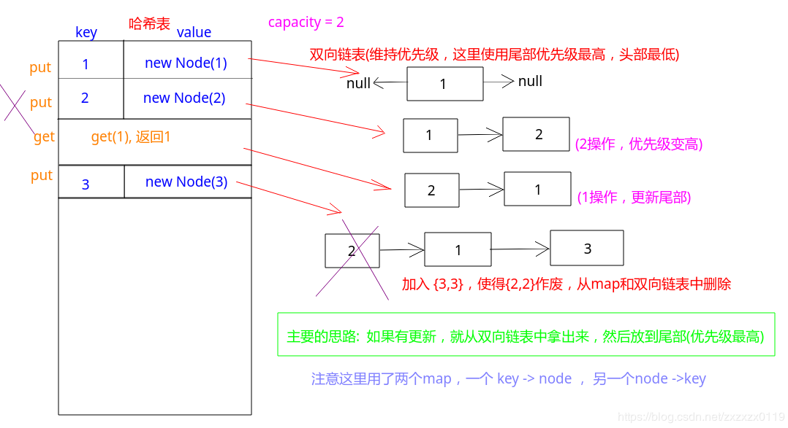

## LeetCode - 146. LRU Cache(LRU缓存变更算法)(LinkedHashMap底层)

#### [题目链接](https://leetcode.com/problems/lru-cache/description/)

> https://leetcode.com/problems/lru-cache/description/

#### 题目



### 解析
这种缓存结构使用**双向链表**和**哈希表**相结合的方式实现。


<font color = red>首先看双向链表: </font>

 - **在双向链表中有两个指针`head`(头)和`tail`(尾)，其中头部是优先级最低的，也就是最早进行`get`或者`put`的，而尾部是最晚(优先级最高)进行`get`和`put`的；** 
 - 双向链表的`add()`操作，将新加入的结点放到链表的尾部，并将这个结点设置成新的尾部；
 - 双向链表的`removeHead()`操作，移除最不常用的头部，并设置新的头部；
 - 双向链表的`moveToTail()`操作，在链表中分离**不是尾部的中间结点**放到尾部；


<font color = red>然后看`HashMap:`</font>

 - 一旦加入(`put`)新的记录，就把该记录加入到双向链表`doubleLinkedList`的尾部；(最近的更新)
 - **一旦`get`或者更新一个记录的`key`，就将这个`key`对应的`node`在`doubleLinkedList`中调整到尾部(`moveToTail`)；**
 - 一旦缓存结构满了，就"删除就不经常使用的"的记录；




```java
class LRUCache {

    private class Node {  //双向链表的结点结构
        public int value;
        public Node next;
        public Node pre;

        public Node(int value) {
            this.value = value;
        }
    }

    /**
     * 双向链表,实现三个功能:
     * (1)  添加结点
     * (2)  删除头部的结点
     * (3)  把一个结点从中间移到尾部
     */
    private class DoubleLinkedList {
        public Node head; //头指针
        public Node tail; //尾指针

        public DoubleLinkedList() {
            head = null;
            tail = null;
        }

        public void add(Node node) {
            if (node == null) return;
            if (head == null) {
                head = node;
                tail = node;
            } else {
                tail.next = node;
                node.pre = tail;
                tail = node;
            }
        }

        //移除头部 并返回头部
        public Node removeHead() {
            if (head == null) return null;
            Node res = head;
            if (head == tail) {
                head = null;
                tail = null;
            } else {
                head = res.next;
                res.next = null;
                head.pre = null;
            }
            return res;
        }

        //把一个结点从链表的中间放到尾部(变成最经常使用的)
        public void moveToTail(Node node) {
            if (node == null) return;
            if (node == tail) return;
            if (head == node) { //删除头部
                head = head.next; //更换头部
                head.pre = null;
            } else { //删除的中间的
                node.pre.next = node.next;
                node.next.pre = node.pre;
            }
            tail.next = node;
            node.next = null;
            node.pre = tail;
            tail = node;
        }
    }

    private HashMap<Integer, Node> kNMap;  // key -> value
    private HashMap<Node, Integer> nKMap;  // value -> key   node ->value

    private DoubleLinkedList nodeList;  //双向链表

    private int capacity;  //容量

    public LRUCache(int capacity) {
        kNMap = new HashMap<>();
        nKMap = new HashMap<>();
        nodeList = new DoubleLinkedList();
        this.capacity = capacity;
    }

    public int get(int key) {
        if (!kNMap.containsKey(key)) {
            return -1;
        }
        Node res = kNMap.get(key);
        nodeList.moveToTail(res);
        return res.value;
    }

    public void put(int key, int value) {
        if (kNMap.containsKey(key)) {  //已经有这个key   更新其value
            Node node = kNMap.get(key);
            node.value = value;
            nodeList.moveToTail(node);  //放到最后
        } else {   //新增
            Node newNode = new Node(value);
            kNMap.put(key, newNode);
            nKMap.put(newNode, key);
            nodeList.add(newNode);
            if (kNMap.size() == capacity + 1) { //缓存结构满了，超过了必须移除最不经常使用的
                Node removeNode = nodeList.removeHead();   //在链表中移除头部
                Integer removeKey = nKMap.get(removeNode);  //要移除的结点的key
                //在两个Map中删除
                kNMap.remove(removeKey);
                nKMap.remove(removeNode);
            }
        }
    }
}
```
***
### Java的LinkedHashMap
Java的容器`LinkedHashMap`底层也使用了`LRU`算法，下面的程序也可以通过LeetCode: 

```java
class LRUCache extends LinkedHashMap<Integer, Integer> {

    private int capacity;

    public LRUCache(int capacity) {
        super(capacity, 1, true);
        this.capacity = capacity;
    }

    public int get(int key) {
        Integer res = super.get(key);
        if (res == null) return -1;
        return res;

    }

    public void put(int key, int value) {
        super.put(key, value);
    }

    @Override
    protected boolean removeEldestEntry(Map.Entry eldest) {
        return this.size() > capacity;
    }
}
```
更多`LinkedHashMap`底层实现可以看下[这篇博客](https://blog.csdn.net/justloveyou_/article/details/71713781)和[这篇博客](http://www.cnblogs.com/lzrabbit/p/3734850.html)。
