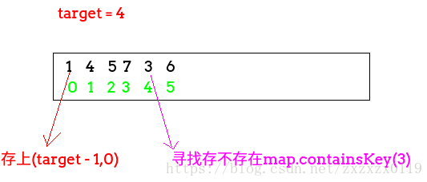

## LeetCode - 1. Two Sum(Hash)

 - 方法一
 - 方法二
***
  <font color = red>**还可以使用`Hash`表解决类似的[进阶问题](https://blog.csdn.net/zxzxzx0119/article/details/81604489)**<font>

#### [题目链接](https://leetcode.com/problems/two-sum/)

> https://leetcode.com/problems/two-sum/

#### 题目


### 方法一
使用`HashMap`存储每个数的下标，然后遍历数组，寻找`target - nums[i]`在`map`中存不存在，如果存在，记为`L`，说明存在`L+nums[i] = target`，这样遍历时间复杂度为`O(n)`。

```java
class Solution {

    public int[] twoSum(int[] nums, int target) {
        Map<Integer, Integer> map = new HashMap<>();
        int[] res = {0, 0};
        for (int i = 0; i < nums.length; i++)
            map.put(nums[i], i);
        for (int i = 0; i < nums.length; i++) {
            int L = target - nums[i];
            if (map.containsKey(L) && map.get(L) != i) {
                res[0] = map.get(L);
                res[1] = i;
                break;
            }
        }
        return res;
    }
}
```
***
### 方法二
也是使用`HashMap`，**但是我们可以一开始不存上每个数的下标，而是在遍历到`nums[i]`的时候，我们就查`nums[i]`在哈希表中存不存在，最后存上`target-nums[i]`，这样就不要一开始就存一次所有的下标。**
比如: 



```java
class Solution {

    public int[] twoSum(int[] nums, int target) {
        Map<Integer, Integer> map = new HashMap<>();
        int[] res = {0, 0};
        for (int i = 0; i < nums.length; i++) {
            if (map.containsKey(nums[i])) {
                res[0] = map.get(nums[i]);
                res[1] = i;
                break;
            }
            map.put(target - nums[i], i);
        }
        return res;
    }
}

```
