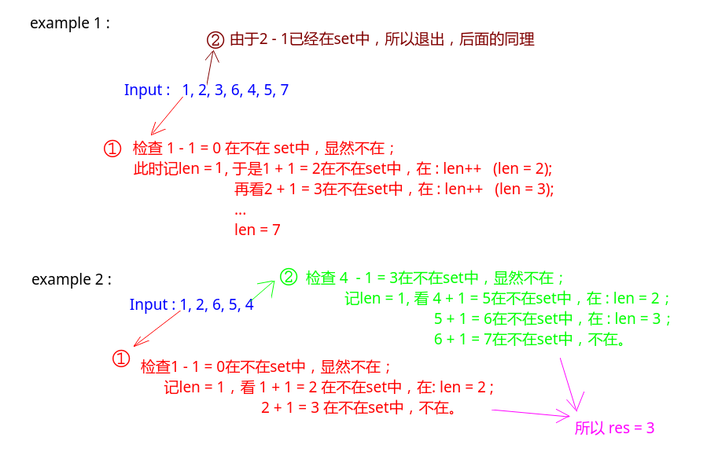
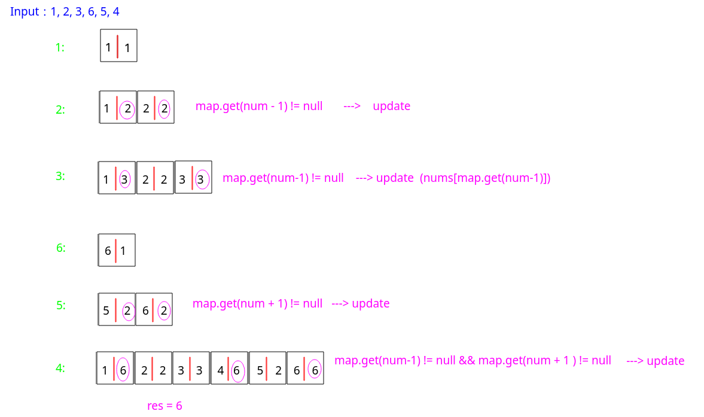

## LeetCode - 128. Longest Consecutive Sequence (哈希表)

#### [题目链接](https://leetcode.com/problems/longest-consecutive-sequence/)

> https://leetcode.com/problems/longest-consecutive-sequence/

#### 题目


#### 解析
第一种方法: 


* 使用一个`HashSet`来存储对应的值，<font color = blue>**一开始先将所有的值都加入`set`**</font>；

* 遍历数组的每一个元素，每次去检查当前元素`num`的前一个元素`num - 1`是不是在`set`中，如果是，<font color = red>说明`num`不是最长长度的起点，跳过</font>；

* 如果不是，则在`set`集合中不断的每次`+1`，(也就是不断检查`num + 1、num + 2、num + 3、num + 4.....`在不在`set`中)，并记录查到的元素个数(也就是长度)，然后更新结果(记录最大长度)`res`即可；

* 时间复杂度: 虽然有两重循环，但是每个元素最多访问两次，所以时间复杂度为`O(N)`；

看两个例子: 


```java
import java.io.*;
import java.util.*;

class Solution {

    public int longestConsecutive(int[] nums) {
        if(nums == null || nums.length == 0)
            return 0;
        HashSet<Integer>set = new HashSet<>();
        for(int num : nums)
            set.add(num);
        int res = 0;
        for(int num : nums){ 
            if(!set.contains(num - 1)){
                int len = 1, temp = num + 1;
                while(set.contains(temp++))
                    len++;
                res = Math.max(res, len);
            }
        }
        return res;
    }

    public static void main(String[] args){ 
        PrintStream out = System.out;
        int[] nums = {1, 2, 3, 6, 4, 5, 7};
        out.println(new Solution().
            longestConsecutive(nums)
        );
    }
}
```

第二种解法: 

* 用一个`HashMap`记录`<key , value > = ` <font color = red><数组的值，这个值如果作为边界(左/右)时的最大长度></font>。整个过程和动态规划有点类似；

* 遍历数组的每一个元素，先得到`num - 1`和`num + 1`在`map`中对应的`value`，如果两个`value`都为空，说明此时`num`两边都没有相邻的元素，所以`put(num, 1)`，表示`num`作为<font color = blue>左/右</font>边界的最大长度为`1`；
* 如果`map.get(num - 1) == null && map.get(num + 1) != null`，说明此时`num`可以作为<font color= green>右边界</font>，而此时不但要更新`num`的`value`，也要更新`nums[num - map.get(num - 1)]`的`value`，这个`value`就是`map.get(num - 1) + 1`，所以说这个过程有点类似动态规划；
* 同理，如果`map.get(num - 1) != null && map.get(num + 1) == null`，说明此时`num`可以作为<font color = green>左边界</font>，而此时不但要更新`num`的`value`，也要更新`nums[num + map.get(num + 1)]`的`value`，这个`value`就是`map.get(num + 1) + 1`。

* 如果`map.get(num - 1) != null && map.get(num + 1) != null`，则此时同时可以作为<font color= green>左右边界，说明它是连接两边的桥梁</font>，所以要同时更新`num、nums[num - map.get(num - 1)]、nums[num + map.get(num + 1)] `的值为`map.get(num - 1) + map.get(num + 1) + 1`；

看一个例子:




```java
import java.io.*;
import java.util.*;

class Solution {

    public int longestConsecutive(int[] nums) {
        if(nums == null || nums.length == 0)
            return 0;
        HashMap<Integer, Integer> map = new HashMap<>();
        for(int num : nums){
            if(map.containsKey(num)) // reduplicative numbers 
                continue;
            Integer L = map.get(num - 1);
            Integer R = map.get(num + 1);
            if(L == null && R == null)
                map.put(num, 1);
            else if(L == null && R != null){
                map.put(num, R + 1);
                map.put(num + R, R + 1);
            }else if(L != null && R == null){ 
                map.put(num, L + 1);
                map.put(num - L, L + 1);
            }else { 
                map.put(num, L + R + 1);
                map.put(num - L, L + R + 1);
                map.put(num + R, L + R + 1);
            } 
        }
        int res = 0;
        for(Map.Entry<Integer, Integer>entry : map.entrySet())
            res = Math.max(res, entry.getValue());
        return res;
    }

    public static void main(String[] args){ 
        PrintStream out = System.out;

        int[] nums = {1, 2, 3, 6, 4, 5, 7};

        out.println(new Solution().
            longestConsecutive(nums)
        );
    }
}
```


***

`C++`代码: 


```java
class Solution {
public:
    int longestConsecutive(vector<int>& nums) {
        unordered_set<int> set(nums.begin(), nums.end());
        int res = 0;
         for(int num : nums){ 
            if(!set.count(num - 1)){ 
                int len = 1, temp = num + 1;
                while(set.count(temp++))
                    len++;
                res = max(res, len);
            }
         }
        return res;
    }
};
```

```cpp
class Solution {
public:
    int longestConsecutive(vector<int>& nums) {
        unordered_map<int, int>mp;
        for(int num : nums){ 
            if(mp.count(num))
                continue;
            auto it_l = mp.find(num - 1);
            auto it_r = mp.find(num + 1);
            int l = it_l != mp.end() ? it_l->second : 0;
            int r = it_r != mp.end() ? it_r->second : 0;
            if(l > 0 && r > 0)
                mp[num] = mp[num - l] = mp[num + r] = l + r + 1;
            else if(l > 0) 
                mp[num] = mp[num - l] = l + 1;
            else if(r > 0)
                mp[num] = mp[num + r] = r + 1;
            else 
                mp[num] = 1;
        }
        int res = 0;
        for(const auto & kv : mp)
            res = max(res, kv.second);
        return res;
    }
};
```

