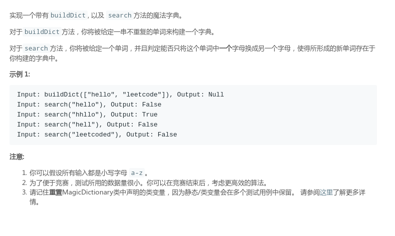
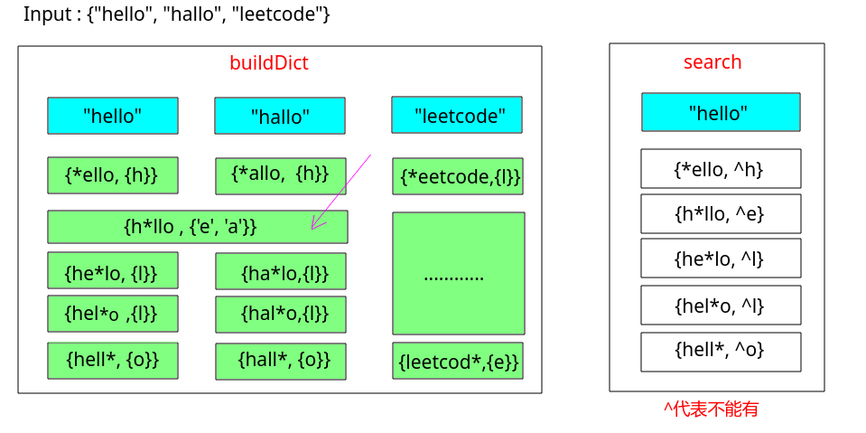
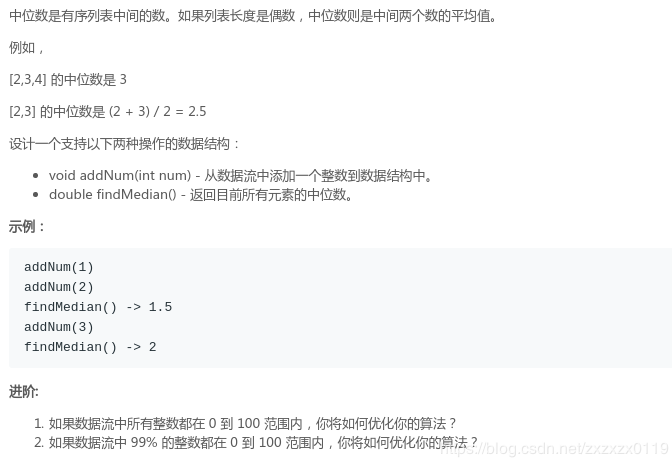

## LeetCode - 676. Implement Magic Dictionary & 295. Find Median from Data Stream
* [LeetCode-676. Implement Magic Dictionary](#1)
* [LeetCode-295. Find Median from Data Stream](#leetcode-295-find-median-from-data-stream)


***
### <font color = red id = "1">LeetCode-676. Implement Magic Dictionary
#### [题目链接](https://leetcode.com/problems/implement-magic-dictionary/)

> https://leetcode.com/problems/implement-magic-dictionary/

#### 题目

#### 解析 

两种解法: <font color = purple>**模糊搜索和利用字典树。**


<font color =purple>**模糊搜索:**


`buildDict`过程: 

* 准备一个`HashMap<String, HashSet<Character>>`，`key`存字符串，`val`存的是字符的集合；
* 其中`key`是在枚举每一个字符串的每一个位置，去掉原来的那个字符，然后用一个特殊字符加入进去，并把替换的字符加入`val`中的`set`集合。

`search`过程: 

* 查看在替换任意一个字符，之后的集合，且这个集合中不能包含替换的字符，或者可以包含但是`set.size() > 1`也行。



```java
class MagicDictionary {

    private HashMap<String, HashSet<Character>>magicMap;

    /** Initialize your data structure here. */
    public MagicDictionary() {
        magicMap = new HashMap<>();
    }

    /** Build a dictionary through a list of words */
    public void buildDict(String[] dict) {
        for(int i = 0; i < dict.length; i++){
            for(int j = 0; j < dict[i].length(); j++){
                String key = dict[i].substring(0, j) + "*" + dict[i].substring(j+1, dict[i].length());
                HashSet<Character>valSet = magicMap.get(key);
                if(valSet == null)
                    valSet = new HashSet<>();
                valSet.add(dict[i].charAt(j));
                magicMap.put(key, valSet);
            }
        }
    }

    /** Returns if there is any word in the trie that equals to the given word after modifying exactly one character */
    public boolean search(String word) {
        for(int i = 0; i < word.length(); i++){
            String key = word.substring(0, i) + "*" + word.substring(i+1, word.length());
            HashSet<Character>valSet = magicMap.get(key);
            if(valSet == null)
                continue;
            // 只要有一个满足这种情况就可以了 注意第二种情况,例如查询 hello，之前map里如果有hello, hallo (valSet.size() > 1)也是可以的
            if(!valSet.contains(word.charAt(i)) || valSet.size() > 1)
                return true;
        }
        return false;
    }
}
```

<font color =purple>**字典树写法**

字典树基础可以看[这里](https://blog.csdn.net/zxzxzx0119/article/details/81134479)。

插入没什么好说的，建立字典树即可，`search`的过程要维护一个`isOneDiff`变量。表示的是<font color = blue>当前是否已经有一个不同了。</font>然后`dfs`即可。


```java
class MagicDictionary {

    private class Node{
        public boolean end;
        public Node[] nexts;
        public Node() {
            end = false;
            this.nexts = new Node[26];
        }
    }

    private class Trie{

        private Node root;

        public Trie() {
            this.root = new Node();
        }

        public void insert(String word){
            Node cur = root;
            for(int i = 0; i < word.length(); i++){
                int index = word.charAt(i) - 'a';
                if(cur.nexts[index] == null)
                    cur.nexts[index] = new Node();
                cur = cur.nexts[index];
            }
            cur.end = true;
        }
    }

    private Trie trie;

    public MagicDictionary() {
        trie = new Trie();
    }

    public void buildDict(String[] dict) {
        for(int i = 0; i < dict.length; i++)
            trie.insert(dict[i]);
    }

    public boolean search(String word) {
        return rec(trie.root, word,  0, false);
    }

    public boolean rec(Node node, String word, int i, boolean isOneDiff){
        if(i == word.length() && node.end && isOneDiff)
            return true;
        else if(i == word.length())
            return false;
        int index = word.charAt(i) - 'a';
        for(int k = 0; k < 26; k++){
            if(node.nexts[k] == null)
                continue;
            if(k == index && !isOneDiff){
                if(rec(node.nexts[k], word, i+1, false))
                    return true;
            } else if(k == index && isOneDiff){
                if(rec(node.nexts[k], word, i+1, true))
                    return true;
            }else if(k != index && !isOneDiff){
                if(rec(node.nexts[k], word, i+1, true))
                    return true;
            }
            // k!=index && isOneDiff shouldn't be consider
        }
        return false;
    }
}
```

***

### <font color= red id = "2">LeetCode-295. Find Median from Data Stream

#### [题目链接](https://leetcode.com/problems/find-median-from-data-stream/)

> https://leetcode.com/problems/find-median-from-data-stream/

#### 题目

#### 解析
准备两个堆: 一个最大堆(`maxHeap`)，一个最小堆`minHeap`。

* 最大堆存储较小元素的一半，最大堆存储较大元素的一半；
* 添加元素后，始终要维持<font color = red>要么两个堆的元素相等，要么左边的堆(`maxHeap`)元素比右边多一个；</font>
* 如果不是上面两种情况，就要在添加元素之后维护；
* `findMedian`函数: 查询时，如果两个堆的元素个数相等就返回两个堆顶的元素的和除以一半，否则返回`maxHeap.peek()`； 

看一个例子: 
|num|smaller(<font color = red>maxHeap</font>)|bigger(<font color = red>minHeap</font>)|median|
|-|-|-|-|
|5|5||5.0|
|8|<font color = red>5|<font color = red>8|6.5|
|2|[2、<font color = red>5</font>]|8|5|
|11|[2、<font color = red>5</font>]|[<font color = red>8</font>、11]|6.5|
|3|[2、3、<font color = red>5</font>]|[8、11]|5|
|4|[2、3、4、5]|[8、11]|<font color = blue>先调整|
||[2、3、<font color = red>4</fonT>]|[<font color = red>5</fonT>、8、11]|4.5|
|14|[2、3、4]|[5、8、11、14]|<font color = blue>先调整|
||[2、3、4、<font color = red>5</font>]|[8、11、14]|5|


```java
class MedianFinder {

    private PriorityQueue<Integer>maxHeap; // 第一个(更小的)是最大堆 (左边的)
    private PriorityQueue<Integer>minHeap; // 第二个(更大的)是最小堆 (右边的)
   
    public MedianFinder() {
        maxHeap = new PriorityQueue<>((o1, o2) -> o2 - o1);
        minHeap = new PriorityQueue<>(); // java默认是最小堆 (堆顶最小)
    }

    public void addNum(int num) {
        if(maxHeap.isEmpty() || (!maxHeap.isEmpty() && num <= maxHeap.peek()))
            maxHeap.add(num);
        else
            minHeap.add(num);

        if(maxHeap.size() < minHeap.size())
            maxHeap.add(minHeap.poll());
        else if(maxHeap.size() - minHeap.size() == 2)
            minHeap.add(maxHeap.poll());
    }

    public double findMedian() {
        if(maxHeap.size() == minHeap.size())
            return (maxHeap.peek() + minHeap.peek())/2.0;
        else    // minHeap.size() = maxHeap.size() + 1;
            return maxHeap.peek();
    }
}
```

