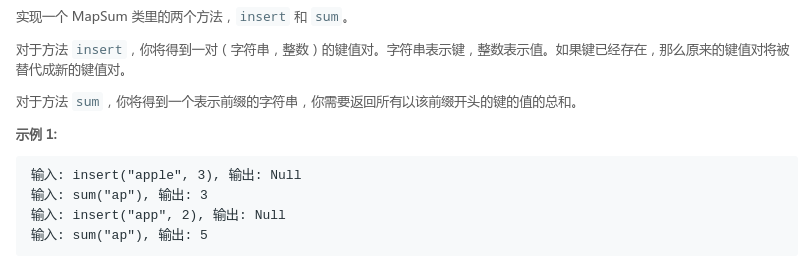
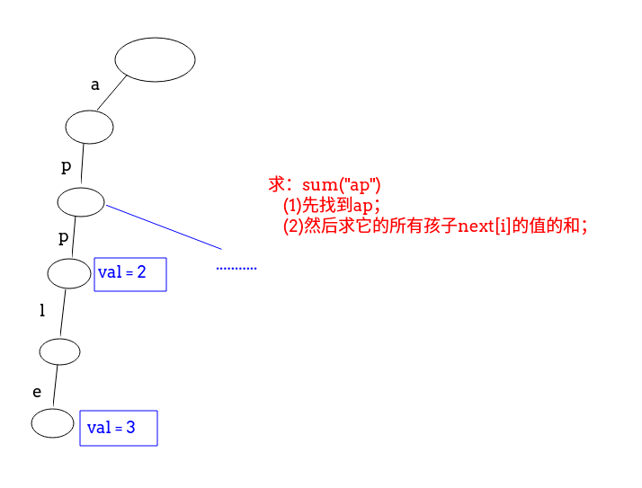

## LeetCode - 677. Map Sum Pairs(键值映射)(字典树变形)
#### [题目链接](https://leetcode.com/problems/map-sum-pairs/description/)

> https://leetcode.com/problems/map-sum-pairs/description/

#### 题目

#### 解析
<font color = red>做这题之前先学[字典树基础](https://blog.csdn.net/zxzxzx0119/article/details/81134479)。这个题目和普通字典树不同的是结点内部存放的是`val`，一个具体的值，不是`path`和`end`。

 - `insert()`也没什么好说的，注意找到末尾结点之后，维护`val`；
 - **注意求这里的`sum`，分为两部，第一步先找到对应字符串的结尾结点，然后使用递归来求解它所有孩子的结点的值的和；**




```java
class MapSum {
    
    private class Node{
        public int val;
        public Node[] next;//使用整数表示字符　c - 'a'

        public Node() {
            val = 0;
            next = new Node[26];
        }
    }

    private Node root;

    public MapSum() {
        root = new Node();
    }

    public void insert(String key, int val) {
        if(key == null)
            return;
        Node cur = root;
        int index = 0;
        for(int i = 0; i < key.length(); i++){
            index = key.charAt(i) - 'a';
            if(cur.next[index] == null)
                cur.next[index] = new Node();
            cur = cur.next[index];
        }
        cur.val = val;
    }

    public int sum(String prefix) {
        if(prefix == null)
            return 0;
        Node cur = root;
        int index = 0;
        for(int i = 0; i < prefix.length(); i++){
            index = prefix.charAt(i) - 'a';
            if(cur.next[index] == null)
                return 0;
            cur = cur.next[index];
        }

        //开始递归求解　所有孩子的值的和
        return process(cur);
    }

    public int process(Node node){
        if(node == null)
            return 0;
        int sum = node.val;
        for(Node cur : node.next){
            sum += process(cur);
        }
        return sum;
    }
}
```


使用`HashMap`来替代数组`next`的写法: 

```java
class MapSum {

    private class Node{
        public int val;
        public HashMap<Character, Node> nexts;

        public Node() {
            val = 0;
            nexts = new HashMap<>();
        }
    }

    private Node root;

    public MapSum() {
        root = new Node();
    }

    public void insert(String key, int val) {
        if(key == null)
            return;
        Node cur = root;
        for(int i = 0; i < key.length(); i++){
            char c = key.charAt(i);
//            Node nxt = cur.nexts.get(c);
//            if(nxt == null) {
//                nxt = new Node();
//                cur.nexts.put(c, nxt);
//            }
            cur.nexts.computeIfAbsent(c, k -> new Node());
            cur = cur.nexts.get(c);
        }
        cur.val = val;
    }

    public int sum(String prefix) {
        if(prefix == null)
            return 0;
        Node cur = root;
        int index = 0;
        for(int i = 0; i < prefix.length(); i++){
            char c = prefix.charAt(i);
            if(cur.nexts.get(c) == null)
                return 0;
            cur = cur.nexts.get(c);
        }
        //开始递归求解　所有孩子的值的和
        return process(cur);
    }

    public int process(Node node){
        if(node == null)
            return 0;
        int sum = node.val;
        for(Map.Entry<Character, Node>entry : node.nexts.entrySet()){
            sum += process(entry.getValue());
        }
        return sum;
    }
}

```

