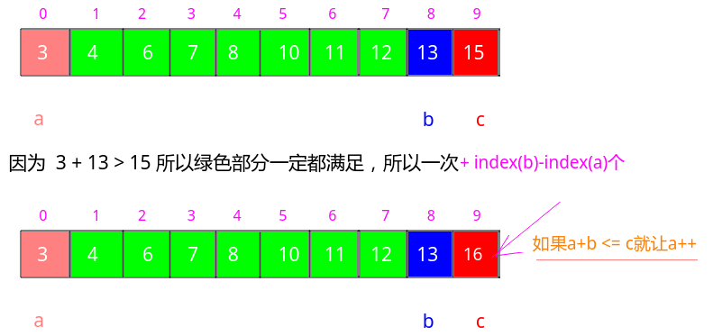

## LeetCode - 204 Count Primes & 611 - Valid Triangle Number

* [LeetCode - 204 Count Primes](#1)
* [LeetCode - 611 - Valid Triangle Number](#leetcode---611---valid-triangle-number)

***

### <font color = red id = "1">LeetCode - 204 Count Primes
#### [题目链接](https://leetcode.com/problems/count-primes/)

> https://leetcode.com/problems/count-primes/

#### 题目大意
筛选`0~n`(`[0，n)`)之间的素数个数。

#### 解析
如果用经典的判断素数，时间复杂度为`O(n*sqrt(n))`，会超时。

于是使用经典的[**埃拉托斯特尼筛法(有动图演示)**](https://zh.wikipedia.org/wiki/%E5%9F%83%E6%8B%89%E6%89%98%E6%96%AF%E7%89%B9%E5%B0%BC%E7%AD%9B%E6%B3%95)，有关素数也可以看我[另一篇博客](https://blog.csdn.net/zxzxzx0119/article/details/82810246)讲解。

超时: 
```java
class Solution {
    //TLE
    public boolean isPrime(int nums){
        if(nums == 0 || nums == 1)
            return false;
        for(int i = 2; i <= (int)Math.sqrt(nums); i++){ // <= not < 
            if(nums%i == 0)
                return false;
        }
        return true;
    }
    
    public int countPrimes(int n) {
        int res = 0;
        for(int i = 0; i < n; i++){
            if(isPrime(i))
                res++;
        }
        return res;
    }
}
```
正解: 
```java
class Solution {
    public int countPrimes(int n) {
        if(n < 3)
            return 0;
        int res = 0;
        boolean[] isPrime = new boolean[n];
        Arrays.fill(isPrime,true);
        isPrime[0] = isPrime[1] = false;
        for(int i = 2; i < n; i++){
            if(isPrime[i]){
                res++;
                for(int j = 2*i; j < n; j+=i) //筛选
                    isPrime[j] = false;
            }
        }
        return res;
    }
}
```

***


### <font color = red id = "2">LeetCode - 611 - Valid Triangle Number

#### [题目链接](https://leetcode.com/problems/valid-triangle-number/)

> https://leetcode.com/problems/valid-triangle-number/

#### 题目大意
给定一个包含非负整数的数组，统计其中可以组成三角形三条边的三元组个数。

#### 解析
很巧妙的方法，使用贪心: 

* 先对数组排序（升序降序都可以，这里按照升序排列）；
* 然后初始化`c=num.length - 1`，`b = c-1`，`a = 0`，然后如果`arr[a]  + arr[b] > arr[c]`，那么所有`arr[a ~ b-1]`和`arr[b]`、`arr[c]`之间都可以构成三角形，所以可以加上`b-a`个；
* 否则说明`a`小了，就让`a++`，知道`a == b`退出；


```java
class Solution {
    public int triangleNumber(int[] nums) {
        if(nums == null || nums.length < 3)
            return 0;
        int res = 0;
        Arrays.sort(nums);
        for(int c = nums.length-1; c >= 2; c--){
            for(int b = c-1; b >= 1; b--){
                int a = 0;
                while(a < b){
                    if(nums[a] + nums[b] > nums[c]){
                        res += b-a;
                        break;
                    }
                    a++;
                }
            }
        }
        return res;
    }
}
```

```java
class Solution {
    // more fast
    public int triangleNumber(int[] nums) {
        if(nums == null || nums.length < 3)
            return 0;
        int res = 0;
        Arrays.sort(nums);
        for(int c = nums.length-1; c >= 2; c--){
            int a = 0,b = c-1;
            while(a < b){
                if(nums[a] + nums[b] > nums[c]){
                    res += b-a;
                    b--;
                }else a++;
            }
        }
        return res;
    }
}
```

***
