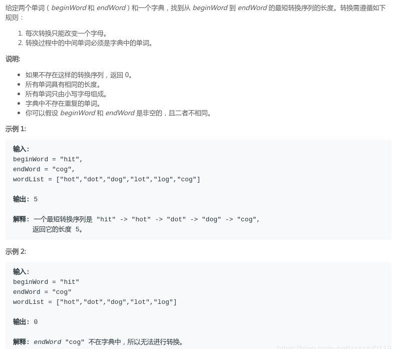
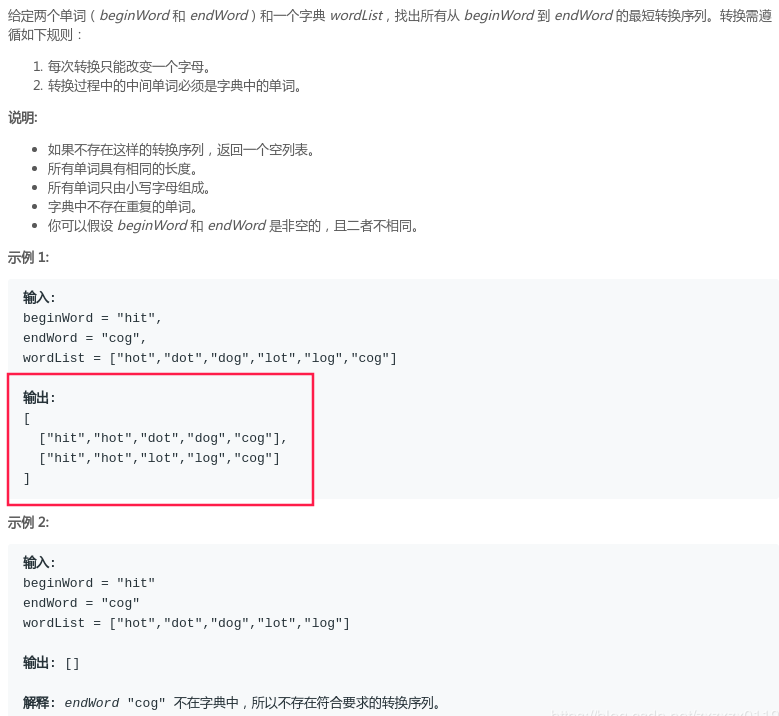
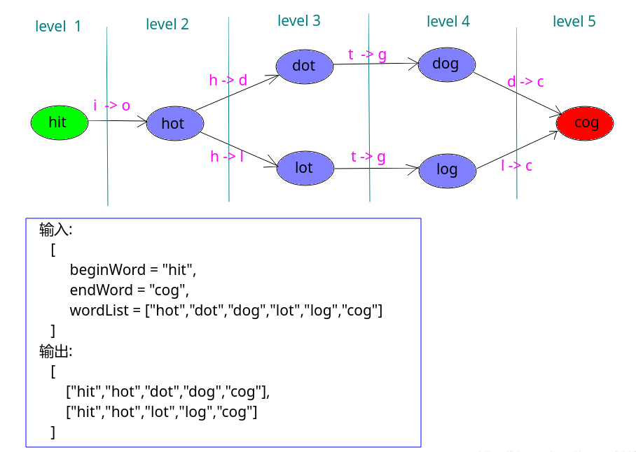

## LeetCode - 127. Word Ladder & 126 (BFS)
* [LeetCode - 127. Word Ladder](#1)
* [LeetCode - 126. Word LadderII](#leetcode---126-word-ladderII)

***

### <font color = red id = "1">LeetCode - 127. Word Ladder
#### [题目链接](https://leetcode.com/problems/word-ladder/)

> https://leetcode.com/problems/word-ladder/

#### 题目

#### 解析
两种解法: 单向`BFS`和双向`BFS`(`Bidrectional BFS`)。

单向BFS:

* 首先将`wordDict`转换成`Set`集合(记为`dict`)，这样查找更快，不然会`TLE`；
* 每次尝试更改一个字符(`a ~ z`)，然后去判断是否这个在`dict`中，如果可以，加入队列；

第一版: 
```java
class Solution {
    
    private class State {
        public String word;
        public int step;

        public State(String word, int step) {
            this.word = word;
            this.step = step;
        }
    }

    public int ladderLength(String beginWord, String endWord, List<String> wordList) {
        HashSet<String> dict = new HashSet<>(wordList); // 将wordList转换成HashSet查找更快
        return bfs(new State(beginWord, 0), new State(endWord, 0), dict) + 1;
    }

    private int bfs(State begin, State end, Set<String> dict) {
        Queue<State> queue = new LinkedList<>();
        queue.add(begin);
        HashMap<String, Boolean> visMap = new HashMap<>();
        visMap.put(begin.word, true);
        while (!queue.isEmpty()) {
            State cur = queue.poll();
            if (cur.word.equals(end.word))
                return cur.step;
            for (int i = 0; i < cur.word.length(); i++) {
                StringBuilder sb = new StringBuilder(cur.word);
                for (char c = 'a'; c <= 'z'; c++) {
                    if (cur.word.charAt(i) == c)
                        continue;
                    sb.setCharAt(i, c);
                    if (visMap.get(sb.toString()) == null && dict.contains(sb.toString())) {
                        visMap.put(sb.toString(), true);
                        queue.add(new State(sb.toString(), cur.step + 1));
                    }
                }
            }
        }
        return -1;
    }
}
```
第二版: 没有使用`visMap`，而是当一个字符串(节点)，已经被访问过了之后，就从`dict`中移除即可。

```java
class Solution {
    
    private class State {
        public String word;
        public int step;

        public State(String word, int step) {
            this.word = word;
            this.step = step;
        }
    }

    public int ladderLength(String beginWord, String endWord, List<String> wordList) {
        HashSet<String> dict = new HashSet<>(wordList); // 将wordList转换成HashSet查找
        return bfs(new State(beginWord, 0), new State(endWord, 0), dict) + 1;
    }

    private int bfs(State begin, State end, Set<String> dict) {
        Queue<State> queue = new LinkedList<>();
        queue.add(begin);
        while (!queue.isEmpty()) {
            State cur = queue.poll();
            if (cur.word.equals(end.word))
                return cur.step;
            for (int i = 0; i < cur.word.length(); i++) {
                StringBuilder sb = new StringBuilder(cur.word);
                for (char c = 'a'; c <= 'z'; c++) {
                    if (cur.word.charAt(i) == c)
                        continue;
                    sb.setCharAt(i, c);
                    if (dict.contains(sb.toString())) {
                        queue.add(new State(sb.toString(), cur.step + 1));
                        dict.remove(sb.toString()); // 直接移除这个就好，不需要使用一个HashMap
                    }
                }
            }
        }
        return -1;
    }
}
```
第三版:  将结构体去掉。
```java
class Solution {
    public int ladderLength(String beginWord, String endWord, List<String> wordList) {
        HashSet<String> dict = new HashSet<>(wordList);
        // start bfs
        Queue<String> queue = new LinkedList<>();
        queue.add(beginWord);
        int level = 0;// 层数
        while (!queue.isEmpty()) {
            level++;
            int qsize = queue.size(); // 一定要定义一个变量，不能在下面的循环中直接写queue.size(),因为会变化
            for(int size = 0; size < qsize; size++){ //当前这一层的节点的数目
                String cur = queue.poll();
                for (int i = 0; i < cur.length(); i++) {
                    StringBuilder sb = new StringBuilder(cur);
                    for (char c = 'a'; c <= 'z'; c++) {
                        if (cur.charAt(i) == c)
                            continue;
                        sb.setCharAt(i, c);
                        if (dict.contains(sb.toString())) {
                            if(sb.toString().equals(endWord))
                                return level + 1;
                            queue.add(sb.toString());
                            dict.remove(sb.toString());
                        }
                    }
                }
            }
        }
        return 0;
    }
}
```

<font color  = red>双向BFS


* 用两个集合`Set`，分别从两边开始搜索(代码上是从一边，但是交换两个集合)；
* 这样的话，返回的条件就是当前扩展的节点如果在`endSet`中有就返回；


注意` dict.removeAll(beginSet);`这一样，是将`beginSet`原来的单词从`dict`中移除掉，而不能在循环中`dict.remove(next); `，因为可能会移除掉对面`endSet`中的元素，导致失败。


```java
class Solution{
    public int ladderLength(String beginWord, String endWord, List<String> wordList) {
        HashSet<String> dict = new HashSet<>(wordList);
        if (!dict.contains(endWord))
            return 0;
        HashSet<String> beginSet = new HashSet<>();
        HashSet<String> endSet = new HashSet<>();

        beginSet.add(beginWord);
        endSet.add(endWord);
        int step = 0;
        while (!beginSet.isEmpty() && !endSet.isEmpty()) {
            ++step;
            if (beginSet.size() > endSet.size()) {
                HashSet<String> hs = beginSet;
                beginSet = endSet;
                endSet = hs;
            }
            HashSet<String> nextSet = new HashSet<>();
            for (String cur : beginSet)  {
                char[] chs = cur.toCharArray();
                for (int i = 0; i < chs.length; i++) {
                    char old = chs[i];
                    for (char c = 'a'; c <= 'z'; c++) {
                        chs[i] = c;
                        String next = String.valueOf(chs);
                        if (dict.contains(next)) {
                            if (endSet.contains(next))
                                return step + 1;
                            nextSet.add(next);
                           // dict.remove(next); //不能这样
                        }
                    }
                    chs[i] = old;
                }
            }
            dict.removeAll(beginSet);
            beginSet = nextSet;
        }
        return 0;
    }
}
```
也可以将上面的方法改成递归:

```java
class Solution {
    public int ladderLength(String beginWord, String endWord, List<String> wordList) {
        Set<String> beginSet = new HashSet<>();
        Set<String> endSet = new HashSet<>();
        beginSet.add(beginWord);
        endSet.add(endWord);
        Set<String> dict = new HashSet<>(wordList);
        if(!dict.contains(endWord)) 
            return 0;
        return bfs(beginSet, endSet, dict, 0);
    }
    
    private int bfs(Set<String> beginSet, Set<String> endSet, Set<String> dict, int step){
        if(beginSet.isEmpty() || endSet.isEmpty()) 
            return 0;
        step++;
        dict.removeAll(beginSet);
        Set<String> nextSet = new HashSet<>();
        for(String str : beginSet){
            char[] chs = str.toCharArray();
            for(int i = 0; i < chs.length; i++){
                char old = chs[i];
                for(char c = 'a'; c <= 'z'; c++){
                    chs[i] = c;
                    String next = new String(chs);
                    if(!dict.contains(next)) continue;
                    if(endSet.contains(next)) return step + 1;
                    nextSet.add(next);
                }
                chs[i] = old;
            }
        }
        return nextSet.size() > endSet.size() ? bfs(endSet, nextSet, dict, step) : bfs(nextSet, endSet, dict, step);
    }
}
```

***
### <font color = red id = "2">LeetCode - 126. Word LadderII
#### [题目链接](https://leetcode.com/problems/word-ladder-ii/)
#### 题目

#### 解析
单向`BFS`解法: 

* 记录当前扩展的`next`的`parent`是`cur`即可；
* 但是这里每个`next`可能有多个`parent`，所以在循环中，不能先移除`dict.remve(next)`，而是使用一个`set`集合`used`数组先标记，退出这次循环之后再一次性移除；
* 最后从`endWord`往前`DFS`求出路径即可(中间集合使用`LinkedList`(可以支持头部插入))；



使用单向`BFS + DFS`: 
```java
class Solution {

    public List<List<String>> findLadders(String beginWord, String endWord, List<String> wordList) {
        List<List<String>> res = new ArrayList<>();
        if (wordList == null || wordList.isEmpty())
            return res;
        Set<String> dict = new HashSet<>(wordList);
        if (!dict.contains(endWord))
            return res;
        dict.remove(beginWord);

        Set<String> used = new HashSet<>();  //不能像前一题一样，找到一个就移除一个，而是搞完一层，才一次性移除
        Map<String, HashSet<String>> parents = new HashMap<>(); //当前节点(单词)的所有的父亲
        Queue<String> queue = new LinkedList<>();
        queue.add(beginWord);
        boolean found = false;
        while (!queue.isEmpty() && !found) {
            int qsize = queue.size();
            for (int size = 0; size < qsize; size++) {
                String cur = queue.poll();
                for (int i = 0; i < cur.length(); i++) {
                    char[] chs = cur.toCharArray();
                    for (char c = 'a'; c <= 'z'; c++) {
                        if (c == chs[i])
                            continue;
                        chs[i] = c;
                        String next = new String(chs);
                        if (!dict.contains(next))
                            continue;
                        if (next.equals(endWord))  // 就算找到了，还是要做完当前这一层
                            found = true;
                        queue.add(next);
                        parents.computeIfAbsent(next, k -> new HashSet<>()).add(cur);// next的其中一个父亲为cur
                        used.add(next);// 只是记录，而不是直接dict.remove(next)
                    }
                }
            }
            dict.removeAll(used);  // 不能像前一题单向那样直接在循环里面移除 next, 而是在这里(这一层结束之后)，才移除，不然会丢失路径 例如 : dog->cog, log->cog
            used.clear();
        }
        if (!found)
            return res;

		//DFS从节点的parent集合中求解答案
        LinkedList<String> list = new LinkedList<>(); // 中间变量
        list.add(endWord);
        dfs(parents, res, endWord, beginWord, list); //backtrack from the endWord(child) to beginWord(parent)
        return res;
    }

    private void dfs(Map<String, HashSet<String>> parents, List<List<String>> res,
                     String curStr, String beginWord, LinkedList<String> list) {
        if (curStr.equals(beginWord)) { //到了起点， 找到一条了
            res.add(new ArrayList<>(list));
            return;
        }
        for (String parent : parents.get(curStr)) {
            list.addFirst(parent);   // 注意是加到开头
            dfs(parents, res, parent, beginWord, list);
            list.removeFirst();      // backtrack
        }
    }
}
```

另外可以添加一个`Map<String, Integer> steps`记录每一个节点的最短路径长度(层数) (<font color = blue>这题不需要</font>):

测试:

```java
import java.util.*;

public class Solution {

    public List<List<String>> findLadders(String beginWord, String endWord, List<String> wordList) {
        List<List<String>> res = new ArrayList<>();
        if (wordList == null || wordList.isEmpty())
            return res;
        Set<String> dict = new HashSet<>(wordList);
        if (!dict.contains(endWord))
            return res;
        dict.remove(beginWord);

        Set<String> used = new HashSet<>();  //不能像前一题一样，找到一个就移除一个，而是搞完一层，才一次性移除
        Map<String, HashSet<String>> parents = new HashMap<>(); //当前单词的所有的父亲
        Map<String, Integer> steps = new HashMap<>(); // 扩展到当前单词所需要的最小步数
        Queue<String> queue = new LinkedList<>();
        queue.add(beginWord);
        boolean found = false;
        int step = 0;
        while (!queue.isEmpty() && !found) {
            int qsize = queue.size();
            ++step;
            for (int size = 0; size < qsize; size++) {
                String cur = queue.poll();
                for (int i = 0; i < cur.length(); i++) {
                    char[] chs = cur.toCharArray();
                    for (char c = 'a'; c <= 'z'; c++) {
                        if (c == chs[i])
                            continue;
                        chs[i] = c;
                        String next = new String(chs);
                        if (!dict.contains(next))
                            continue;
                        if (next.equals(endWord))  // 就算找到了，还是要做完当前这一层
                            found = true;
                        queue.add(next);
                        steps.put(next, step + 1);
                        parents.computeIfAbsent(next, k -> new HashSet<>()).add(cur);
                        used.add(next);
                    }
                }
            }
            dict.removeAll(used);  // 不能像前一题那样直接在循环里面移除 next, 而是在这里(这一层结束之后)，才移除，不然会丢失路径 例如 : dog->cog, log->cog
            used.clear();
        }
        if (!found)
            return res;
        LinkedList<String> list = new LinkedList<>(); // 中间变量
        list.add(endWord);
        dfs(parents, res, endWord, beginWord, list); //backtrack from the endWord(child) to beginWord(parent)

        System.out.println(steps); //输出 steps
        return res;
    }

    private void dfs(Map<String, HashSet<String>> parents, List<List<String>> res,
                     String curStr, String beginWord, LinkedList<String> list) {
        if (curStr.equals(beginWord)) { //到了起点， 找到一条了
            res.add(new ArrayList<>(list));
            return;
        }
        for (String parent : parents.get(curStr)) {
            list.addFirst(parent);   // 注意是加到开头
            dfs(parents, res, parent, beginWord, list);
            list.removeFirst();      // backtrack
        }
    }


    public static void main(String[] args) {
        String beginWord = "hit";
        String endWord = "cog";
        List<String> wordList = Arrays.asList("hot", "dot", "dog", "lot", "log", "cog");

        System.out.println(new Solution().findLadders(beginWord, endWord, wordList));
    }
}
```
输出:

```java
{lot=3, log=4, dot=3, cog=5, hot=2, dog=4}
[[hit, hot, lot, log, cog], [hit, hot, dot, dog, cog]]
```

***
