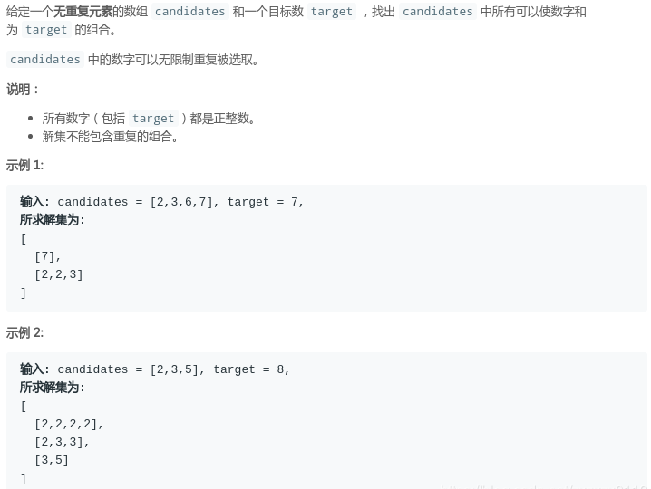

### LeetCode - 39. Combination Sum (组合总和 | dfs)

#### [题目链接](https://leetcode.com/problems/combination-sum/)

> https://leetcode.com/problems/combination-sum/

#### 题目


#### 解析


**先看通过`dfs`求解排列数和组合数的代码。**

①`dfs`求解<font color = blue>排列数

之前也做过一个求排列数的例题。
[**LeetCode-46. Permutations用dfs排列数**](https://blog.csdn.net/zxzxzx0119/article/details/81452269#t4)


```java
import java.io.*;
import java.util.*;

public class Main{
    
    static List<List<Integer>>res; 

    static void dfs(int[] nums, int d, int n, boolean[] used, ArrayList<Integer>curr){
        if(d == n){ 
            res.add(new ArrayList<>(curr));
            return;
        }
        for(int i = 0; i < nums.length; i++){ 
            if(!used[i]){ // 第i个元素没有使用过 
                used[i] = true;
                curr.add(nums[i]);
                dfs(nums, d + 1, n, used, curr);
                curr.remove(curr.size()-1);
                used[i] = false;
            }
        }
    }

    public static void main(String[] args) {
        PrintStream out = System.out;

        int[] arr = {2, 1, 3};

        res = new ArrayList<>();        
        dfs(arr, 0, 3, new boolean[arr.length], new ArrayList<>()); // 从3个数中取3个数的排列
        out.println(res);

        out.println("-------------------------------");

        res = new ArrayList<>();
        dfs(arr, 0, 2, new boolean[arr.length], new ArrayList<>());// 从3个数中取2个数的排列
        out.println(res);
    }
}
```

输出：
```c
[[2, 1, 3], [2, 3, 1], [1, 2, 3], [1, 3, 2], [3, 2, 1], [3, 1, 2]]
-------------------------------
[[2, 1], [2, 3], [1, 2], [1, 3], [3, 2], [3, 1]]
```

②`dfs`求解<font color = blue>组合数

<font color = red>注意这里的`d`和`cur`意义不同:

* <font color = green>`d`表示的还是层数，当`d == n`时，就达到了`n`个数，就可以将中间结果加入结果集；
* 而`cur`存在意义就是因为组合和排列不同，不需要判断前面是否使用过（不会考虑顺序），而是只会选取指定的数，而不考虑顺序，所以`cur`表示的是当前已经选取到了这个位置，下面的选择是从`cur ~ arr.length`选择即可。这样一定不会选择重复的元素；
```java
import java.io.*;
import java.util.*;

public class Main{
    
    static List<List<Integer>>res; 

    static void dfs(int[] nums, int d, int cur, int n, ArrayList<Integer>curr){
        if(d == n){ 
            res.add(new ArrayList<>(curr));
            return;
        }
        for(int i = cur; i < nums.length; i++){ 
            curr.add(nums[i]); //当前 d 层元素为nums[i]
            dfs(nums, d+1, i+1, n, curr); //去考虑d+1以及后面的层
            curr.remove(curr.size()-1);
        }
    }

    public static void main(String[] args) {
        PrintStream out = System.out;

        int[] arr = {2, 1, 3};

        res = new ArrayList<>();        
        dfs(arr, 0, 0, 3, new ArrayList<>()); // 从3个数中取3个数的组合(不是排列)
        out.println(res);

        out.println("-------------------------------");

        res = new ArrayList<>();
        dfs(arr, 0, 0, 2, new ArrayList<>());// 从3个数中取2个数的组合(不是排列)
        out.println(res);
    }
}

```

输出:

```c
[[2, 1, 3]]
-------------------------------
[[2, 1], [2, 3], [1, 3]]
```

<font color = red>**本题和求解组合数有几分类似，但是却不是完全相同:**

* 本题可以有重复元素，所以在递归的时候不能选择`i+1`（下一个元素），而是需要选择当前的`i`；
* 那这样不就死循环了吗?，所以我们在选择当前`nums[i]`的时候，先检查当前累加`curSum + nums[i] > target`，如果满足，则当前`nums[i]`就不考虑了，考虑下一个，所以这样就不会死循环；
* 且这里的递归终止条件就不是元素个数了，而是当前的累加和`curSum == target`；


```java
import java.io.*;
import java.util.*;

class Solution {

    private List<List<Integer>>res;

    private void dfs(int[] nums, int target, int curSum, int cur, List<Integer>curr){ 
        if(curSum == target){ 
            res.add(new ArrayList<>(curr));
            return;
        }
        for(int i = cur; i < nums.length; i++){ 
            if(curSum + nums[i] > target) continue; // 一定要有终止条件，不然会死循环
            curr.add(nums[i]);
            dfs(nums, target, curSum + nums[i], i, curr); // 注意不是i+1，因为可以有重复的元素
            curr.remove(curr.size()-1);
        }
    }

    public List<List<Integer>> combinationSum(int[] candidates, int target) {
        res = new ArrayList<>();
        if(candidates == null || candidates.length == 0)
            return res;
        dfs(candidates, target, 0, 0, new ArrayList<>());
        return res;
    }


    public static void main(String[] args){ 
        PrintStream out = System.out;

        int[] nums = {2, 3, 6, 7};
        int target = 7;

        out.println(new Solution().
                combinationSum(nums, target)
        );
    }
}
```

剪枝，先对数组排序，然后递归函数循环中可以将`continue`改成`break`，这样速度快了很多:

```java
import java.io.*;
import java.util.*;

class Solution {

    private List<List<Integer>>res;

    private void dfs(int[] nums, int target, int curSum, int cur, List<Integer>curr){ 
        if(curSum == target){ 
            res.add(new ArrayList<>(curr));
            return;
        }
        for(int i = cur; i < nums.length; i++){ 
            if(curSum + nums[i] > target) break; // 因为排序了，所以这里是break，不是continue，这样可以加速(剪枝)
            curr.add(nums[i]);
            dfs(nums, target, curSum + nums[i], i, curr); // 注意不是i+1，因为可以有重复的元素
            curr.remove(curr.size()-1);
        }
    }

    public List<List<Integer>> combinationSum(int[] candidates, int target) {
        res = new ArrayList<>();
        if(candidates == null || candidates.length == 0)
            return res;
        Arrays.sort(candidates); //先排序
        dfs(candidates, target, 0, 0, new ArrayList<>());
        return res;
    }


    public static void main(String[] args){ 
        PrintStream out = System.out;

        int[] nums = {2, 3, 6, 7};
        int target = 7;

        out.println(new Solution().
                combinationSum(nums, target)
        );
    }
}
```

也可以将`curSum`累加和去掉，直接从`target ~ 0`去递归: 


```java
import java.io.*;
import java.util.*;

class Solution {

    private List<List<Integer>>res;

    private void dfs(int[] nums, int target, int cur, List<Integer>curr){ 
        if(0 == target){ 
            res.add(new ArrayList<>(curr));
            return;
        }
        for(int i = cur; i < nums.length; i++){ 
            if(nums[i] > target) break; //也是因为排序，所以不是continue而是break
            curr.add(nums[i]);
            dfs(nums, target-nums[i], i, curr); // 注意不是i+1，因为可以有重复的元素
            curr.remove(curr.size()-1);
        }
    }

    public List<List<Integer>> combinationSum(int[] candidates, int target) {
        res = new ArrayList<>();
        if(candidates == null || candidates.length == 0)
            return res;
        Arrays.sort(candidates);
        dfs(candidates, target, 0, new ArrayList<>());
        return res;
    }


    public static void main(String[] args){ 
        PrintStream out = System.out;

        int[] nums = {2, 3, 6, 7};
        int target = 7;

        out.println(new Solution().
                combinationSum(nums, target)
        );
    }
}
```

**另外，如果题目要求结果`res`里面的顺序是从短到长的，应该怎么做呢?**

例如第二个样例如果答案必须是第二种样子:


输入: `candidates = [2,3,5], target = 8`
解集为:

①
```c
[
  [2,2,2,2],
  [2,3,3],
  [3,5]
]
```
②(如果题目需要这样输出)
```c
[
  [3,5],
  [2,3,3],
  [2,2,2,2]
]
```


其实也不难，只需要在递归函数中增加两个参数`d、n`，和之前的组合数一样，`d`表示的当前深度，`n`表示的是需要凑多少个数，然后在主函数中，依次从`n = 1、n = 2，n = 3.....`去递归，这样求出的结果的集合的大小就是从小到大的。


```java
import java.io.*;
import java.util.*;

class Solution {

    private List<List<Integer>>res;

    private void dfs(int[] nums, int target, int d, int n, int cur, List<Integer>curr){ 
        if(d == n){
            if(target == 0)
                res.add(new ArrayList<>(curr));
            return;
        }
        for(int i = cur; i < nums.length; i++){ 
            if(nums[i] > target) break; //也是因为排序，所以不是continue而是break
            curr.add(nums[i]);
            dfs(nums, target-nums[i], d+1, n, i, curr); // 注意不是i+1，因为可以有重复的元素
            curr.remove(curr.size()-1);
        }
    }

    public List<List<Integer>> combinationSum(int[] candidates, int target) {
        res = new ArrayList<>();
        if(candidates == null || candidates.length == 0)
            return res;
        Arrays.sort(candidates);
        for(int n = 1; n <= target / candidates[0]; n++)// 大小从小到大
            dfs(candidates, target, 0, n, 0, new ArrayList<>());
        return res;
    }


    public static void main(String[] args){ 
        PrintStream out = System.out;

        int[] nums = {2, 3, 6, 7};
        int target = 7;

        out.println(new Solution().
                combinationSum(nums, target)
        );
    }
}
```

