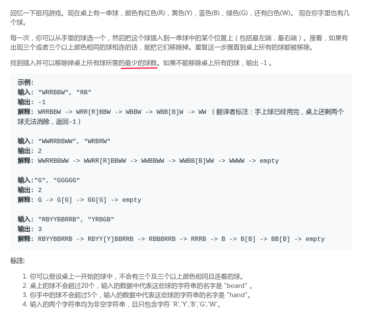
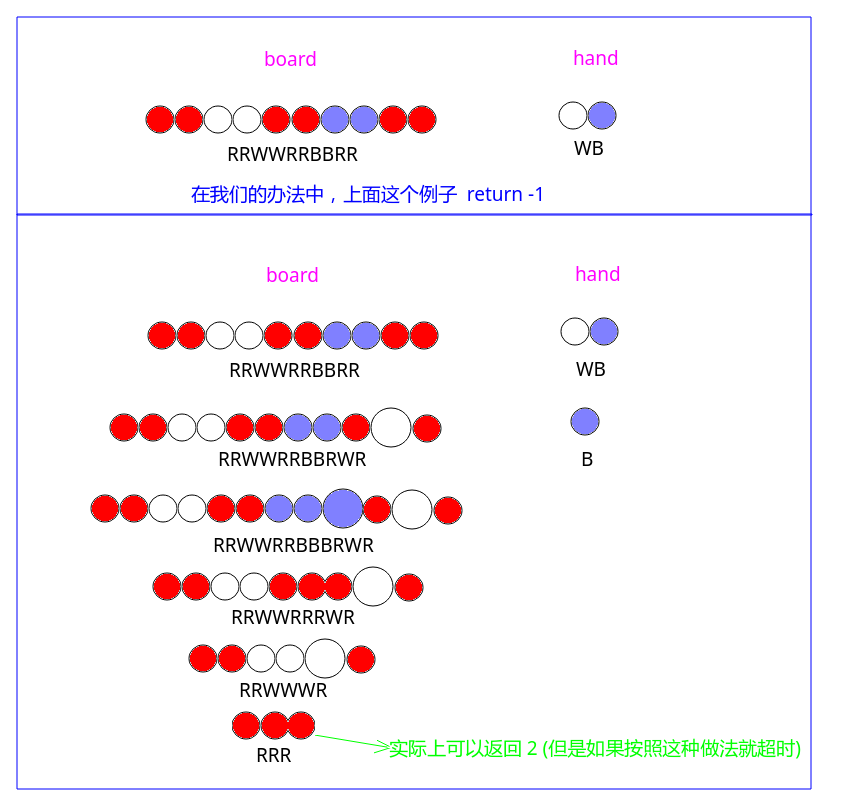

## LeetCode - 488. Zuma Game (DFS)

#### [题目链接](https://leetcode.com/problems/zuma-game/)

> https://leetcode.com/problems/zuma-game/

#### 题目


#### 解析

看题目中的三个例子: 


DFS过程:

* 先用一个`map`保存`hand`字符串中每种颜色的个数；
* `dfs`过程，遍历当前`board`字符串，逐个去寻找一段连续的相同的球，如果这段相同的球在`map`中还可以提供足够的消去的球，就先消去，这里需要消耗`3 - (j - i)`个球(具体看代码)；
* 然后先去递归消去剩下的(由`eliminate`函数求出消去之后剩下的字符串(连环消))，然后这种情况下消去的总消耗是`3 - (j - i)  + dfs(剩下的串)`，然后更新最小值即可；


```java
import java.io.*;
import java.util.*;

class Solution {

    private HashMap<Character, Integer>hMap; // hand中每个字符的数量

    public int findMinStep(String board, String hand) {
        if(board == null || hand == null)
            return 0;
        hMap = new HashMap<>();
//        for(char c : hand.toCharArray()){ 
//            if(!hMap.containsKey(c)) 
//                hMap.put(c, 1);
//            else
//                hMap.put(c, hMap.get(c) + 1);
//        }
        for(char c : hand.toCharArray())
            hMap.put(c, 1 + hMap.getOrDefault(c, 0));
        return dfs(board);
    } 

    private int dfs(String s){ 
        if("".equals(s))
            return 0;
        int res = 2 * s.length() + 1; // worst case, every character need 2 characters
        for(int i = 0; i < s.length(); ){ 
            char ch = s.charAt(i);
            int j = i+1; // continuous same length
            while(j < s.length() && ch == s.charAt(j))
                j++;
            // s[i] ~ s[j-1] have the same value
            int num = 3 - (j - i);
            Integer count = hMap.get(ch);
            if(count != null && count >= num){ // can eliminate 
                String ns = eliminate(s.substring(0, i) + s.substring(j));
                hMap.put(ch, count - num);  // update the map
                int r = dfs(ns);
                hMap.put(ch, hMap.get(ch) + num);  // backtrack
                if(r != -1)
                    res = Math.min(res, r + num);
            }
            i = j;  // next the same string
        }
        return res == 2 * s.length() + 1 ? -1 : res;
    }
    
	// example : "YWWRRRWWYY" -> "YWWWWYY" -> "YYY" --> ""
    private String eliminate(String s){
        for(int i = 0; i < s.length(); ){ 
            int j = i + 1;
            while(j < s.length() && s.charAt(i) == s.charAt(j))
                j++;
            if(j - i >= 3){   //subtract 
                s = s.substring(0, i) + s.substring(j);
                i = 0; // notice
            }else 
                i++;
        }
        return s;
    }

    public static void main(String[] args){ 
        PrintStream out = System.out;
        String board = "WWRRBBWW";
        String hand = "WRBRW";
        out.println(new Solution().
            findMinStep(board, hand)
        );
    }
}

```

将`map`改成数组: 
```java
import java.io.*;
import java.util.*;

class Solution {

    private int[] counts;

    public int findMinStep(String board, String hand) {
        if(board == null || hand == null)
            return 0;
        counts = new int[128];
        for(char c : hand.toCharArray())
            counts[c]++;
        return dfs(board);
    } 

    private int dfs(String s){ 
        if("".equals(s))
            return 0;
        int res = 2 * s.length() + 1; // worst case, every character need 2 character s;=
        for(int i = 0; i < s.length(); ){ 
            char ch = s.charAt(i);
            int j = i+1; // continuous same length
            while(j < s.length() && ch == s.charAt(j))
                j++;
            // s[i] ~ s[j-1] have the same value
            int num = 3 - (j - i);
            if(counts[ch] >= num) { // can eliminate 
                String ns = eliminate(s.substring(0, i) + s.substring(j));
                counts[ch] -= num;
                int r = dfs(ns);
                counts[ch] += num;
                if(r != -1)
                    res = Math.min(res, r + num);
            }
            i = j; // next the same string
        }
        return res == 2 * s.length() + 1 ? -1 : res;
    }

	// example : "YWWRRRWWYY" -> "YWWWWYY" -> "YYY" --> ""
    private String eliminate(String s){
        for(int i = 0; i < s.length(); ){ 
            int j = i + 1;
            while(j < s.length() && s.charAt(i) == s.charAt(j))
                j++;
            if(j - i >= 3){ //subtract 
                s = s.substring(0, i) + s.substring(j);
                i = 0; // notice
            }else 
                i++;
        }
        return s;
    }

    public static void main(String[] args){ 
        PrintStream out = System.out;
        String board = "WWRRBBWW";
        String hand = "WRBRW";
        out.println(new Solution().
            findMinStep(board, hand)
        );
    }
}
```

注意其实真正的祖玛游戏和这个题目有点偏差，这种方法我们每次都是如果`map`中有足够的球，就消去，也就是说，我们每次都会消去，但是实际游戏是我们可以在中间部分不消去，而是只摆法一个球，后面可以消去而节省步数。看下面的例子:

如果按照这种方式枚举每一个位置，会超时

