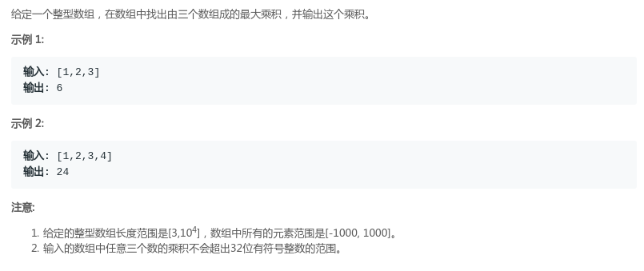

## LeetCode - 628. Maximum Product of Three Numbers(数组中三个数的最大累成积)(简单题)
* 排序方法
* O(N)方法

***
#### [题目链接](https://leetcode.com/problems/maximum-product-of-three-numbers/)

> https://leetcode.com/problems/maximum-product-of-three-numbers/

#### 题目

### 排序方法
很容易想到最大的累成积只有可能是<font color= red>**最大的三个数相乘`(max1 * max2 * max3)`**</font>或者<font color = blue>**`最大数(max1) * 最小的数(min1) * 次小的数(min2)`**</font> 。

于是第一种方法就是排序，然后找出这些数即可。

```java
class Solution {
    public int maximumProduct(int[] nums) {
        Arrays.sort(nums);
        return Math.max(nums[0] * nums[1] * nums[nums.length - 1],
                nums[nums.length - 1] * nums[nums.length - 2] * nums[nums.length - 3]
        );
    }
}
```

***
### O(N)的方法
很明显这题不会是用排序`N * logN`的复杂度，**其实只需要记录几个变量就可以找出这五个值**，于是下面的代码是很容易写出来的，遍历三次，每次`O(N)`，显然这种办法有点累赘，可以从 `3 * N`优化到`N`。

```java
class Solution {
    public int maximumProduct(int[] nums) {
        int min1 = Integer.MAX_VALUE, min2 = Integer.MAX_VALUE;
        int max1 = Integer.MIN_VALUE, max2 = Integer.MIN_VALUE, max3 = Integer.MIN_VALUE;
        int min1I = -1, max1I = -1, max2I = -1;

        for (int i = 0; i < nums.length; i++) {
            if (nums[i] < min1) {
                min1 = nums[i];
                min1I = i;
            }
            if (nums[i] > max1) {
                max1 = nums[i];
                max1I = i;
            }
        }
        for (int i = 0; i < nums.length; i++) {
            if (i == min1I || i == max1I)
                continue;
            if (nums[i] < min2) {
                min2 = nums[i];
            }
            if (nums[i] > max2) {
                max2 = nums[i];
                max2I = i;
            }
        }
        for (int i = 0; i < nums.length; i++) {
            if (i == max1I || i == max2I) //注意这里不要多余的加上　i == min1I 不然出错
                continue;
            if (nums[i] > max3) {
                max3 = nums[i];
            }
        }
        return Math.max(max1 * max2 * max3, max1 * min1 * min2);
    }
}
```
注意到其中的**层次关系和更新的关系**，即可写出下面的代码: 

```java
class Solution {
    public int maximumProduct(int[] nums) {
        int min1 = Integer.MAX_VALUE, min2 = Integer.MAX_VALUE;
        int max1 = Integer.MIN_VALUE, max2 = Integer.MIN_VALUE, max3 = Integer.MIN_VALUE;

        for (int i = 0; i < nums.length; i++) {
            //judge max
            if (nums[i] > max1) {
                max3 = max2;
                max2 = max1;
                max1 = nums[i];
            } else if (nums[i] > max2) {
                max3 = max2;
                max2 = nums[i];
            } else if (nums[i] > max3) {
                max3 = nums[i];
            }
            // judge min
            if (nums[i] < min1) {
                min2 = min1;
                min1 = nums[i];
            } else if (nums[i] < min2) {
                min2 = nums[i];
            }
        }
        return Math.max(max1 * max2 * max3, max1 * min1 * min2);
    }
}
```

