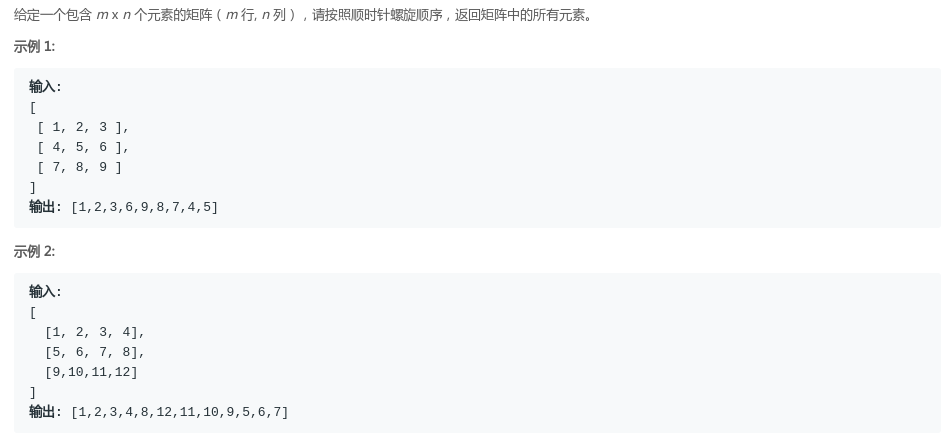

## LeetCode - 54. Spiral Matrix(圈圈打印矩阵)
#### [题目链接](https://leetcode.com/problems/spiral-matrix/description/)

> https://leetcode.com/problems/spiral-matrix/description/

#### 题意


#### 解析
 题目不难，但是如果去一个个的打印的话会比较的麻烦。
* 好的方法是使用<font color = red>矩阵分圈处理</font>的方式，在矩阵中使用`(ar,ac)`表示左上角，`(br,bc)`表示矩阵的右下角；
* 每次只需要通过这四个变量打印一个举证，然后用一个<font color = red>宏观的函数来调用</font>打印的局部的函数，这样调理更加清晰；

看图很清晰


```java
class Solution {

    public List<Integer> spiralOrder(int[][] matrix) {
        List<Integer> res = new ArrayList<>();
        if (matrix == null || matrix.length == 0 || matrix[0] == null || matrix[0].length == 0)
            return res;
        int ar = 0;
        int ac = 0;
        int br = matrix.length - 1;
        int bc = matrix[0].length - 1;

        while (ar <= br && ac <= bc)   //知道tr > dr 或者 tc > dc才不打印了
            edgePrint(matrix, ar++, ac++, br--, bc--, res);
        return res;
    }

    public void edgePrint(int[][] matrix, int ar, int ac, int br, int bc, List<Integer> res) {
        if (ar == br) { //只有一行
            for (int i = ac; i <= bc; i++) res.add(matrix[ar][i]);
        } else if (ac == bc) { // 只有一列
            for (int i = ar; i <= br; i++) res.add(matrix[i][ac]);
        } else {
            for (int i = ac; i <= bc - 1; i++) res.add(matrix[ar][i]);
            for (int i = ar; i <= br - 1; i++) res.add(matrix[i][bc]);
            for (int i = bc; i >= ac + 1; i--) res.add(matrix[br][i]);
            for (int i = br; i >= ar + 1; i--) res.add(matrix[i][ac]);
        }
    }
}
```
