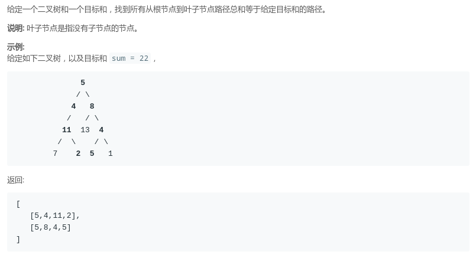

# LeetCode - 113. Path Sum II

#### [题目链接](https://leetcode.com/problems/path-sum-ii/)

> https://leetcode.com/problems/path-sum-ii/

#### 题目

## 解析

这题和上面唯一的不同，就是需要记录路径，递归写法很简单：　


* 就是每次先将当前节点加入中间集合(`path`)，然后深度优先遍历；
* 遍历完记得回溯的时候要在`path`集合中移除当前节点；
* 注意递归条件哪里一定不要`return `；


```java
class Solution {
    public List<List<Integer>> pathSum(TreeNode root, int sum) {
        List<List<Integer>> res = new ArrayList<>();
        if (root == null)
            return res;
        helper(root, 0, sum, new ArrayList<>(), res);
        return res;
    }

    private void helper(TreeNode node, int curSum, int sum, List<Integer> path, List<List<Integer>> res) {
        if (node == null)
            return;
        path.add(node.val);
        if (node.left == null && node.right == null && curSum + node.val == sum) {
            // why do we need new arrayList here?if we are using the same path variable path
            // path will be cleared after the traversal
            res.add(new ArrayList<>(path));
            // return ; // can't do this
        }
        helper(node.left, curSum + node.val, sum, path, res);
        helper(node.right, curSum + node.val, sum, path, res);
        path.remove(path.size() - 1);
    }
}
```

非递归写法自己没有出来，看了讨论区，方法很好: 

* 当前节点`cur`只要不为空，先走到树的最左边节点(第一个`while`循环)；
* 然后取栈顶元素，但是此时还要继续判断栈顶的右孩子的左子树，此时不能`pop()`，因为有孩子还有可能也是有左子树的；
* `pre`节点的作用是为了回溯，记录前一个访问的节点，如果`cur.right == pre`，则说明右子树正在回溯，下面的已经访问完了；
* 实在不懂可以画一个图看看。。。。

```java
class Solution {
    public List<List<Integer>> pathSum(TreeNode root, int sum) {
        List<List<Integer>> res = new ArrayList<>();
        if (root == null)
            return res;

        Stack<TreeNode> stack = new Stack<>();
        ArrayList<Integer> path = new ArrayList<>();
        TreeNode cur = root, pre = null;
        int curSum = 0;
        while (cur != null || !stack.isEmpty()) {
            while (cur != null) {  //先到最左边
                stack.push(cur);
                curSum += cur.val;
                path.add(cur.val);
                cur = cur.left;
            }
            cur = stack.peek(); //此时cur = 最左边的没有左孩子的节点

            //此时已经到了最左边，但是这个节点还是有可能有右孩子,且这个右孩子又有自己的左子树
            if (cur.right != null && cur.right != pre) { //有孩子不为空且没有被访问过
                cur = cur.right;
            } else { // 右孩子为空　或者　已经访问过 此时先判断是否叶子 然后 开始回溯
                if (cur.left == null && cur.right == null && curSum == sum)
                    res.add(new ArrayList<>(path));
                stack.pop();//出栈
                pre = cur; // 更新pre
                path.remove(path.size() - 1);
                curSum -= cur.val;
                cur = null;//把当前的节点置为空，然后继续从栈中取别的节点
            }
        }
        return res;
    }
}
```