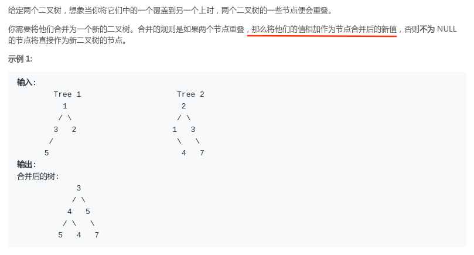
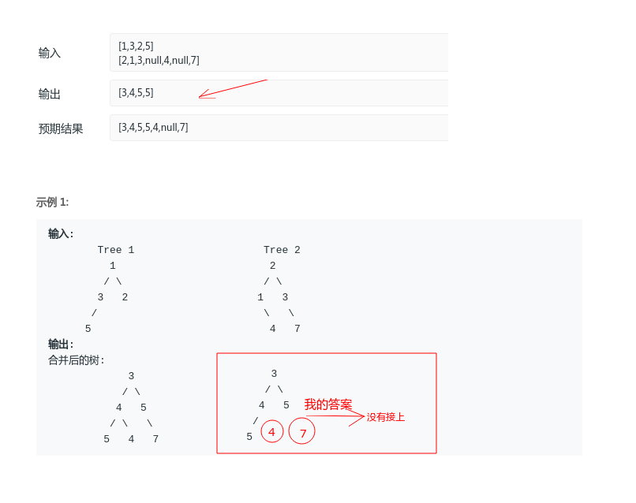

## LeetCode - 617. Merge Two Binary Trees(合并两棵二叉树)
* 递归
* 递归优化(改变原有的二叉树结构)
* 非递归前序
* BFS(层序)

***
#### [题目链接](https://leetcode.com/problems/merge-two-binary-trees/description/)

> https://leetcode.com/problems/merge-two-binary-trees/description/

#### 题目

### 递归
递归的想法很简单，当前的结点的值是`t1.val + t2.val`，然后当前`root.left`和`right`去递归的求解。
```java
class Solution {
    public TreeNode mergeTrees(TreeNode t1, TreeNode t2) {
        if (t1 == null)
            return t2;
        if (t2 == null)
            return t1;
        TreeNode root = new TreeNode(t1.val + t2.val);
        root.left = mergeTrees(t1.left, t2.left);
        root.right = mergeTrees(t1.right, t2.right);
        return root;
    }
}
```
***
### 递归优化(改变原有的二叉树结构)
这个优化在于我们<font color = red>不需要每次递归的时候都创建一个`TreeNode `对象(`Java`堆中): 

而是只声明一个`TreeNode`的引用(在栈中): 
```java
class Solution {
    public TreeNode mergeTrees(TreeNode t1, TreeNode t2) {
        if (t1 == null)
            return t2;
        if (t2 == null)
            return t1;
        TreeNode root = t1;
        root.val += t2.val;
        root.left = mergeTrees(t1.left, t2.left);
        root.right = mergeTrees(t1.right, t2.right);
        return root;
    }
}
```
***
### 非递归前序
既然写出了递归的前序遍历，自然想到非递归的前序遍历，于是我一开始写出了下面的代码: 

```java
class Solution {
    public TreeNode mergeTrees(TreeNode t1, TreeNode t2) {
        if (t1 == null)
            return t2;
        if (t2 == null)
            return t1;
        Stack<TreeNode[]> stack = new Stack<>();// 使用数组可以在栈中操作结点

        //前序非递归处理   因为前序是 中 -> 左 -> 右，压栈的顺序就是 右 -> 左
        stack.add(new TreeNode[]{t1, t2});
        while (!stack.isEmpty()) {
            TreeNode[] tops = stack.pop();
            if (tops[1] == null)
                continue;
            if (tops[0] == null) {
                tops[0] = tops[1];//这里看似处理了t1，但是这个tops[0]本来是null，没有和它的父亲连接
                continue;
            }
            // tops[0] != null && tops[1] != null
            tops[0].val += tops[1].val;
            stack.add(new TreeNode[]{tops[0].right, tops[1].right});
            stack.add(new TreeNode[]{tops[0].left, tops[1].left});

        }
        return t1;
    }
}
```
但是上面显然是错误的。
为什么呢，经过调试，<font color = blue>发现虽然看似处理了当前`t1`为`null`的情况，但是当前`t1`却没有和它的父亲连接起来，也就是没有在树的体系结构中，看下图: 

**所以处理的办法就是:**
* <font color = red>当前的`t1`直接判断自己的`left`和`right`，如果为空，就设置成`t2`的结点；</font>
* <font color = red>如果不为空，就加入栈中，进行前序非递归的步骤；
* <font color = red>这样的话，当前的`t1(tops[0])`一定不为`null`；

非递归前序不懂的可以看[这篇博客](https://blog.csdn.net/zxzxzx0119/article/details/79808127#t2)。
```java
class Solution {
    public TreeNode mergeTrees(TreeNode t1, TreeNode t2) {
        if (t1 == null)
            return t2;
        if (t2 == null)
            return t1;
        Stack<TreeNode[]> stack = new Stack<>();// 使用数组可以在栈中操作结点

        //前序非递归处理   因为前序是 中 -> 左 -> 右，压栈的顺序就是 右 -> 左
        stack.add(new TreeNode[]{t1, t2});
        while (!stack.isEmpty()) {
            TreeNode[] tops = stack.pop();
            if (tops[1] == null)
                continue;
            //这里注意tops[0]一定不会 = null，因为下面判断了tops[0]的空值
            tops[0].val += tops[1].val;
            // right
            if (tops[0].right == null)
                tops[0].right = tops[1].right;
            else
                stack.add(new TreeNode[]{tops[0].right, tops[1].right});
            //left
            if (tops[0].left == null)
                tops[0].left = tops[1].left;
            else
                stack.add(new TreeNode[]{tops[0].left, tops[1].left});

        }
        return t1;
    }
}
```
因为不一定非要先遍历左孩子，再右孩子(不一定需要按照前序)，所以`left`和`right`颠倒也是可以的: 

```java
class Solution {
    public TreeNode mergeTrees(TreeNode t1, TreeNode t2) {
        if (t1 == null)
            return t2;
        if (t2 == null)
            return t1;
        Stack<TreeNode[]> stack = new Stack<>();// 使用数组可以在栈中操作结点

        //前序非递归处理   因为前序是 中 -> 左 -> 右，压栈的顺序就是 右 -> 左
        stack.add(new TreeNode[]{t1, t2});
        while (!stack.isEmpty()) {
            TreeNode[] tops = stack.pop();
            if (tops[1] == null)
                continue;
            //这里注意tops[0]一定不会 = null，因为下面判断了tops[0]的空值
            tops[0].val += tops[1].val;
            //left
            if (tops[0].left == null)
                tops[0].left = tops[1].left;
            else stack.add(new TreeNode[]{tops[0].left, tops[1].left});
            // right
            if (tops[0].right == null)
                tops[0].right = tops[1].right;
            else
                stack.add(new TreeNode[]{tops[0].right, tops[1].right});
        }
        return t1;
    }
}
```
***
### BFS(层序)
这题当然也可以层序合并求解。

```java
class Solution {
    public TreeNode mergeTrees(TreeNode t1, TreeNode t2) {
        if (t1 == null)
            return t2;
        if (t2 == null)
            return t1;
        Queue<TreeNode[]> queue = new LinkedList<>();// 使用数组可以在栈中操作结点
        queue.add(new TreeNode[]{t1, t2});
        while (!queue.isEmpty()) {
            TreeNode[] tops = queue.poll();
            if (tops[1] == null)
                continue;
            tops[0].val += tops[1].val;
            if (tops[0].left == null)
                tops[0].left = tops[1].left;
            else
                queue.add(new TreeNode[]{tops[0].left, tops[1].left});
            if (tops[0].right == null)
                tops[0].right = tops[1].right;
            else
                queue.add(new TreeNode[]{tops[0].right, tops[1].right});
        }
        return t1;
    }
}
```

 

