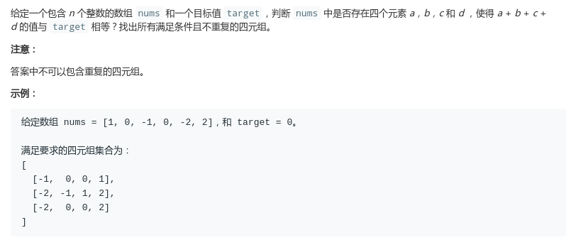

# LeetCode - 18. 4Sum

#### [题目链接](https://leetcode.com/problems/4sum/)

> https://leetcode.com/problems/4sum/

#### 题目



## 解析

还是用双指针的方法。只不过前面还需要套一层循环，时间复杂度是`O(N^3)`。

```java
class Solution {

    // O(N ^ 3)
    public List<List<Integer>> fourSum(int[] nums, int target) {
        List<List<Integer>> res = new ArrayList<>();
        if (nums == null || nums.length < 4) return res;
        Arrays.sort(nums);
        for (int i = 0; i < nums.length - 3; i++) {
            if (i != 0 && nums[i] == nums[i - 1]) continue; // 去重
            for (int j = i + 1; j < nums.length - 2; j++) {
                if (j != i + 1 && nums[j] == nums[j - 1]) continue; // 去重
                int L = j + 1, R = nums.length - 1;
                int another = target - nums[i] - nums[j];
                while (L < R) {
                    if (nums[L] + nums[R] == another) {
                        res.add(Arrays.asList(nums[i], nums[j], nums[L], nums[R]));
                        // 也是去重
                        while (L < R && nums[L] == nums[L + 1]) L++;// 去重
                        while (L < R && nums[R] == nums[R - 1]) R--;// 去重
                        L++;
                        R--;
                    } else if (nums[L] + nums[R] > another) {
                        R--;
                    } else {
                        L++;
                    }
                }
            }
        }
        return res;
    }
}

```

讨论区关于使用`map`可以降低到`O(N ^ 2)`，有兴趣可以[点这里](https://leetcode.com/problems/4sum/discuss/8565/lower-bound-n3)看一下。