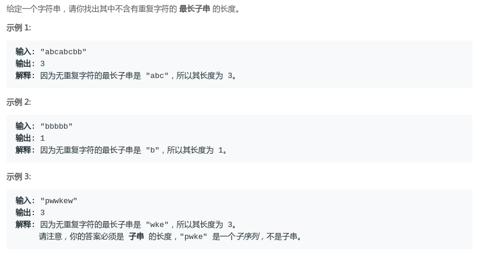

## LeetCode - 3. Longest Substring Without Repeating Characters(滑动窗口)
* 暴力**O(N<sup>3</sup>)**
* 普通滑动窗口
* 优化滑动窗口
***
#### [题目链接](https://leetcode-cn.com/problems/longest-substring-without-repeating-characters/description/)

> https://leetcode-cn.com/problems/longest-substring-without-repeating-characters/description/

#### 题目

### 暴力O(N<sup>3</sup>)
方法: 
* 使用一个函数`isAllUnique`来判断某一段字符串是不是有重复的字符；
* 然后枚举左右边界，一段一段的判断，时间复杂度<font color = red>**O(N<sup>3</sup>)**；

```java
class Solution {
    
    public int lengthOfLongestSubstring(String s) {
        if (s == null || s.length() == 0)
            return 0;
        int res = 0;
        for (int l = 0; l < s.length(); l++) {
            for (int r = l; r < s.length(); r++) {//注意从l开始，可以是长度为1
                if (isAllUnique(s, l, r))
                    res = Math.max(res, r - l + 1);
            }
        }
        return res;
    }

    //判断[L,R]之间的字符是不是都是不重复的
    public boolean isAllUnique(String s, int L, int R) {
        Set<Character> set = new HashSet<>();

        for (int i = L; i <= R; i++) {
            if (!set.contains(s.charAt(i)))
                set.add(s.charAt(i));
            else
                return false;
        }
        return true;
    }
}    
```
### 普通滑动窗口
和普通的滑动窗口一样，使用一个`freq`数组来保存字符出现的次数:
* 每次试探`++R`，要判断是否越界，然后判断如果前面的字符串段中没有重复的话，`R`就可以继续扩展，对应`s.charAt(++R)`上的频次要`++`；
* 如果有重复的话，左边界`L`就扩展，此时对应的频次要`--`；

```java
class Solution {

    // 普通滑动窗口
    public int lengthOfLongestSubstring(String s) {
        if (s.length() == 0 || s == null)
            return 0;
        char[] str = s.toCharArray();
        int[] freq = new int[256];
        int L = 0, R = -1, res = 0;
        while (R < str.length) {
            if (R + 1 == str.length)//一定要break 不然L不会break； R你都到str.length - 1，L你要再移动也不会更长了
                break;
            if (freq[str[R + 1]] == 0)
                freq[str[++R]]++;
            else
                freq[str[L++]]--;

            res = Math.max(res, R - L + 1);
        }
        return res;
    }
}
```
对于`R`边界的判断以及循环的终止，因为`R`如果到达了边界的话，此时`L`你再往右边扩展，此时的长度只会更小，所以上述代码也可以简写成下面的样子: 

```java
class Solution {
    // 普通滑动窗口
    public int lengthOfLongestSubstring(String s) {
        if (s.length() == 0 || s == null)
            return 0;
        char[] str = s.toCharArray();
        int[] freq = new int[256];
        int L = 0, R = -1, res = 0;
        while (R + 1 < str.length) {
            if (freq[str[R + 1]] == 0)
                freq[str[++R]]++;
            else
                freq[str[L++]]--;

            res = Math.max(res, R - L + 1);
        }
        return res;
    }
}
```
***
### 优化滑动窗口
更加优化的方式是: 
* 每次更新`L`的时候，不是简单的只移动一个位置，使用一个`last[i]`记录`i`最后一次出现的位置；
* 然后当扩展`R`的时候，如果前面有重复的，就可以让L扩展到`last[s.charAt( R )] + 1`的位置；
* 然后记得每次都要更新`last[s.charAt( R )]`的值；


```java
class Solution {
    // 优化的滑动窗口
    // 其中使用last[c]保存字符c上一次出现的位置, 用于在右边界发现重复字符时, 快速移动左边界
    // 使用这种方法, 时间复杂度依然为O(n), 但是只需要动r指针, 实际上对整个s只遍历了一次
    public int lengthOfLongestSubstring(String s) {
        if (s == null || s.length() == 0)
            return 0;
        int L = 0, R = -1, res = 0;
        int[] last = new int[256]; //保存s[i] 上一次出现的位置
        Arrays.fill(last, -1);      // 标记
        while (R + 1 < s.length()) {
            R++;
            if (last[s.charAt(R)] != -1) {  //有重复的,此时快速的移动L
                L = Math.max(L, last[s.charAt(R)] + 1);
            }
            last[s.charAt(R)] = R;
            res = Math.max(res, R - L + 1);
        }
        return res;
    }
}
```


