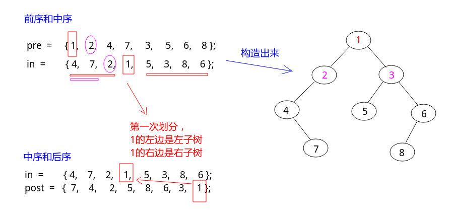

## 剑指Offer - 04 - 重建二叉树

#### [题目链接]()

> https://www.nowcoder.com/practice/8a19cbe657394eeaac2f6ea9b0f6fcf6?tpId=13&tqId=11157&tPage=1&rp=1&ru=%2Fta%2Fcoding-interviews&qru=%2Fta%2Fcoding-interviews%2Fquestion-ranking

#### 题目

> 输入某二叉树的前序遍历和中序遍历的结果，请重建出该二叉树。假设输入的前序遍历和中序遍历的结果中都不含重复的数字。
例如输入前序遍历序列`{1,2,4,7,3,5,6,8}`和中序遍历序列`{4,7,2,1,5,3,8,6}`，则重建二叉树并返回。

#### 解析


 - 根据前序和中序建树时，**前序遍历的第一个结点就是根，在中序遍历中找到根所在的位置**，计算的左子树长度(左边孩子的个数`lLen`)(可以得出右子树的长度 = 总长度-左子树长度-1)；
 - 这样在中序遍历中就确定了根节点的位置，且在`pre`数组中`pre[pL+1, pL+lLen]`之间都是根节点的左孩子；在`in`数组中`in[iL, iL + lLen - 1]`位置也都是根节点的左孩子，利用这个重新递归构造根节点的左子树即可；
 - 同理，在`pre`数组中`pre[pL + lLen + 1 , pR]`都是当前根节点的右孩子，在`in`数组中`in[iL + lLen + 1 , iR]`也都是当前根节点的右孩子，利用这两段重新构造根节点的右子树即可；

> 注意根据**前序遍历和中序遍历，中序遍历和后续遍历都可以建立一颗二叉树**，**但是根据前序遍历和后续遍历不可以确定一颗二叉树**，前序和后序在本质上都只是**将子节点和父节点**分离，没有指明左右子树的能力。

题目中的样例:



根据前序遍历和中序遍历:

```java
public class Solution {

    public TreeNode reConstructBinaryTree(int[] pre, int[] in) {
        return rec(pre, 0, pre.length - 1, in, 0, in.length - 1);
    }

    public TreeNode rec(int[] pre, int pL, int pR, int[] in, int iL, int iR) {
        if (pL > pR || iL > iR)
            return null;
        TreeNode root = new TreeNode(pre[pL]); //根
        int lLen = 0; //左子树 数组长度 (在in数组中找到pre[pL](根))
        for (int i = iL; i <= iR && in[i] != pre[pL]; i++, lLen++) ;
        root.left = rec(pre, pL + 1, pL + lLen, in, iL, iL + lLen - 1); //pre[pL]和in[iL + iLen]是根
        root.right = rec(pre, pL + lLen + 1, pR, in, iL + lLen + 1, iR);
        return root;
    }
}
```

附上一个利用中序数组和后序数组建立二叉树的程序，原理类似(在`in`数组找到`post[poR]`即可):

```java
class TreeNode {
    int val;
    TreeNode left;
    TreeNode right;

    TreeNode(int x) {
        val = x;
    }
}

public class Solution {

    //根据中序和后序
    public TreeNode reConstructBinaryTreeByInPost(int[] in, int[] post) {
        return rec(in, 0, in.length - 1, post, 0, post.length - 1);
    }

    public TreeNode rec(int[] in, int iL, int iR, int[] post, int poL, int poR) {
        if (iL > iR || poL > poR) return null;
        TreeNode root = new TreeNode(post[poR]);//最后一个是根
        int lLen = 0; // 左子树长度, 在in[]中找到 post[posR]的位置
        for (int i = iL; i <= iR && in[i] != post[poR]; i++, lLen++) ;
        root.left = rec(in, iL, iL + lLen - 1, post, poL, poL + lLen - 1);
        root.right = rec(in, iL + lLen + 1, iR, post, poL + lLen, poR - 1);
        return root;
    }

    public void preOrder(TreeNode T) {
        if (T == null)
            return;
        System.out.print(T.val + " ");
        preOrder(T.left);
        preOrder(T.right);
    }

    public static void main(String[] args) {
//        int[] pre = {1, 2, 4, 7, 3, 5, 6, 8};
        int[] in = {4, 7, 2, 1, 5, 3, 8, 6};
        int[] post = {7, 4, 2, 5, 8, 6, 3, 1};

        //遍历结果应该和pre[]数组一样
        new Solution().preOrder(new Solution().reConstructBinaryTreeByInPost(in, post));
    }
}
```

