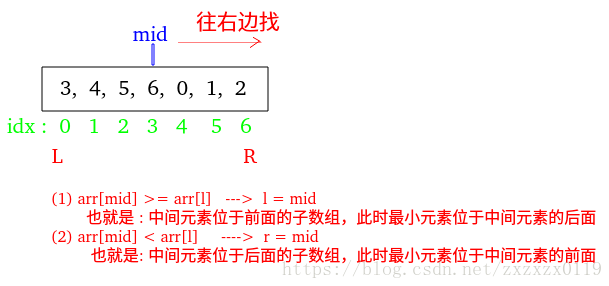

## 剑指Offer - 06 - 旋转数组的最小数字

#### [题目链接](https://www.nowcoder.com/practice/9f3231a991af4f55b95579b44b7a01ba?tpId=13&tqId=11159&tPage=1&rp=1&ru=%2Fta%2Fcoding-interviews&qru=%2Fta%2Fcoding-interviews%2Fquestion-ranking)

> https://www.nowcoder.com/practice/9f3231a991af4f55b95579b44b7a01ba?tpId=13&tqId=11159&tPage=1&rp=1&ru=%2Fta%2Fcoding-interviews&qru=%2Fta%2Fcoding-interviews%2Fquestion-ranking

#### 题目

> 把一个数组最开始的若干个元素搬到数组的末尾，我们称之为数组的旋转。 输入一个非减排序的数组的一个旋转，输出旋转数组的最小元素。 
>
> 例如数组`{3,4,5,1,2}`为`{1,2,3,4,5}`的一个旋转，该数组的最小值为1。 NOTE：给出的所有元素都大于0，若数组大小为0，请返回0。


首先

 - 旋转之后的数组实际上可以划分成两个有序的子数组；
 - 前面子数组的大小都大于后面子数组中的元素；

则先有一个基本的`O(N)`想法:

```java
public class Solution {
    public int minNumberInRotateArray(int[] array) {
        if (array.length == 0)
            return 0;
        for (int i = 1; i < array.length; i++) {
            if (array[i] < array[i - 1])
                return array[i];
        }
        return array[0];//有序，就返回最后一个
    }
}
```

**我们先看没有重复元素的问题(这个题目可以有重复的元素)。**

思路：

 - 我们用两个指针`L,R`分别指向每次判断的数组左右边界。按照题目的旋转的规则，**左边界应该是大于右边界的（没有重复的元素）**。
 - 然后找到数组的中间元素`arr[mid]`，`arr[mid] > arr[L]`，则中间元素位于前面的递增子数组，此时最小元素位于中间元素的后面。我们可以让第一个指针`L` 指向中间元素；(移动之后，第一个指针仍然位于前面的递增数组中)；
 - `arr[mid] < arr[L]`，中间元素小于第一个元素，则中间元素位于后面的递增子数组，此时最小元素位于中间元素的前面。我们可以让第二个指针`L` 指向中间元素；(移动之后，第二个指针仍然位于后面的递增数组中)；
 - 按照以上思路，第一个指针`L`总是指向前面递增数组的元素，第二个指针`R`总是指向后面递增的数组元素；
 - 最终第一个指针`L`将指向前面数组的最后一个元素，第二个指针`R`指向后面数组中的第一个元素；
 - 也就是说他们将指向两个相邻的元素(第一种代码思路)，而第二个指针指向的刚好是最小的元素，这就是循环的结束条件；



**以上思路解决了没有重复数字的情况，这一道题目添加上了这一要求，有了重复数字。**

因此这一道题目比上一道题目多了些特殊情况：

我们看一组例子：**｛1，0，1，1，1｝**和 **｛1，1， 1，0，1｝**都可以看成是递增排序数组**{0，1，1，1，1}**的旋转。
**这种情况下我们无法继续用上一道题目的解法，去解决这道题目。因为在这两个数组中，第一个数字，最后一个数字，中间数字都是1。**

**第一种情况下，中间数字位于后面的子数组，第二种情况，中间数字位于前面的子数组。**

因此当两个指针指向的数字和中间数字相同的时候，我们无法确定中间数字1是属于前面的子数组(第一种)还是属于后面的子数组（第二种）。

代码:

两种代码，边界稍有不同，意思是一样的。

```java
public class Solution {
    public int minNumberInRotateArray(int[] array) {
        if (array.length == 0)
            return 0;
        int L = 0, R = array.length - 1;
        while (array[L] >= array[R]) {   // 确保是旋转的
            if (R - L == 1) //递归条件 l是前一个递增序列的最后一个元素, r是后一个递增序列的第一个元素
                return array[R];
            int mid = L + (R - L) / 2;
            //无法确定中间元素是属于前面还是后面的递增子数组，只能暴力找
            if (array[L] == array[mid] && array[mid] == array[R]) {
                for (int i = L + 1; i <= R; i++)
                    if (array[i] < array[i - 1])
                        return array[i];
            }
            //中间元素位于前面的递增子数组  ---> 此时最小元素位于中间元素的后面
            if (array[mid] >= array[L]) //注意我们这里认为 = 也算是上升的
                L = mid;  // not mid - 1
            else       // 中间元素位于后面的递增子数组     --->  此时最小元素位于中间元素的前面
                R = mid;  // not mid + 1
        }
        return array[L];  // 此时array[R] > array[L](因为循环退出了), 肯定返回array[L]
    }
}
```

```java
public class Solution {
    public int minNumberInRotateArray(int[] array) {
        if (array.length == 0)
            return 0;
        int L = 0, R = array.length - 1;
        while (L < R && array[L] >= array[R]) {   // 确保是旋转的，且L<R，退出的时候L==R或者array[L] < array[R]
            int mid = L + (R - L) / 2;
            //无法确定中间元素是属于前面还是后面的递增子数组，只能暴力找
            if (array[L] == array[mid] && array[mid] == array[R]) {
                for (int i = L + 1; i <= R; i++)
                    if (array[i] < array[i - 1])
                        return array[i];
            }
            //中间元素位于前面的递增子数组  ---> 此时最小元素位于中间元素的后面
            if (array[mid] >= array[L]) //注意我们这里认为 = 也算是上升的
                L = mid + 1;
            else          // 中间元素位于后面的递增子数组     --->  此时最小元素位于中间元素的前面
                R = mid;
        }
        // 如果L == R，则arr[L] = arr[R]，返回正确，否则也是返回arr[L]
        return array[L];
    }
}
```

