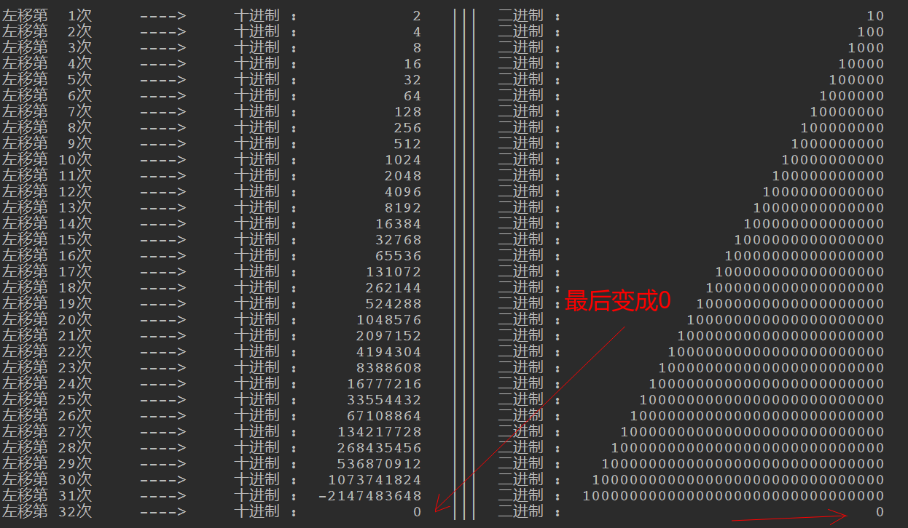

## 剑指Offer - 11 - 二进制中1的个数

#### [题目链接](https://www.nowcoder.com/practice/8ee967e43c2c4ec193b040ea7fbb10b8?tpId=13&tqId=11164&tPage=1&rp=1&ru=%2Fta%2Fcoding-interviews&qru=%2Fta%2Fcoding-interviews%2Fquestion-ranking)

> https://www.nowcoder.com/practice/8ee967e43c2c4ec193b040ea7fbb10b8?tpId=13&tqId=11164&tPage=1&rp=1&ru=%2Fta%2Fcoding-interviews&qru=%2Fta%2Fcoding-interviews%2Fquestion-ranking

#### 题目

> 输入一个整数，输出该数二进制表示中1的个数。**其中负数用补码表示**。

### 解析

本题考察位运算。

左移运算符 `m << n `表示把 `m` 左移`n `位。左移`n`位的时候，最左边的`n`位将被丢弃，同时在最右边补上`n`个 0。比如:

```c
00001010 << 2 = 00101000
10001010 << 3 = 01010000          
```

右移运算符` m >> n` 表示把 `m` 右移`n` 位。右移`n` 位的时候，最右边的`n`位将被丢弃。

但右移时处理最左边位的情形要稍微复杂一点。

* **如果数字是一个无符号数值，则用 0 填补最左边的 n 位**。
* **如果数字是一个有符号数值，则用数字的符号位填补最左边的n位**。

**也就是说如果数字原先是一个正数，则右移之后在最左边补`n`个 0；如果数字原先是负数，则右移之后在最左边补n个1**。比如对两个 8 位有符号数作右移的例子:

```c
00001010 >> 2= 00000010
10001010 >> 3 = 11110001 // 负
```
#### 1)、思路一(不能处理负数-wrong answer)

简单的想法：

* 就是使用位运算，直接将`n`每次右移一位；
* 并且每次移动之后最后一位和`1`做与运算，然后此时统计`1`的个数；
* 但是这种方法不能处理负数，因为负数右移在左边补`1`，有不同，所以`wrong answer`；

代码:

```java
public class Solution {
    // 右移 不能处理负数
    public int NumberOf1(int n) {
        int sum = 0;
        while (n > 0) {
            if ((n & 1) != 0)
                sum++;
            n >>= 1;
        }
        return sum;
    }
}
```

#### 2)、思路二

为了解决死循环的问题，使用另一个变量`another`：

* **another一开始初始化为1，然后每次和n做与运算，这样也可以判断n的每一位是不是1**；
* 这种做法`another`左移32次，终止条件为`another = 0`；

```java
public class Solution {
    public int NumberOf1(int n) {
        int sum = 0;
        int another = 1;
        while (another != 0) {
            if ((n & another) != 0)
                sum++;
            another <<= 1;
        }
        return sum;
    }
}
```

这里写一个关于`another`终止条件(最终为`0`)的测试:

```java
public class Test {
    public static void main(String[] args) {
        int n = 1;
        for (int i = 0; i < 32; i++) {
            n <<= 1;
            System.out.print("左移第 ");
            System.out.printf("%2d", (i + 1));
            System.out.print("次     ---->     ");
            System.out.print("十进制 :  ");
            System.out.printf("%11d", n);
            System.out.print("   |||  二进制 : ");
            System.out.printf("%33s", Integer.toBinaryString(n));
            System.out.println();
        }
    }
}

```




#### 3)、思路三

* 一个数和比自己小`1`的数做与运算，会把这个数最右边的`1`变成`0`；
* 然后看能做几次这样的运算，这个数就有多少个`1`；
* 这个方法有多少个`1`，就只需要循环多少次，是最优解法；

> 如果一个整数不等于0，那么该整数的二进制表示中至少有一位是 1。先假设这个数的最右边一位是 1，那么减去 1 时，最后一位变成 0 而其他所有位都保持不变。也就是最后一位相当于做了取反操作，由 1 变成了 0。
>
> 接下来假设最后一位不是 1 而是 0 的情况。如果该整数的二进制表示中最右边 1 位于第 m 位，那么减去1时，第m 位由1 变成0，而第 m 位之后的所有 0 都变成 1整数中第 m 位之前的所有位都保持不变。举个例子，一个二进制数 `1100`，它的第二位是从最右边数起的一个 1。减去 1 后，第二位变成0，它后面的两位 0 变成 1，而前面的 1 保持不变，因此得到的结果是 `1011`。
>
> 在前面两种情况中, 我们发现把一个整数减去 1，都是把最右边的 1 变成0。如果它的右边还有 0 的话，所有的 0 都变成 1，而它左边所有位都保持不变。接下来我们把一个整数和它减去 1 的结果做位与运算，相当于把它最右边的 1 变成 0。还是以前面的 `1100` 为例，它减去 1 的结果是 `1011`。我们再把 `1100`和 `1011` 做位与运算，得到的结果是 `1000`。我们把 `1100` 最右边的 1 变成了0，结果刚好就是 `1000`。
>
> **总结: 把一个整数减去 1 再和原整数做与运算，会把该整数最右边一个 1 变成 0。那么一个整数的二进制表示中有多少个 1，就可以进行多少次这样的操作**。

代码:

```java
public class Solution {
    public int NumberOf1(int n) {
        int sum = 0;
        while (n != 0) {
            sum++;
            n = n & (n - 1);
        }
        return sum;
    }
}
```

这种方法和[**这个题**](https://github.com/ZXZxin/ZXNotes/blob/master/%E5%88%B7%E9%A2%98/LeetCode/Bit/LeetCode%20-%20461.%20Hamming%20Distance(%E4%BD%8D%E8%BF%90%E7%AE%97).md)第三种写法很类似。