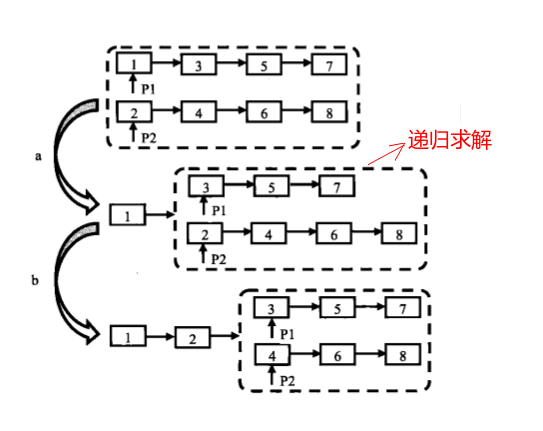

## 剑指Offer - 16 - 合并两个排序的链表

#### [题目解析](https://www.nowcoder.com/practice/d8b6b4358f774294a89de2a6ac4d9337?tpId=13&tqId=11169&tPage=1&rp=1&ru=%2Fta%2Fcoding-interviews&qru=%2Fta%2Fcoding-interviews%2Fquestion-ranking)

> https://www.nowcoder.com/practice/d8b6b4358f774294a89de2a6ac4d9337?tpId=13&tqId=11169&tPage=1&rp=1&ru=%2Fta%2Fcoding-interviews&qru=%2Fta%2Fcoding-interviews%2Fquestion-ranking

#### 题目

> 输入两个**单调递增**的链表，输出两个链表合成后的链表，当然我们需要合成后的链表满足**单调不减**规则。

#### 解析

也是两种思路，一种迭代类似外排，一种递归。

##### 1)、迭代

* 使用类似合并有序数组的方法，外排(归并排序中最后合并的方式)的方式(那个小就先加哪一个)；

* 但是这里要注意**我这里设置了一个虚拟的头结点，这样的话方便第一个结点的添加和判断**；


```java
public class Solution {
    public ListNode Merge(ListNode list1, ListNode list2) {
        if (list1 == null)
            return list2;
        if (list2 == null)
            return list1;
        ListNode p1 = list1, p2 = list2;
        ListNode dummyHead = new ListNode(-1);
        ListNode p3 = dummyHead;
        while (p1 != null && p2 != null) {
            if (p1.val < p2.val) {
                p3.next = p1;
                p1 = p1.next;
            } else {
                p3.next = p2;
                p2 = p2.next;
            }
            p3 = p3.next;
        }
        while (p1 != null) {
            p3.next = p1;
            p1 = p1.next;
            p3 = p3.next;
        }
        while (p2 != null) {
            p3.next = p2;
            p2 = p2.next;
            p3 = p3.next;
        }
        return dummyHead.next; //虚拟头结点的下一个
    }
}
```

稍微改进一下，因为是链表结构，所以最后的合并只需要一步即可，不需要`while`循环: 

```java
public class Solution {
    public ListNode Merge(ListNode list1, ListNode list2) {
        if (list1 == null)
            return list2;
        if (list2 == null)
            return list1;
        ListNode p1 = list1, p2 = list2;
        ListNode dummyHead = new ListNode(-1);
        ListNode p3 = dummyHead;
        while (p1 != null && p2 != null) {
            if (p1.val < p2.val) {
                p3.next = p1;
                p1 = p1.next;
            } else {
                p3.next = p2;
                p2 = p2.next;
            }
            p3 = p3.next;
        }
        if (p1 != null)
            p3.next = p1;
        if (p2 != null)
            p3.next = p2;
        return dummyHead.next;
    }
}
```

##### 2)、递归

* 先建立一个新的结点，然后比较两个链表头结点的大小，用小的那个作为头结点；
* 然后递归小的那个链表的下一个结点和另一个表的结点递归比较，让较小的结点作为上一个新结点的下一个结点；



上面的例子:

* 链表 1 的头结点的值小于链表 2 的头结点的值，因此链表1的头结点是合并后链表的头结点。
* 在剩余的结点中，链表 2 的头结点的值小于链表 1 的头结点的值，因此链表 2 的头结点是剩余结点的头结点，把这个结点和之前已经合并好的链表的尾结点链接起来。
* 递归求解即可；

```java
public class Solution {
    public ListNode Merge(ListNode list1, ListNode list2) {
        if (list1 == null)
            return list2;
        if (list2 == null)
            return list1;
        ListNode curHead;//当前选中的头结点
        if (list1.val < list2.val) {
            curHead = list1;
            curHead.next = Merge(list1.next, list2);
        } else {
            curHead = list2;
            curHead.next = Merge(list1, list2.next);
        }
        return curHead;
    }
}
```

