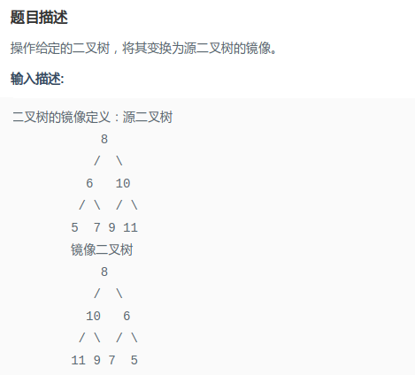

## 剑指Offer - 18 - 二叉树的镜像

#### [题目链接](https://www.nowcoder.com/practice/564f4c26aa584921bc75623e48ca3011?tpId=13&tqId=11171&tPage=1&rp=1&ru=%2Fta%2Fcoding-interviews&qru=%2Fta%2Fcoding-interviews%2Fquestion-ranking)

>https://www.nowcoder.com/practice/564f4c26aa584921bc75623e48ca3011?tpId=13&tqId=11171&tPage=1&rp=1&ru=%2Fta%2Fcoding-interviews&qru=%2Fta%2Fcoding-interviews%2Fquestion-ranking

#### 题目



#### 解析

这题算一个简单题了。

思路很简单，递归求解的过程:

* 先把当前根节点的左右子树换掉；
* 然后递归换自己的左右子树即可；

例子:


递归代码:

```java
public class Solution {
    public void Mirror(TreeNode root) {
        if (root == null)
            return;
        TreeNode t = root.left;
        root.left = root.right;
        root.right = t;
        Mirror(root.left);
        Mirror(root.right);
    }
}
```

非递归也可以，意思一样:

```java
import java.util.Stack;
public class Solution {

    public void Mirror(TreeNode root) {
        if (root == null)
            return;
        Stack<TreeNode>stack = new Stack<>();
        stack.push(root);
        while (!stack.isEmpty()) {
            TreeNode cur = stack.pop();
            if (cur.left != null || cur.right != null) {
                TreeNode t = cur.left;
                cur.left = cur.right;
                cur.right = t;
            }
            if (cur.left != null)
                stack.push(cur.left);
            if (cur.right != null)
                stack.push(cur.right);
        }
    }
}
```

