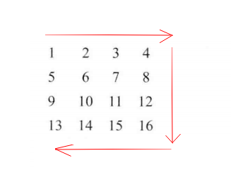
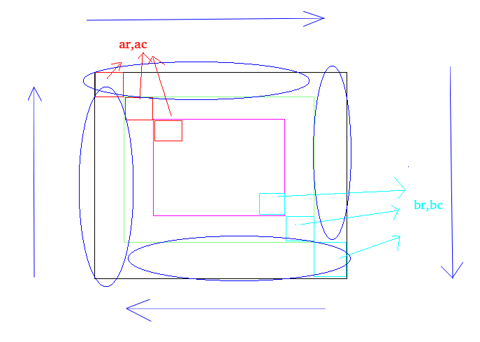

## 剑指Offer - 19 - 顺时针打印矩阵

#### [题目链接](https://www.nowcoder.com/practice/9b4c81a02cd34f76be2659fa0d54342a?tpId=13&tqId=11172&tPage=1&rp=1&ru=%2Fta%2Fcoding-interviews&qru=%2Fta%2Fcoding-interviews%2Fquestion-ranking)

> https://www.nowcoder.com/practice/9b4c81a02cd34f76be2659fa0d54342a?tpId=13&tqId=11172&tPage=1&rp=1&ru=%2Fta%2Fcoding-interviews&qru=%2Fta%2Fcoding-interviews%2Fquestion-ranking

#### 题目

> 输入一个矩阵，按照从外向里以顺时针的顺序依次打印出每一个数字，例如，如果输入如下4 X 4矩阵： `1 2 3 4 5 6 7 8 9 10 11 12 13 14 15 16` 。
>
> 则依次打印出数字`1,2,3,4,8,12,16,15,14,13,9,5,6,7,11,10`.
>
> 

#### 解析

题目本身很容易，但是代码容易写的很乱，所以这里考虑一种宏观思考问题的思想。

* 使用矩阵分圈处理的方式，在矩阵中使用`(ar,ac)`表示左上角，`(br,bc)`表示矩阵的右下角；
* 每次只需要通过这四个变量打印一个矩阵，然后用一个宏观的函数来调用打印的局部的函数，这样调理更加清晰；



代码

```java
import java.util.ArrayList;
public class Solution {

    private ArrayList<Integer> res;

    public ArrayList<Integer> printMatrix(int[][] matrix) {
        if (matrix == null || matrix.length == 0 || matrix[0].length == 0)
            return null;
        res = new ArrayList<>();
        int ar = 0, ac = 0, br = matrix.length - 1, bc = matrix[0].length - 1;
        while (ar <= br && ac <= bc)
            print(ar++, ac++, br--, bc--, matrix);
        return res;
    }

    private void print(int ar, int ac, int br, int bc, int[][] matrix) {
        if (ar == br)
            for (int j = ac; j <= bc; j++) res.add(matrix[ar][j]);
        else if (ac == bc)
            for (int i = ar; i <= br; i++) res.add(matrix[i][ac]);
        else {
            for (int j = ac; j < bc; j++) res.add(matrix[ar][j]);
            for (int i = ar; i < br; i++) res.add(matrix[i][bc]);
            for (int j = bc; j > ac; j--) res.add(matrix[br][j]);
            for (int i = br; i > ar; i--) res.add(matrix[i][ac]);
        }
    }
}
```

