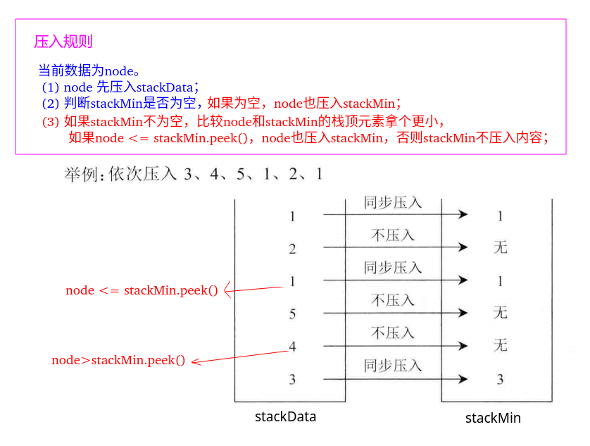
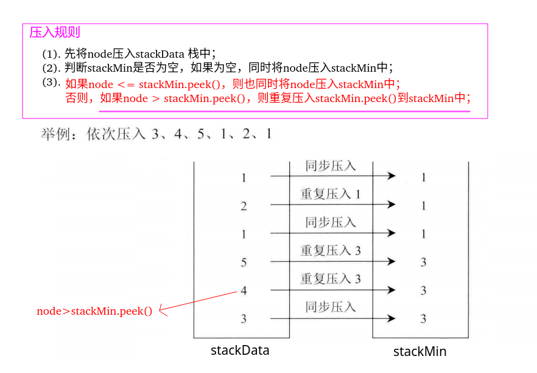

## 剑指Offer - 20 - 包含min函数的栈

#### [题目链接](https://www.nowcoder.com/practice/4c776177d2c04c2494f2555c9fcc1e49?tpId=13&tqId=11173&tPage=1&rp=1&ru=%2Fta%2Fcoding-interviews&qru=%2Fta%2Fcoding-interviews%2Fquestion-ranking)

> https://www.nowcoder.com/practice/4c776177d2c04c2494f2555c9fcc1e49?tpId=13&tqId=11173&tPage=1&rp=1&ru=%2Fta%2Fcoding-interviews&qru=%2Fta%2Fcoding-interviews%2Fquestion-ranking

#### 题目

> 定义栈的数据结构，请在该类型中实现一个能够得到栈中所含最小元素的`min`函数（时间复杂度应为O（1））。

#### 解析

用两个栈，也有两种实现思路。

##### 1)、思路一

先看压入栈的规则(写在图中)。



**弹出数据规则**

* 先在`stackData`中弹出栈顶元素，记为`top`，然后比较`top`和`stackMin`的栈顶元素，看哪个更小；
* 因为`stackMin`中存的是从**栈底到栈顶逐渐变小**的，`stackMin`栈顶的元素既是`stackMin`中的最小值，也是`stackData`中的最小值，所以`top` 只可能` >= stackMin.peek()`；
* 当`top = stackMin.peek()`的时候，`stackMin`弹出栈顶元素；` top > stcakMin.peek()`的时候，不做任何操作，最后返回`top`；
* 上面那样做的目的就是对应压入的时候，因为当`node > stackMin.peek()`的时候我们没有压入`stackMin`任何东西，所以当`top>stackMin.peek()`的时候也不要弹出；

```java
import java.util.Stack;

public class Solution {

    Stack<Integer> stackData = new Stack<>(); // 数据栈
    Stack<Integer> stackMin = new Stack<>();  // 辅助栈

    public void push(int node) {
        stackData.push(node);
        if (stackMin.isEmpty()) {
            stackMin.push(node);
        } else {
            if (node <= stackMin.peek()) {
                stackMin.push(node);
            }
        }
    }

    public void pop() {
        int top = stackData.pop();
        if (top == stackMin.peek())// 弹出栈顶
            stackMin.pop();
    }

    public int top() {
        if (stackData.isEmpty())
            throw new RuntimeException("stack is empty!");
        return stackData.peek();
    }

    public int min() {
        if (stackMin.isEmpty())
            throw new RuntimeException("stack is empty!");
        return stackMin.peek();
    }
}
```

##### 2)、思路二

思路二和思路一不同的地方在于，当`node > stackMin.peek()`的时候，不是不压入，而是重复将`stackMin.peek()`再压入一份到`stackMin`中。

这样处理之后，`pop()`过程就变得很简单了，直接都弹出即可。



```java
import java.util.Stack;

public class Solution {

    Stack<Integer> stackData = new Stack<>(); // 数据栈
    Stack<Integer> stackMin = new Stack<>();  // 辅助栈

    public void push(int node) {
        stackData.push(node);
        if (stackMin.isEmpty()) {
            stackMin.push(node);
        } else {
            if (node <= stackMin.peek()) {
                stackMin.push(node);
            } else {    //压入时候唯一的改动
                stackMin.push(stackMin.peek());
            }
        }
    }

    public void pop() {
        stackData.pop();// 直接弹出即可
        stackMin.pop();
    }

    public int top() {
        if (stackData.isEmpty())
            throw new RuntimeException("stack is empty!");
        return stackData.peek();
    }

    public int min() {
        if (stackMin.isEmpty())
            throw new RuntimeException("stack is empty!");
        return stackMin.peek();
    }
}
```

