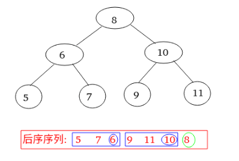

## 剑指Offer - 23 - 二叉搜索树的后序遍历序列

#### [题目链接](https://www.nowcoder.com/practice/a861533d45854474ac791d90e447bafd?tpId=13&tqId=11176&tPage=2&rp=1&ru=%2Fta%2Fcoding-interviews&qru=%2Fta%2Fcoding-interviews%2Fquestion-ranking)

> https://www.nowcoder.com/practice/a861533d45854474ac791d90e447bafd?tpId=13&tqId=11176&tPage=2&rp=1&ru=%2Fta%2Fcoding-interviews&qru=%2Fta%2Fcoding-interviews%2Fquestion-ranking

#### 题目

> 输入一个整数数组，判断该数组是不是某二叉搜索树的后序遍历的结果。如果是则输出`Yes`,否则输出`No`。假设输入的数组的任意两个数字都互不相同。

#### 解析

思路:

* 在后序遍历得到的序列中，最后一个数是树的根节点 `root`；
* 二叉搜索树的后序遍历数组可以**划分为两部分**。第一部分是左子树结点的值，它们都比根节点的值小；第二部分是右子树结点的值，它们都比根节点的值大；
* 所以按照上面的方法，递归的时候，每次先确定根`root`，然后在`[L,R]`范围内每次先找到`mid`，即第一个`>root.val`的位置，后面的就是右子树，必须要全部`>root.val`，如果不满足就返回`false`；

举个栗子:



数组`{5, 7, 6, 9, 11, 10, 8}` ，后序遍历结果的最后一个数字`8`就是根结点(`root`)的值。在这个数组中，前3 个数字`5、7 、6`都比`8`小，是值为8的结点的左子树结点；后 3 个数字`9、11、10` 都比 8 大，是值为 8 的结点的右子树结点。

我们接下来用同样的方法确定与数组每一部分对应的子树的结构。这其实就是一个递归的过程。对于序列 `5、7、6`，最后一个数字 6 是左子树的根结点的值。数字 5 比 6 小，是值为 6 的结点的左子结点，而 7 则是它的右子结点。同样，在序列` 9、11、10` 中，最后一个数字 10 是右子树的根结点，数字9 比10 小，是值为 10 的结点的左子结点，而 11 则是它的右子结点。

> 反例: 另一个整数数组{7, 4, 6, 5}。后序遍历的最后一个数是根结点，因此根结点的值是 5。由于第一个数字 7 大于 5，因此在对应的二叉搜索树中，根结点上是没有左子树的，数字 7、4 和 6 都是右子树结点的值。
>
> 但我们发现在右子树中有一个结点的值是 4，比根结点的值 5 小， 这违背了二叉搜索树的定义。因此不存在一棵二又搜索树, 它的后序遍历的结果是 7、4、6、5。

其实很好理解，看代码就知道了。

```java
public class Solution {

    public boolean VerifySquenceOfBST(int[] sequence) {
        if (sequence == null || sequence.length == 0)
            return false;
        return rec(sequence, 0, sequence.length - 1);
    }

    private boolean rec(int[] seq, int L, int R) {
        if (L >= R)  //前面的已经满足条件
            return true; 
        int root = seq[R]; //根 
        int i = L;
        // 找到左子树 --> 左右子树的分界 
        while (i <= R - 1 && seq[i] < root)
            i++;
        int mid = i; // seq[mid] > root, 从mid开始是右子树，必须都>root
        while (i <= R - 1) {
            if (seq[i] < root)
                return false;
            i++;
        }
        return rec(seq, L, mid - 1) && rec(seq, mid, R - 1); //左右两边都是满足条件的
    }
}
```

非递归的写法:

* 这种写法，是后往前(从前往后也可以)，**将每一个数都看做某一棵子树的根**，然后判断这颗子树之后是否满足(即前一部分是`<root`，后一部分是`>root`)；
* 但是这种方式重复判断了一些问题，效率没有这么高；

```java
public class Solution {
    public boolean VerifySquenceOfBST(int[] sequence) {
        if (sequence == null || sequence.length == 0)
            return false;
        for(int root = sequence.length - 1; root >= 0; root--){
            int p = 0;
            while(sequence[p] < sequence[root]) p++;
            while(sequence[p] > sequence[root]) p++;
            if(p != root)
                return false;
        }
        return true;
    }
}
```

