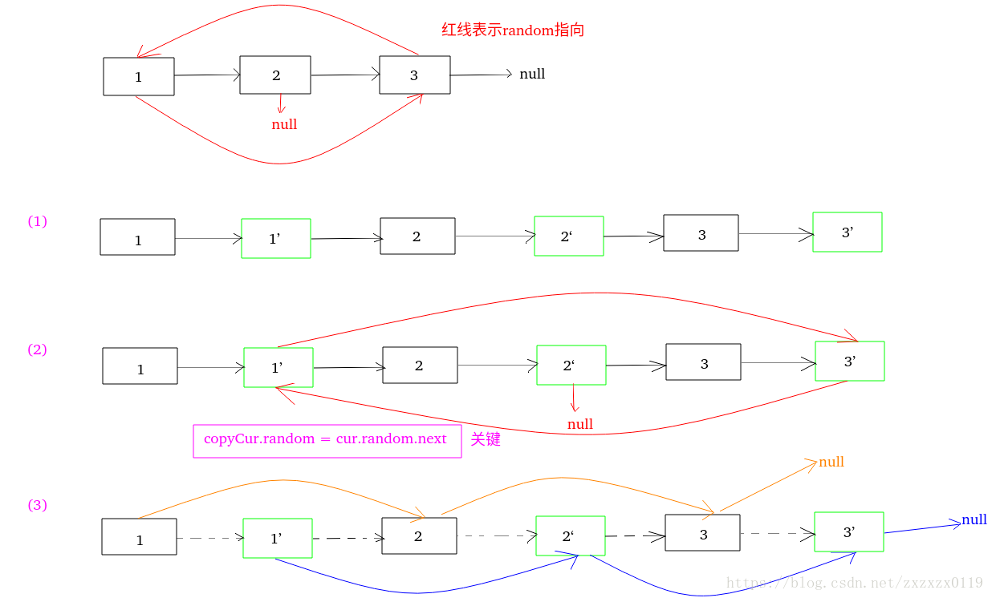

## 剑指Offer - 25 - 复杂链表的复制

#### [题目链接](https://www.nowcoder.com/practice/f836b2c43afc4b35ad6adc41ec941dba?tpId=13&tqId=11178&tPage=2&rp=1&ru=%2Fta%2Fcoding-interviews&qru=%2Fta%2Fcoding-interviews%2Fquestion-ranking)

> https://www.nowcoder.com/practice/f836b2c43afc4b35ad6adc41ec941dba?tpId=13&tqId=11178&tPage=2&rp=1&ru=%2Fta%2Fcoding-interviews&qru=%2Fta%2Fcoding-interviews%2Fquestion-ranking

#### 题目

> 输入一个复杂链表（每个节点中有节点值，以及两个指针，一个指向下一个节点，另一个特殊指针指向任意一个节点），返回结果为复制后复杂链表的head。（注意，输出结果中请不要返回参数中的节点引用，否则判题程序会直接返回空）

### 解析

[**LeetCode138**](https://github.com/ZXZxin/ZXNotes/blob/master/%E5%88%B7%E9%A2%98/LeetCode/Data%20Structure/List/LeetCode%20-%20138.%20Copy%20List%20with%20Random%20Pointer(%E5%90%AB%E6%9C%89%E9%9A%8F%E6%9C%BA%E6%8C%87%E9%92%88%E7%9A%84%E9%93%BE%E8%A1%A8%E7%9A%84%E6%8B%B7%E8%B4%9D).md)也是一样的题目。两种思路:

#### 1)、思路一－Use HashMap

思路:

- 从左到右遍历链表，对每个结点都复制生成相应的副本结点，然后将对应的关系(之前的结点和新的副本结点)放入哈希表中；
- 然后从左到右设置每一个副本结点的`next`和`random`指针，即找到原先`cur`的`next`和`random`的拷贝(从`Map`中获取)；
- 最后返回副本结点的头结点(`map.get(head)`)即可；

看一个例子:

例如: 原链表 `1->2->3->null`，假设 `1 `的 `rand `指针指向 `3`，`2` 的 `rand` 指针指向 `null`，`3`的`rand`指针指向` 1`。遍历到节点` 1` 时，可以从 `map `中得到节点` 1` 的副本节点`1`，节点 `1` 的`next `指向节点 `2`，所以从 `map `中得到节点 `2`的副本节点` 2`，然后令 `1’.next=2'`，副本节点了的 `next` 指针就设置好了。同时节点 `1`的 `rand `指向节点` 3`，所以从`map` 中得到节点` 3` 的副本节点 `3`，然后令 `1‘.rand=3'`，副本节点`1`的 `rand` 指针也设置好了。

```java
import java.util.HashMap;
public class Solution {

    public RandomListNode Clone(RandomListNode pHead) {
        HashMap<RandomListNode, RandomListNode> map = new HashMap<>();
        RandomListNode cur = pHead;
        while (cur != null) {
            map.put(cur, new RandomListNode(cur.label));
            cur = cur.next;
        }
        cur = pHead;
        while (cur != null) {
            map.get(cur).next = map.get(cur.next);
            map.get(cur).random = map.get(cur.random);
            cur = cur.next;
        }
        return map.get(pHead);
    }
}
```

这里还有一种思路就是在一开始先拷贝好`next`的，然后后面再拷贝`random`的:

```java
import java.util.HashMap;
public class Solution {

    public RandomListNode Clone(RandomListNode pHead) {
        if (pHead == null)
            return null;
        HashMap<RandomListNode, RandomListNode> map = new HashMap<>();
        RandomListNode copyHead = new RandomListNode(pHead.label);
        map.put(pHead, copyHead);
        RandomListNode cur = pHead, copyCur = copyHead;
        while (cur != null) {
            if (cur.next != null)
                copyCur.next = new RandomListNode(cur.next.label);
            map.put(cur.next, copyCur.next);
            cur = cur.next;
            copyCur = copyCur.next;
        }

        // 后面拷贝random的
        cur = pHead;
        while (cur != null) {
            map.get(cur).random = map.get(cur.random);
            cur = cur.next;
        }
        return copyHead;
    }
}
```

这种写法前面的拷贝`next`部分也可以改成递归的:

```java
import java.util.HashMap;
public class Solution {

    public RandomListNode Clone(RandomListNode pHead) {
        if (pHead == null)
            return null;
        HashMap<RandomListNode, RandomListNode> map = new HashMap<>();
        RandomListNode copyHead = rec(pHead, map);

        RandomListNode cur = pHead;
        while (cur != null) {
            map.get(cur).random = map.get(cur.random);
            cur = cur.next;
        }
        return copyHead;
    }

    // 宏观来看: 就是返回拷贝以node为头结点的链表的拷贝 以及next的拷贝
    private RandomListNode rec(RandomListNode node, HashMap<RandomListNode, RandomListNode> map) {
        if (node == null)
            return null;
        RandomListNode copyNode = new RandomListNode(node.label);
        map.put(node, copyNode);
        copyNode.next = rec(node.next, map);
        return copyNode;
    }
}
```

#### 2)、思路二－O(1)空间

本题最优解法是只用`O(1)`的空间来解决。

* 第一个步骤，先从左到右遍历一遍链表，对每个结点`cur`都复制生成相应的副本结点`copy`，然后把副本结点`copy`放在`cur`和下一个要遍历结点的中间；
* 再从左到右遍历一遍链表，在遍历时设置每一个结点的副本结点的`random`指针；
* 设置完`random`指针之后，将链表拆成两个链表，返回第二个链表的头部；

例子:



代码:

```java
public class Solution {
    public RandomListNode Clone(RandomListNode pHead) {
        if (pHead == null)
            return null;
        RandomListNode cur = pHead, next;
        //先拷贝一份原来的链表
        while (cur != null) {
            next = cur.next;  //先存着之前的next
            cur.next = new RandomListNode(cur.label);
            cur.next.next = next;
            cur = next;
        }

        //复制结点的random指针
        cur = pHead;
        RandomListNode copyCur = null;
        while (cur != null) {
            next = cur.next.next; //保存原来链表中的下一个
            copyCur = cur.next; //复制链表的cur
            copyCur.random = cur.random != null ? cur.random.next : null;
            cur = next;
        }

        //拆开两个链表
        RandomListNode copyHead = pHead.next;
        cur = pHead;
        while (cur != null) {
            next = cur.next.next;
            copyCur = cur.next;
            cur.next = next;
            copyCur.next = next != null ? next.next : null;
            cur = next;
        }
        return copyHead;
    }
}

```

