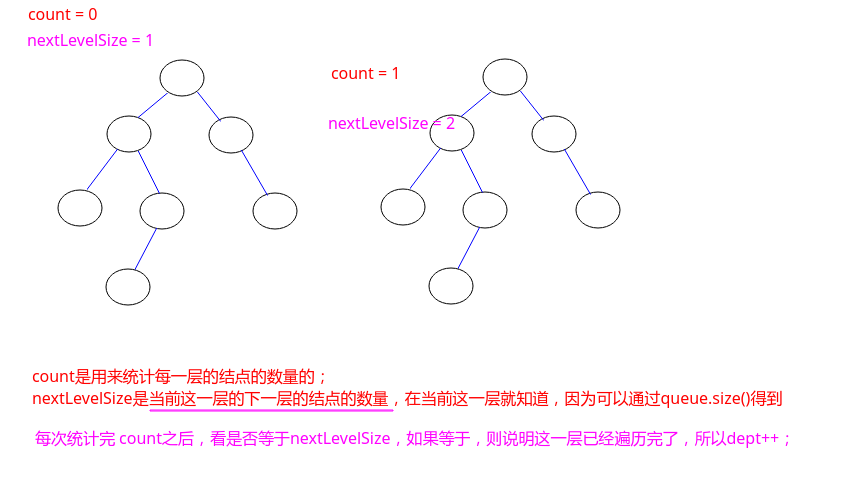

## 剑指Offer - 38 - 二叉树的深度

#### [题目链接](https://www.nowcoder.com/practice/435fb86331474282a3499955f0a41e8b?tpId=13&tqId=11191&tPage=2&rp=1&ru=%2Fta%2Fcoding-interviews&qru=%2Fta%2Fcoding-interviews%2Fquestion-ranking)

> https://www.nowcoder.com/practice/435fb86331474282a3499955f0a41e8b?tpId=13&tqId=11191&tPage=2&rp=1&ru=%2Fta%2Fcoding-interviews&qru=%2Fta%2Fcoding-interviews%2Fquestion-ranking

#### 题目

> 输入一棵二叉树，求该树的深度。从根结点到叶结点依次经过的结点（含根、叶结点）形成树的一条路径，最长路径的长度为树的深度。

### 解析

两种思路。递归和非递归。

#### 1、递归

递归的思路很简单。当前结点为根的树的高度 = 左右子树中高的那个 + 1 (自己)。

```java
public class Solution {
    public int TreeDepth(TreeNode root) {
        if(root == null)
            return 0;
        return 1 + Math.max(TreeDepth(root.left), TreeDepth(root.right));
    }
}
```

#### 2、非递归

可以利用层次遍历。来求树的层数(高度)。

* 每一层的数量用一个变量`count`统计，总的层数用`depth`统计；
* 同时，我们在当前层的时候，可以得知下一层的节点的数量(通过`queue.size()`)；
* 然后在到了下一层的时候， 就判断统计的数量`count == nextLevelSize`，如果等于，就加一层`depth++`；



代码:

```java
import java.util.*;
public class Solution {
    public int TreeDepth(TreeNode root) {
        if(root == null)
            return 0;
        Queue<TreeNode>queue = new LinkedList<>();
        queue.add(root);
        int count = 0, nextLevelSize = 1;
        int depth = 0;
        while(!queue.isEmpty()){
            TreeNode cur = queue.poll();
            count++;
            if(cur.left != null) queue.add(cur.left);
            if(cur.right != null) queue.add(cur.right);
            if(count == nextLevelSize){
                count = 0;
                depth++;
                nextLevelSize = queue.size(); //下一层的节点的个数
            }
        }
        return depth;
    }
}
```

