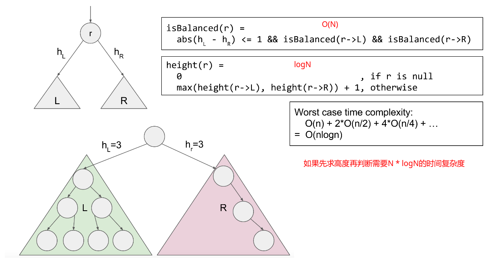

## 剑指Offer - 39 - 平衡二叉树

#### [题目链接](https://www.nowcoder.com/practice/8b3b95850edb4115918ecebdf1b4d222?tpId=13&tqId=11192&tPage=2&rp=1&ru=%2Fta%2Fcoding-interviews&qru=%2Fta%2Fcoding-interviews%2Fquestion-ranking)

> https://www.nowcoder.com/practice/8b3b95850edb4115918ecebdf1b4d222?tpId=13&tqId=11192&tPage=2&rp=1&ru=%2Fta%2Fcoding-interviews&qru=%2Fta%2Fcoding-interviews%2Fquestion-ranking

#### 题目

> 输入一棵二叉树，判断该二叉树是否是平衡二叉树。

### 解析

这题在[**LeetCode**](https://github.com/ZXZxin/ZXNotes/blob/master/%E5%88%B7%E9%A2%98/LeetCode/Tree/LeetCode%20-%20110.%20Balanced%20Binary%20Tree(%E5%88%A4%E6%96%AD%E4%B8%80%E6%A3%B5%E6%A0%91%E6%98%AF%E5%90%A6%E6%98%AF%E5%B9%B3%E8%A1%A1%E4%BA%8C%E5%8F%89%E6%A0%91).md)中也写过了。两种解法。

#### 解法一

思路

- 首先我们知道平衡二叉树**是一棵空树或它的左右两个子树的高度差的绝对值不超过1，并且左右两个子树都是一棵平衡二叉树**；
- 我们可以使用一个获取树的高度的函数`depth()`。然后递归比较左右子树是不是平衡二叉树且左右子树的高度不超过`1`即可。
- 这里获取高度需要`logN`复杂度，主函数`isBalance`需要`O(N)`，所以总的时间复杂度为`N*logN`；



代码:

```java
public class Solution {
    
    public boolean IsBalanced_Solution(TreeNode root) {
        if(root == null)
            return true;
        return IsBalanced_Solution(root.left) && IsBalanced_Solution(root.right) 
                && Math.abs(depth(root.left) - depth(root.right)) <= 1;
    }
    
    private int depth(TreeNode node) {
        if (node == null)
            return 0;
        return Math.max(depth(node.left), depth(node.right)) + 1;
    }
}
```

#### 解法二

