# Git

* [一、Git基础概念](#一git基础概念)
* [二、Git常用命令](#二git常用命令)
* [三、分支](#三分支)
* [四、Git版本回退](#四git版本回退)

## 一、Git基础概念

Git功能简单概述

- 可以随时回滚到之前的代码版本(`git reset --hard `)；
- 协同开发时不会覆盖别人的代码(分支)；
- 留下修改记录(`git log`)；
- 发版时可以方便的管理不同的版本；

### 1、Git工作模式

* 版本库初始化

* 个人计算机从版本服务器同步

操作

* 90%以上的操作在个人计算机上

* 添加文件

* 修改文件

* 提交变更

* 查看版本历史等

* 版本库同步

* 将本地修改推送到版本服务器

版本控制系统:

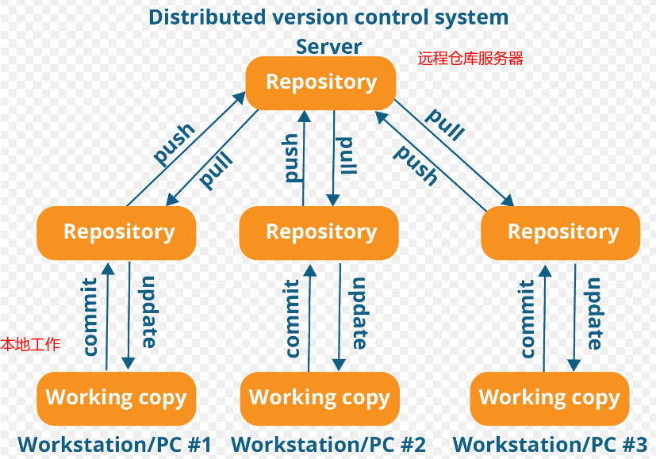

### 2、Git文件存储

注意文件存储和SVN不同:

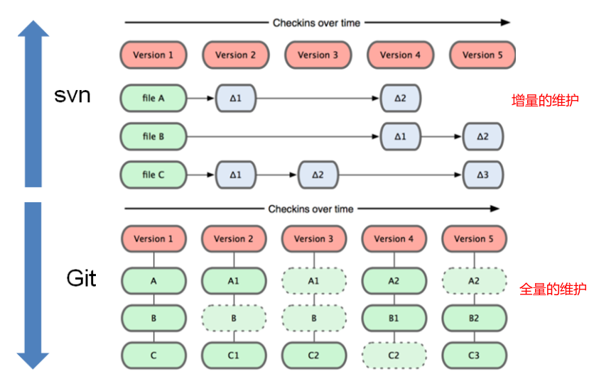

Git 不按照SVN那样对待或保存数据。 **反之，Git 更像是把数据看作是对小型文件系统的一组快照。 每次你提交更新，或在 Git 中保存项目状态时，它主要对当时的全部文件制作一个快照并保存这个快照的索引。 为了高效，如果文件没有修改，Git 不再重新存储该文件，而是只保留一个链接指向之前存储的文件**。 Git 对待数据更像是一个 快照流。

总结特点:

* 直接记录快照`snapshoot`。而并非比较差异；
* 近乎所有操作都在本地执行；
* **时刻保持数据完整性**；
* 多数操作仅添加数据；
* **文件的三种状态**（只会处于这三种状态）
  * 已修改(modified)
  * 已暂存(staged)
  * 已提交(committed)

### 3、Git文件状态

* Git文件: 已被版本库管理的文件；
* 已修改: 在工作目录(`working directory`)修改Git文件；
* 已暂存: 对已修改的文件执行Git暂存操作，将文件存入**暂存区**(`staging area`)； (注意SVN中没有暂存区这个概念)
* 已提交: 将已暂存的文件执行Git提交操作，将文件存入版本库(`git directory`)；

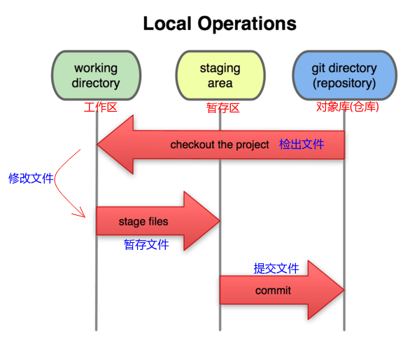

Git 仓库目录是 Git 用来保存项目的元数据和对象数据库的地方。 这是 Git 中最重要的部分，从其它计算机克隆仓库时，拷贝的就是这里的数据。

工作目录是对项目的某个版本独立提取出来的内容。 这些从 Git 仓库的压缩数据库中提取出来的文件，放在磁盘上供你使用或修改。

暂存区域是一个文件，保存了下次将提交的文件列表信息，一般在 Git 仓库目录中。 有时候也被称作‘索引’，不过一般说法还是叫暂存区域。

基本的 Git 工作流程如下：

1. 在工作目录中修改文件。
2. 暂存文件，将文件的快照放入暂存区域`git add`。
3. 提交更新，找到暂存区域的文件，将快照永久性存储到 Git 仓库目录`git commit`。

> git add 放到暂存区；
>
> git commit 从暂存区放到版本仓库中；

### 4、本地版本库与服务器版本库

Git是分布式的。

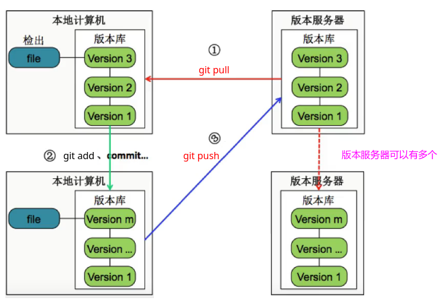

## 二、Git常用命令
### 1、config和email

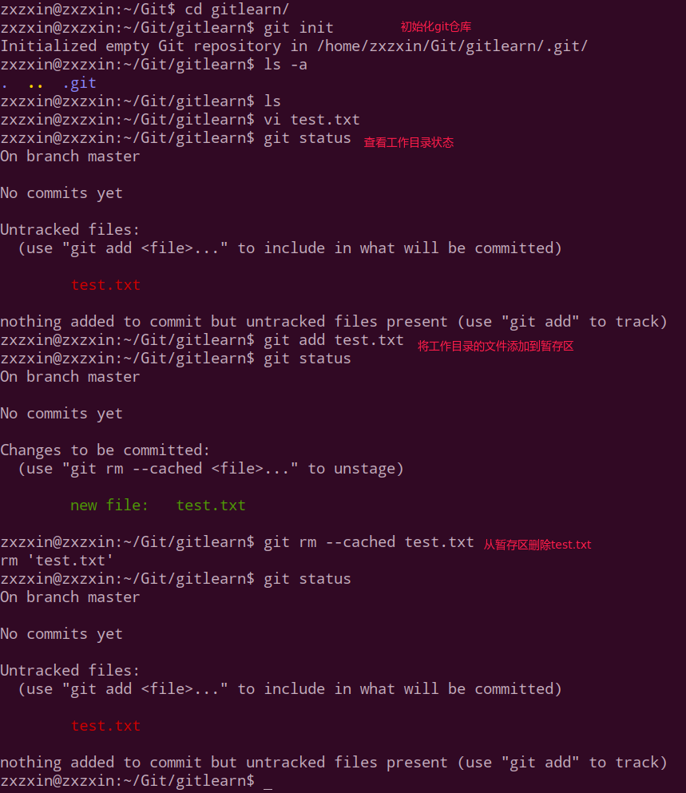

关于配置`user.name`和`user.email`:

可以有三个地方配置:

比如输入`git config`命令， 会出现下面三个信息，即系统级别`system`，全局`global`，和局部`local`。其中优先级不断升高。

```shell
zxzxin@zxzxin:~/Git/gitlearn$ git config
usage: git config [<options>]

Config file location
    --global              use global config file
    --system              use system config file
    --local               use repository config file
    -f, --file <file>     use given config file
    --blob <blob-id>      read config from given blob object

```

这里展示一下配置我们局部的`gitlearn`仓库:

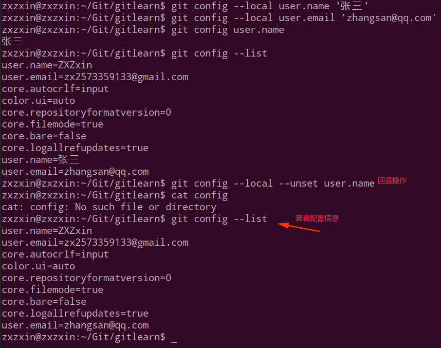

> git 提交的id(`commit id`)是一个摘要值，这个摘要值实际上是一个`sha1`计算出来的。

### 2、git rm 和rm的区别

**git rm** : 

* 1、删除了一个文件
* 2、将被删除的文件纳入到了暂存区(stage)；(可以直接调用`git commit`来提交)

若想恢复被删除的文件，需要进行两个动作:

* 1、`git reset HEAD test2.txt`，将待删除的文件从暂存区恢复到工作区；
* 2、`git checkout -- test2.txt`， 将工作区的修改丢弃掉；

**rm **:

* 只是将文件删除；注意: 这时，被删除的文件并未纳入到暂存区当中。
* 这时是提交(`git commit`)不了的。要想纳入暂存区，必须要再调用一次`git add`。

实战对比:

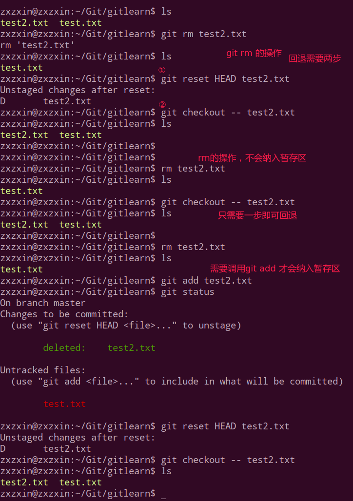

### 3、git mv 和 mv的对比

git mv(和`git rm `类似)：

* 先完成重命名；
* 然后提交到暂存区；

`git mv`演示:


而  mv:

* 只是完成重命名；
* 需要自己调用`git add`提交到暂存区；

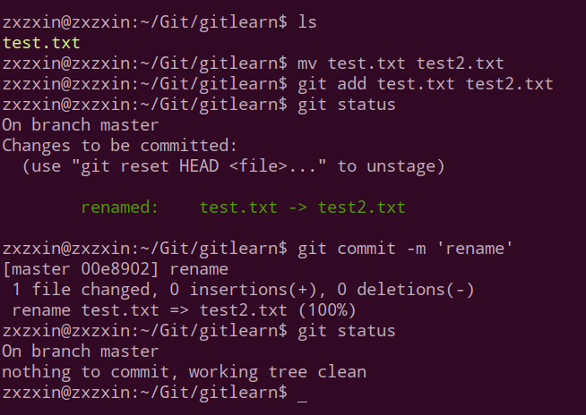

​	

> 使用技巧: 可以通过`git commit --amend -m '修正内容'`更改上次错误的提交消息。(就是`-m ''`)后面的提交信息写错了。

### 4、git log查看日志

`git log -n `可以查看最近的`n`条日志。

`git log --pretty=oneline`以一行一行的方式显示出来。 

查看git命令帮助:

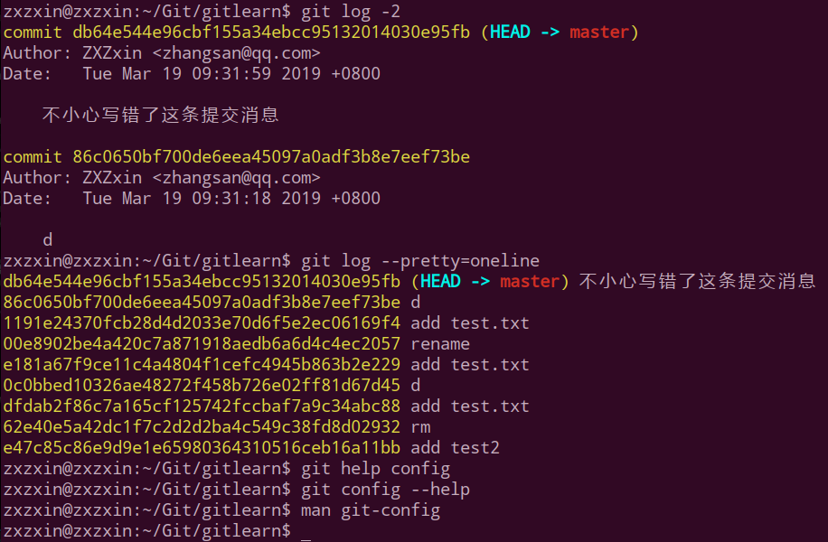

### 5、`.gitignore`文件

在开发中，如果我们不想将所有的文件都放到git当中，而是要忽略少数一些文件(比如`jar`包、配置文件等)，我们可以在我们的目录创建一个`.gitignore`文件，git就不会将这些文件放入暂存区，也不会提交(不会加入版本控制系统)。

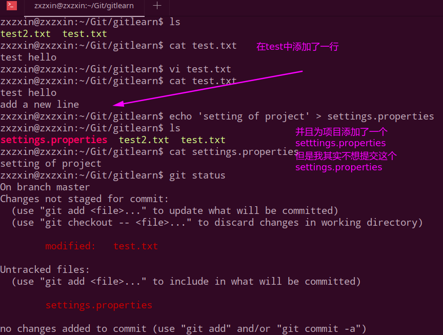

此时我们可以创建一个`.gitignore`文件:

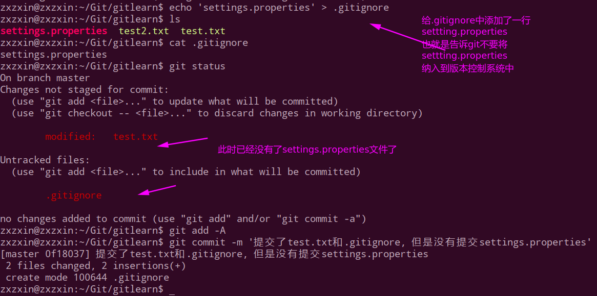

简而言之，**放在`.gitignore`中的文件会直接被`git`无视**。

> 其中，放在`.gitignore`中的文件也支持正则表达式。
>
> 例如:
>
> * `*.a`，会忽略所有`.a`结尾的文件；
> * `!lib.a`，不要忽略`lib.a`(排除这个忽略)；
> * `/test.txt`，仅仅忽略项目根目录下的`TODO`文件，不包括子目录下的`test.txt`文件；
> * `dir1/`，忽略`dir1/`目录下的所有文件；
> * `dir1/*.txt`，会忽略`dir1/a.txt`但不会包括`dir1/dir2/a.txt`。
> * 例如`dir1/*.txt`会忽略`dir1`下的所有`.txt`文件，`dir1/*/*.txt`会忽略`dir1`下所有层下的`.txt`，而`dir1/**/*.txt`会忽略`dir1/`下的任意层的`.txt`文件。

在`.gitignore`中用`#`表示注释。

## 三、分支

### 1、分支简单介绍

简单使用:

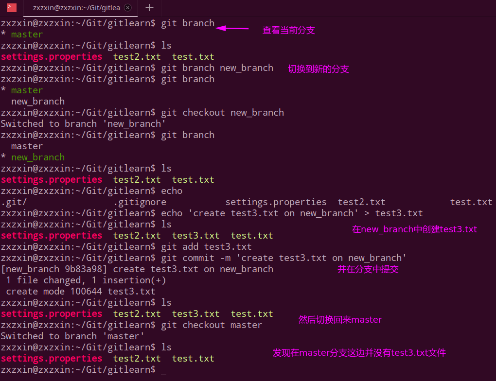

> 可以将`git branch new_branch`和`git checkout new_branch`两个命令合并成一个命令:
> `git checkout -b new_branch`。这个命令的意思就是创建一个分支并且切换到这个分支上。

### 2、合并分支merge

这个过程中，下一个版本会记录一个`parent id`，这个`parent id`就是前一个版本的`commit id`。

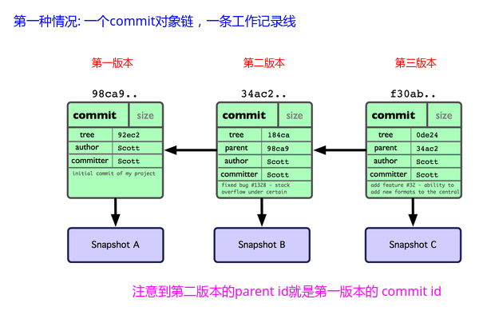


注意当我们在`dev`中更改文件之后，一定要先`add`和`commit`，不然那样就会和`master`内容同步了，我们需要的是在`dev`中更改之后，在没有进行`merge`之前，`master`不会和`dev`相同: 看下面的演示：


### 3、快进fast forward

HEAD的含义: (在`git reset HEAD test.txt`中使用过)

* HEAD指向的是当前分支；
* master是指向提交(本质上只的是当前的提交)；

即如下表示:


如果我们执行`git checkout -b dev`，我们就会创建一个`dev`分支并指向新的分支。

这是在`master`分支的基础上，但是这个过程并不是像`SVN`一样会拷贝一份，而是只是创建一个指针`dev`，会和`master`指向了同一个提交。但此时HEAD指向的是`dev`（当前分支）。


查看HEAD文件的内容:


然后我在上图的基础上，如果我在`dev`分支下进行了一次提交，图就会变成下面这样:


**此时`master`指向第3次提交，而`dev`已经指向了第四次提交**。

接下来，如果我将`dev`上面的修改合并到`master`上面 (在`master`中操作)，上面的图就会变成下面这样:


这种情况不会有冲突存在。

实战演示:


总结一下这种情况，就是直接从`master`分支跳转到了最后的`dev`修改的那个位置，相当于指针的跳转。

### 4、master和dev同时修改同一文件同一位置产生冲突

演示冲突：在`master`中修改了`test.txt`的第三行，在`dev`中也修改了`test.txt`中的第三行，于是合并的时候就会产生冲突:


上面的过程就是如下图的过程:

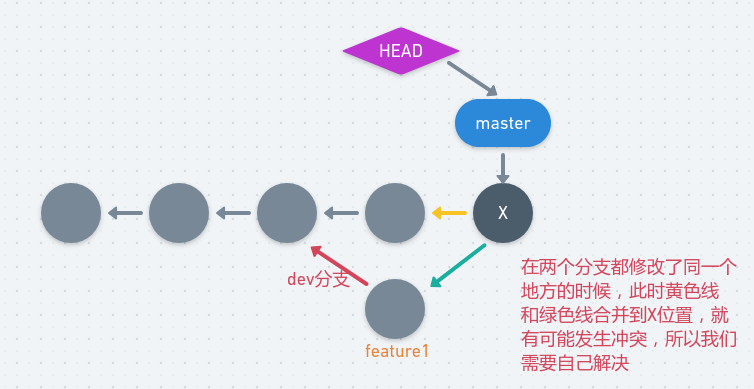

> 注意箭头往回指是因为后一个提交里面包含一个`parent-id`指向前一个提交的`commit-id`，前面已经说过。

注意观察`master`分支中`test.txt`文件的内容以及我们将解决这次冲突(即我们打算保存`master`的修改而丢弃`dev`的修改)：


### 5、深入fast-forward模式

也就是说在`fast-forward`模式下:

* 如果可能（合并时没有冲突），那么Git就会采用`fast-forward`模式；
* 在这种模式下，删除分支时会丢掉分支信息；
* 合并时加上 `-- no-ff`参数会禁用`fast-forward`模式，这样就会多出一个`commit - id`，也就是说在`fast-forward`模式下面`merge`不会多出一个`commit-id`；

```shell
git merge -- no-ff dev
```

* 查看日志更好的方式

```shell
git log --graph
```

关于`fast-forward`模式和非`fast-forward`模式下的少一次`commit-id`和多一次`commid-id`的图解:


我们先看使用`fast-forward`模式下的: (即合并的时候`commit-id`和另一个分支相同):

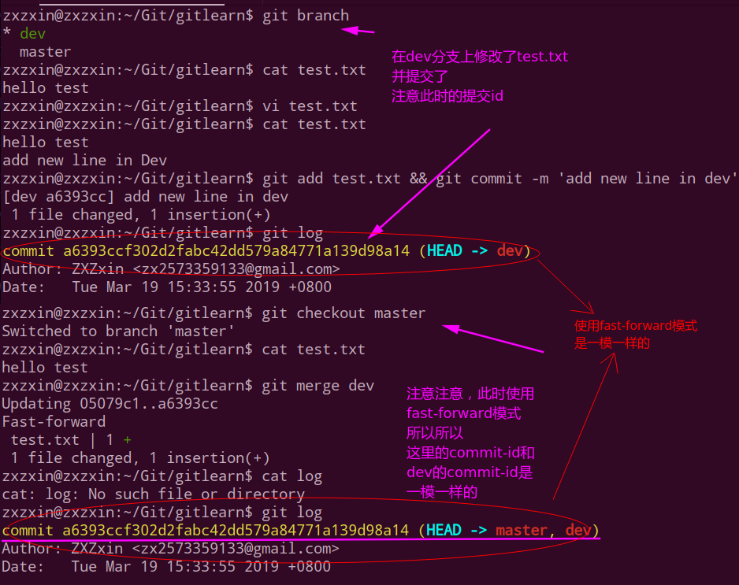

再看不使用`fast-forward`模式:


## 四、Git版本回退


