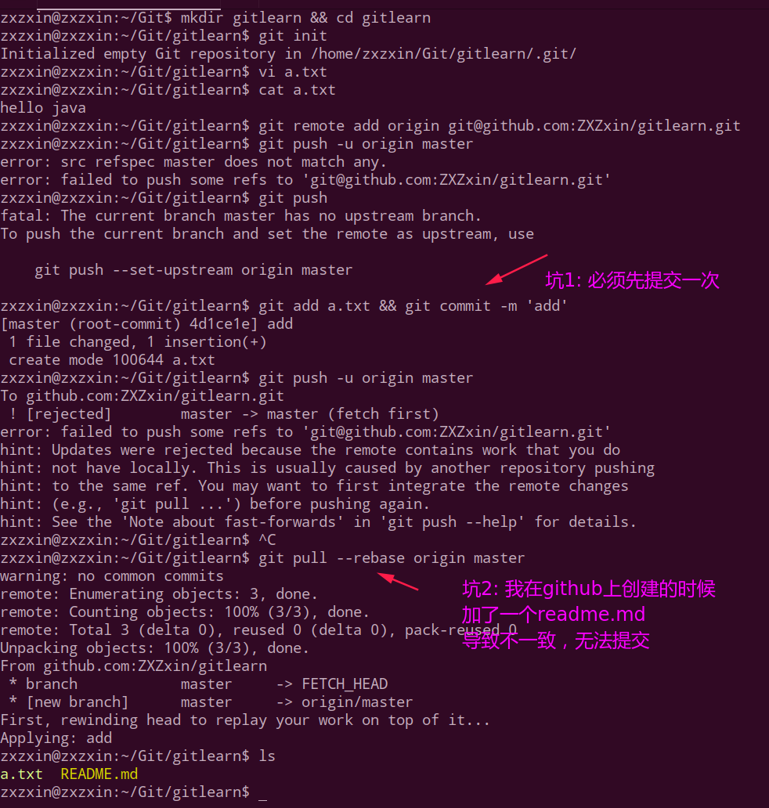
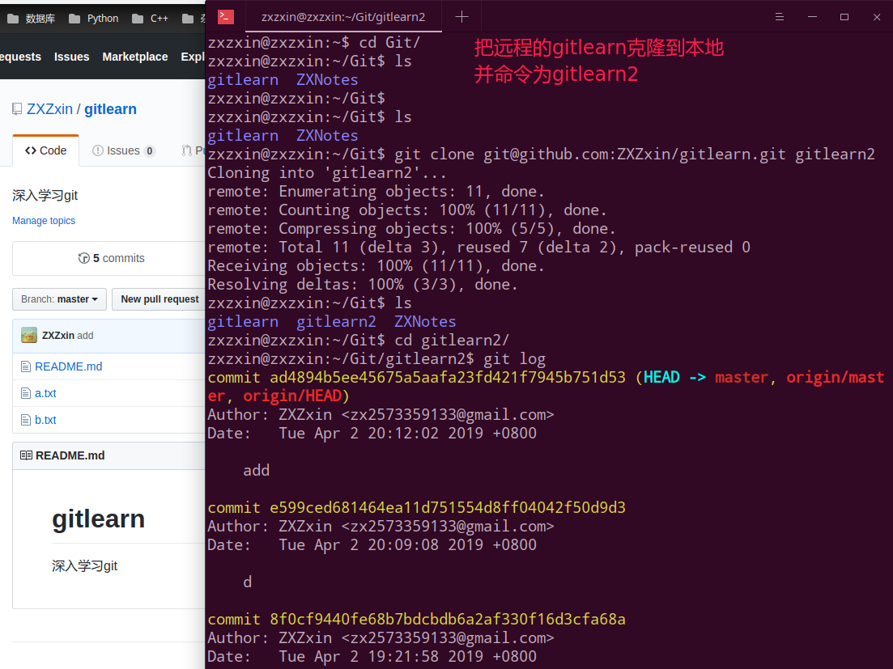
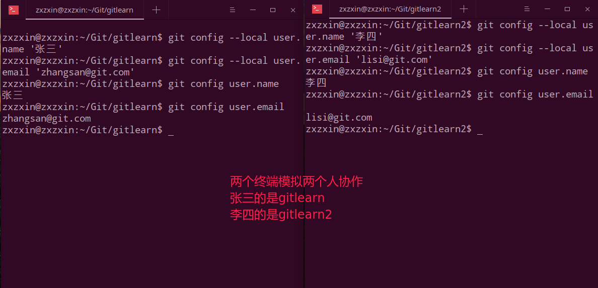
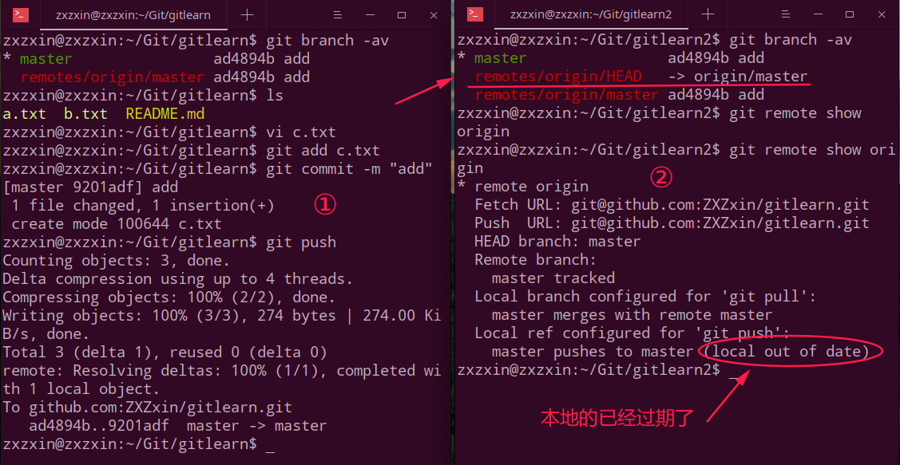
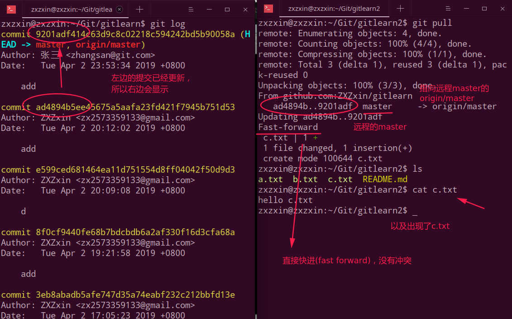
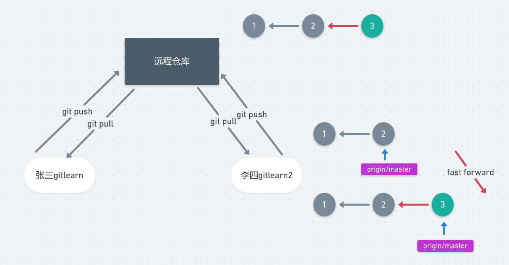

# Git远程协作和分支

## 一、远程基本操作

基本的配置远程仓库有两个命令：

* `git remote add origin git@github.com:ZXZxin/gitlearn.git `；
* `git push -u origin master`；

这里先演示环境搭建，也就是和`github`上一个仓库远程关联起来，这里遇到了一些坑，记录一下:

> 坑解决的两篇文章:
>
> * https://blog.csdn.net/yemoweiliang/article/details/52980658
> * https://blog.csdn.net/uotail/article/details/80211897
> * https://jingyan.baidu.com/article/f3e34a12a25bc8f5ea65354a.html
>
> 普及:
>
> * 可以使用`git remote show origin`，查看详细的远程remote信息(注意`origin`是一个别名，不一定要这个名字)
> * `git commit am '....'`只会将已经纳入版本库的文件`add`并提交，新增的文件不会`add`。

## 二、协作

然后我们需要再调用一次`git push`来同步远程，这样`id`就会相同了。

解释：

`git`内部会自己维护`origin/master`这个分支，我们不能操作，但是可以执行`git checkout origin/master`，虽然这个命令不会报错，但是我们实际上只是切换到了提交的那个点(`commit-id`)的位置上，也就是和之前那个游离的状态一样。我们可以在这个`commit-id`位置上进行修改，但是切换的时候要先`stash`一下。

来看一下上面的原理和过程:

初始状态: 

 

然后我们调用了增加或者修改元素，调用`git add`和`git commit`之后(这时候还没有`push`)，就会变成下面这样: (这时候git会告诉我们`master`比`origin/master`提前了一步)

 

然后我们调用`git push`，注意这个过程做了两步:

* 将本地的内容push到远程了；
* 将`origin/master`由上面的`①`指向了`②`；

 

## 三、Git协作实战

模拟环境:

* 有两个人协作，一个张三，一个李四，张三的仓库就是我们之前用的那个`gitlearn`，李四是直接从张三的远程仓库`git clone`下来的；
* 然后我们再将张三的`gitlearn`和李四的`gitlearn2`都设置一下`user.name`和`user.email`；

李四先`git clone`下来:

然后将张三和李四的用户名和密码配置一下:

现在我们在`gitlearn`添加一个`c.txt`文件，然后`git push`到远程仓库，然后在`gitlearn2`这边输入`git remote show origin`来查看区别:

> `remotes/origin/HEAD -> origin/master` 啥意思呢？  
>
> 在clone完成之后，Git 会自动为你将此远程仓库命名为`origin`（`origin`只相当于一个别名，运行`git remote –v`或者查看`.git/config`可以看到origin的含义），并下载其中所有的数据，建立一个指向它的master 分支的指针，我们用`(远程仓库名)/(分支名)` 这样的形式表示远程分支，所以`origin/master`指向的是一个`remote branch`（从那个branch我们clone数据到本地）
>
> 也就是`origin/master`是用来追踪远程分支的。

然后我们在`gitlearn2`里面执行`git pull`，将远程的最新更新拉去过来。查看最新的更新信息。

上图的过程:

下面展示会发生冲突的情况:

> 一般在`git push`之前都要进行`git pull`操作。
>
> `git pull = git fetch + git merge`。

`git fetch`会直接将代码拉到`origin/master`，但是和当前本地的`master`不会冲突。但是`git merge`就会产生冲突。

关于远程`git`分支，远程(**注意不是本地分支**)通常有如下几种: 

* 1、`master`分支: 很稳定的分支；
* 2、`test`分支: 测试分支；
* 3、`develop`分支:  变化最频繁的分支；
* 4、`hotfix`分支: 紧急bug需要修复；

