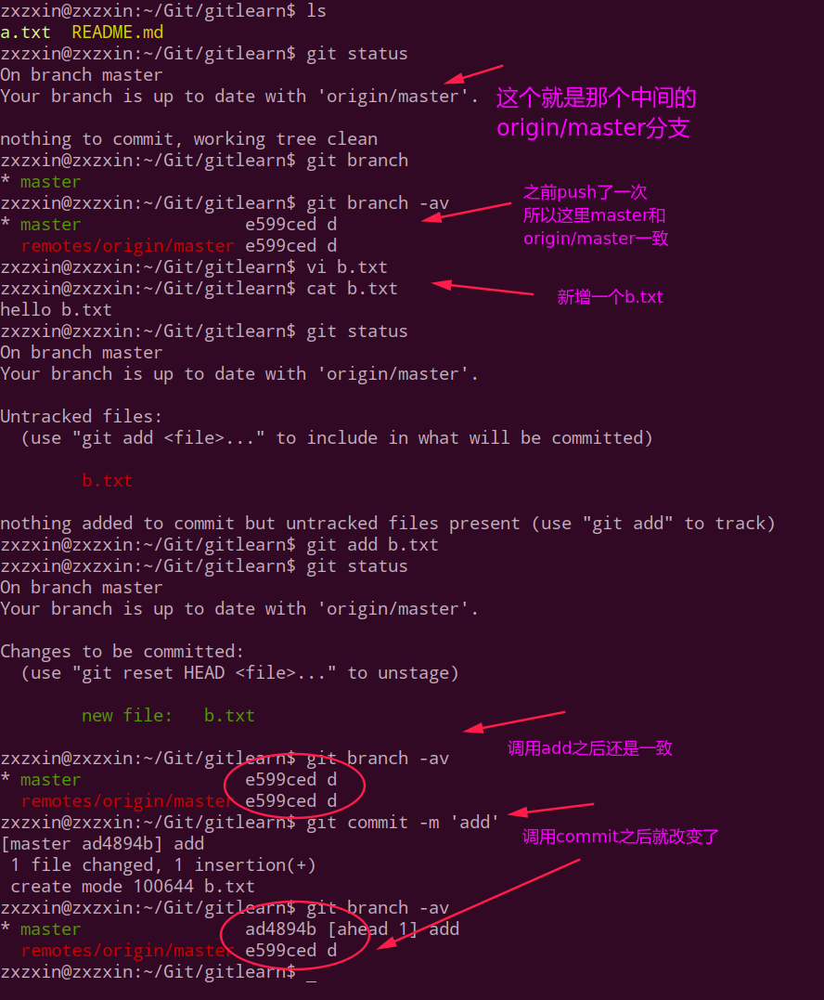
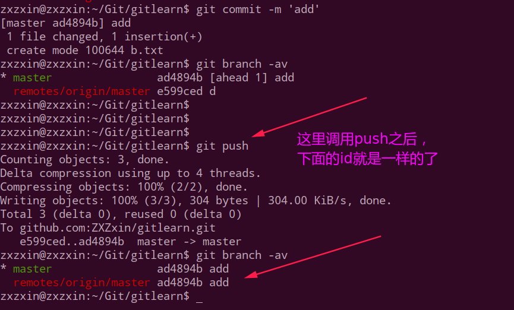

# Git远程协作和分支

## 一、远程基本操作

基本的配置远程仓库有两个命令：

* `git remote add origin git@github.com:ZXZxin/gitlearn.git `；
* `git push -u origin master`；

这里先演示环境搭建，也就是和`github`上一个仓库远程关联起来，这里遇到了一些坑，记录一下:

> 坑解决的两篇文章:
>
> * https://blog.csdn.net/yemoweiliang/article/details/52980658
> * https://blog.csdn.net/uotail/article/details/80211897
> * https://jingyan.baidu.com/article/f3e34a12a25bc8f5ea65354a.html
>
> 普及:
>
> * 可以使用`git remote show origin`，查看详细的远程remote信息(注意`origin`是一个别名，不一定要这个名字)
> * `git commit am '....'`只会将已经纳入版本库的文件`add`并提交，新增的文件不会`add`。

## 二、协作

然后我们需要再调用一次`git push`来同步远程，这样`id`就会相同了。

解释：

`git`内部会自己维护`origin/master`这个分支，我们不能操作，但是可以执行`git checkout origin/master`，虽然这个命令不会报错，但是我们实际上只是切换到了提交的那个点(`commit-id`)的位置上，也就是和之前那个游离的状态一样。我们可以在这个`commit-id`位置上进行修改，但是切换的时候要先`stash`一下。

来看一下上面的原理和过程:

初始状态: 

 

然后我们调用了增加或者修改元素，调用`git add`和`git commit`之后(这时候还没有`push`)，就会变成下面这样: (这时候git会告诉我们`master`比`origin/master`提前了一步)

 

然后我们调用`git push`，注意这个过程做了两步:

* 将本地的内容push到远程了；
* 将`origin/master`由上面的`①`指向了`②`；

 