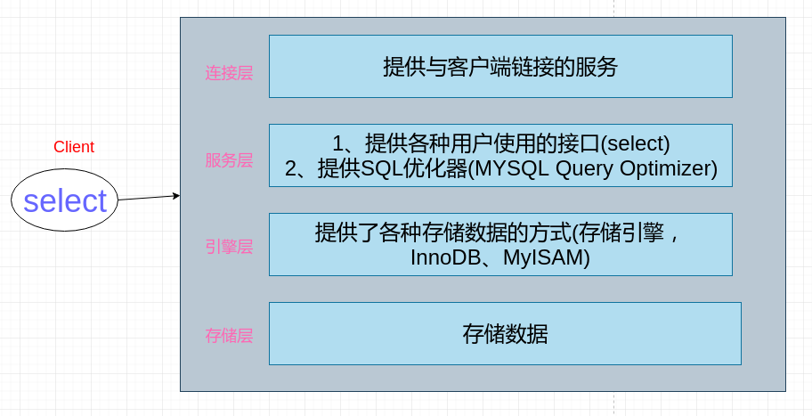
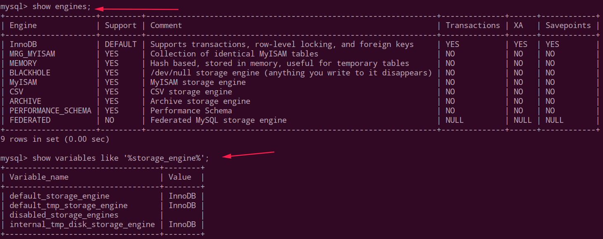
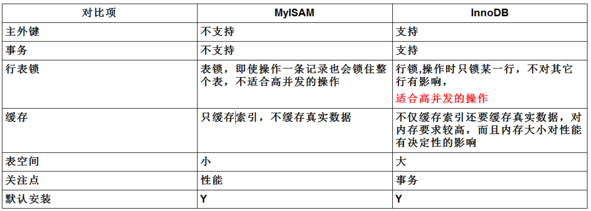
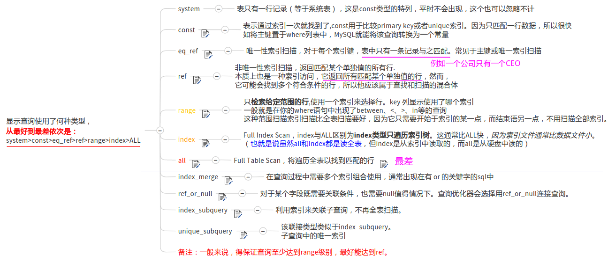
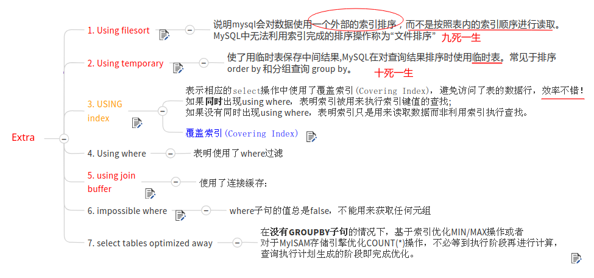
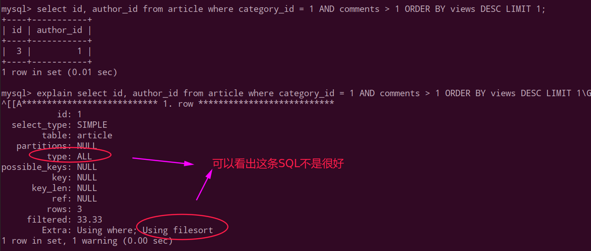
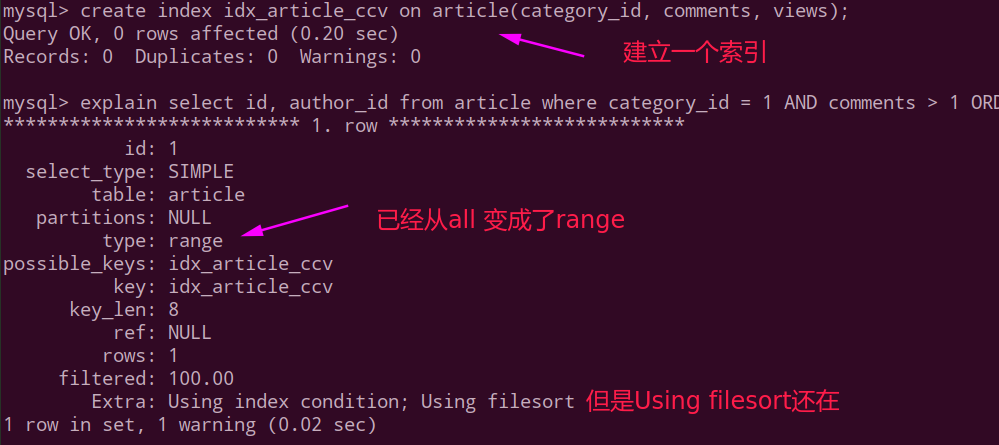

# MYSQL高级

* [一、Mysql的架构介绍](#一mysql的架构介绍)
  * [1、Mysql在Linux下的基本安装配置](#1mysql在linux下的基本安装配置)
  * [2、主要配置文件](#2主要配置文件)
  * [3、Mysql逻辑架构介绍](#3mysql逻辑架构介绍)
  * [4、Mysql存储引擎](#4mysql存储引擎)
* [二、索引优化分析](#二、索引优化分析)
* 三、查询截取分析
* 四、主从复制
* 五、Mysql锁机制

## 一、Mysql的架构介绍

### 1、Mysql在Linux下的基本安装配置

#### 1)、查看是否已经安装好


#### 2)、Mysql的启动和停止

```shell
service mysql start # 启动
service mysql stop # 停止
# 另外一种启动停止的方式
/etc/init.d/mysql start
/etc/init.d/mysql stop
```

#### 3)、在Linux下配置Mysql的密码

方式一(在mysql系统之外):
在mysql系统外:

```shell
mysqladmin -u root -p password "test123"
Enter password: 【输入原来的密码】
```

方式二(登录mysql):

```shell
mysql -u root -p
Enter password: 【输入原来的密码】
mysql>use mysql;
mysql> update user set password=password("test") where user='root';
mysql> flush privileges;
mysql> exit;      
```

#### 4)、Mysql在linux下的安装位置

| 路径              | 解释                      | 备注                         |
| ----------------- | ------------------------- | ---------------------------- |
| /var/lib/mysql/   | mysql数据库文件的存放路径 | /var/lib/mysql/              |
| /usr/share/mysql  | 配置文件目录              | mysql.server命令以及配置文件 |
| /usr/bin          | 相关命令目录              | mysqladmin mysqldump等命令   |
| /etc/init.d/mysql | 启停相关脚本              |                              |

#### 5)、中文乱码问题

一个很重要的点: **乱码问题解决是你修改完配置之后再建的新的表，之前的表还是会是乱码**。

给一个博客讲解。

> https://www.2cto.com/database/201305/215563.html

### 2、主要配置文件

* 二进制日志`log-bin` : 主从复制；
* 错误日志`log-error` : **默认是关闭的**，记录严重的警告和错误信息，每次启动和关闭的详细信息等；
* 查询日志`log` : 默认关闭，记录查询的`sql`语句，如果开启会减低`mysql`的整体性能，因为记录日志也是需要消耗系统资源的；
* 数据文件


* 如何配置: ①`windows`: `my.ini`文件；②`linux`: `/etc/my.cnf`文件；

### 3、Mysql逻辑架构介绍

Mysql逻辑架构图如下:


下面是mysql官网的体系图:




各层的基本概述

> 1.连接层
>
> 最上层是一些**客户端和连接服务**，包含本地sock通信和大多数基于客户端/服务端工具实现的类似于`tcp/ip`的通信。主要完成一些类似于连接处理、授权认证、及相关的安全方案。在该层上引入了**线程池**的概念，为通过认证安全接入的客户端提供线程。同样在该层上可以实现基于SSL的安全链接。服务器也会为安全接入的每个客户端验证它所具有的操作权限。
>
> 2.服务层
>
> 第二层架构主要完成大多少的核心服务功能，如SQL接口，并完成**缓存的查询，SQL的分析和优化及部分内置函数的执行**。所有跨存储引擎的功能也在这一层实现，如**过程、函数**等。在该层，服务器会解析查询并创建相应的内部解析树，并对其完成相应的优化如确定查询表的顺序，是否利用索引等，最后生成相应的执行操作。如果是select语句，服务器还会查询内部的缓存。如果缓存空间足够大，这样在解决大量读操作的环境中能够很好的提升系统的性能。
>
> 3.引擎层
>
> 存储引擎层，存储引擎真正的负责了MySQL中数据的存储和提取，服务器通过APl与存储引擎进行通信。不同的存储引擎具有的功能不同，这样我们可以根据自己的实际需要进行选取。
>
> 4.存储层
>
> 数据存储层，主要是将数据存储在运行于裸设备的文件系统之上，并完成与存储引擎的交互。

### 4、Mysql存储引擎

查看数据库存储引擎两个命令:

```mysql
show engines;
show variables like '%storage engine%';// 查看默认的存储引擎
```

演示:



关于MyISAM和InnoDB的简单对比:



> 问：MyISAM和InnoDB引擎的区别
>
> - MyISAM 不支持外键，而 InnoDB 支持
>
> - MyISAM 是非事务安全型的，而 InnoDB 是事务安全型的。
>
> - **MyISAM 锁的粒度是表级，而 InnoDB 支持行级锁定**。
>
> - MyISAM 支持全文类型索引，而 InnoDB 不支持全文索引。
>
> - MyISAM 相对简单，所以在效率上要优于 InnoDB，小型应用可以考虑使用 MyISAM。
>
> - MyISAM 表是保存成文件的形式，在跨平台的数据转移中使用 MyISAM 存储会省去不少的麻烦。
>
> - InnoDB 表比 MyISAM 表更安全，可以在保证数据不会丢失的情况下，切换非事务表到事务表（`alter  table tablename type=innodb`）。
>
> 应用场景:
> * MyISAM 管理非事务表。它提供高速存储和检索，以及全文搜索能力。如果应用中需要执行大量的 SELECT 查询，那么 MyISAM 是更好的选择。
> * InnoDB 用于事务处理应用程序，具有众多特性，包括 ACID 事务支持。如果应用中需要执行大量的 INSERT 或 UPDATE 操作，则应该使用 InnoDB，这样可以提高多用户并发操作的性能。
>

## 二、索引优化分析

### 1、性能下降分析

需要优化的原因：性能低、执行时间太长、等待时间太长、SQL语句欠佳（连接查询）、索引失效、服务器参数设置不合理（缓冲、线程数）	。

<div align="center"></div><br>

先看SQL执行的顺序:

```mysql
编写过程：
select dinstinct  ..from  ..join ..on ..where ..group by ...having ..order by ..limit ..

解析过程：			
from .. on.. join ..where ..group by ....having ...select dinstinct ..order by limit ...
```

解析图:


> 详细参考这篇博客: https://www.cnblogs.com/annsshadow/p/5037667.html

SQL优化， 主要就是在优化索引

*  相当于书的目录；
*  index是帮助MYSQL高效获取数据的数据结构。索引是数据结构（树：B树(默认)、Hash树...）；

### 2、索引优缺点

索引的弊端：

 * 索引本身很大， 实际上索引也是一张表，该表保存了主键与索引字段，并指向实体表的记录，所以索引列也是要占用空间的；
 * 索引不是所有情况均适用： a. 少量数据，b.频繁更新的字段，c.很少使用的字段
 * 索引会降低增删改的效率；MySQL不仅要保存数据，还要保存一下索引文件每次更新添加了索引列的字段， 都会调整因为更新所带来的键值变化后的索引信息。

 优势：

 * 提高查询效率（降低IO使用率）
 * 降低CPU使用率 （...order by age desc，因为 B树索引 本身就是一个 好排序的结构，因此在排序时  可以直接使用）

### 3、索引分类

* 主键索引：  不能重复。**id  不能是null** (设定为主键后数据库会**自动建立索引**，innodb为聚簇索引)；
* 唯一索引  ：不能重复。**id   可以是null**
* 单值索引  ： 单列， 一个表可以多个单值索引。
* 复合索引  ：多个列构成的索引 （相当于二级目录 ：  z: zhao）  (name,age)   (a,b,c,d,...,n)

创建索引的两种方式:

```mysql
创建索引：
	方式一(创建)：
        create 索引类型  索引名  on 表(字段)
            单值(普通索引)：
            create index dept_index on tb(dept);
            唯一：
            create unique index name_index on tb(name) ;
            复合索引
            create index dept_name_index on tb(dept,name);

	方式二(添加)：
		alter table 表名 索引类型  索引名（字段）
            主键索引:
            ALTER TABLE `table_name` ADD PRIMARY KEY ( `column` ) 
            单值：
            alter table tb add index dept_index(dept) ;
            唯一：
            alter table tb add unique index name_index(name);
            复合索引
            alter table tb add index dept_name_index(dept,name);
            全文索引
            ALTER TABLE `table_name` ADD FULLTEXT ( `column`) 
            
    注意：如果一个字段是primary key，则改字段默认就是 主键索引	
```

删除索引

```mysql
删除索引：
drop index 索引名 on 表名 ;
drop index name_index on tb ;
```
查询索引
```mysql
查询索引：
show index from 表名 ;
show index from 表名 \G
```

### 4、哪些情况需要建立索引，哪些不需要

需要建立索引的情况: 

* 主键自动建立唯一索引(`primary key`)；
* 频繁作为查询条件的字段应该创建索引(`where` 后面的语句)；
* 查询中与其它表关联的字段，**外键关系建立索引**；
* 单键/组合索引的选择问题，`who？`(在高并发下倾向创建组合索引)；
* 查询中排序的字段，排序字段若通过索引去访问将大大提高排序速度；
* 查询中统计或者分组字段；(`group by....`)

不需要建立索引的情况:

* 表记录太少；
* 经常增删改的表；
* **Where条件里用不到的字段不创建索引**；
* 数据重复且**分布平均**的表字段，因此应该只为最经常查询和最经常排序的数据列建立索引。 注意，如果某个数据列包含许多重复的内容，为它建立索引就没有太大的实际效果(有一个比值，不同的个数和总个数的比值越大越好)；

### 5、Explain

具体可以参考这篇博客: [https://blog.csdn.net/drdongshiye/article/details/84546264](#https://blog.csdn.net/drdongshiye/article/details/84546264)。

#### 1)、概念和作用

概念: 使用EXPLAIN关键字可以模拟优化器执行SQL查询语句，从而知道MySQL是 如何处理你的SQL语句的。分析你的查询语句或是表结构的性能瓶颈；

作用: 

* 表的读取顺序；
* 哪些索引可以使用；
* 哪些索引被实际使用；
* 数据读取操作的**操作类型**；
* 表之间的引用；
* 每张表有多少行被优化器查询；

#### 2)、id

表示：**`select`查询的序列号**，包含一组数字，表示**查询中执行select子句或操作表的顺序**。

分为三种情况:

a)、第一种情况: **id相同，执行顺序由上至下**。

此例中 先执行where 后的第一条语句 `t1.id = t2.id` 通过 `t1.id` 关联 `t2.id` 。 而  t2.id 的结果建立在 `t2.id=t3.id` 的基础之上。

b)、**id不同，如果是子查询，id的序号会递增，id值越大优先级越高，越先被执行**。

c)、id相同不同，同时存在。

id如果相同，可以认为是一组，从上往下顺序执行；在所有组中，id值越大，优先级越高，越先执行。

衍生表 = `derived2 --> derived + 2` （2 表示由 id =2 的查询衍生出来的表。type 肯定是 all ，因为衍生的表没有建立索引）

#### 3)、select_type


#### 4)、type



#### 5)、possible_keys和key

possible_keys : 显示可能应用在这张表中的索引，一个或多个。 查询涉及到的字段上若存在索引，则该索引将被列出，但不一定被查询实际使用。

key:

* 实际使用的索引。如果为NULL，则没有使用索引；
* 查询中若使用了**覆盖索引**，则该索引和查询的select字段重叠；

> 覆盖索引:
>
> 如果一个索引包含 (或者说覆盖) 所有需要查询的字段的值，我们就称之为“覆盖索引”。我们知道在InnoDB存情引擎中，如果不是主键索引，叶子节点存储的是主键+列值。最终还是要"回表"，也就是要通过主键再查找一次。这样就会比较慢。
>
> 覆盖索引就是把要查询出的列和索引是对应的，不做回表操作!  
>
> 现在我创建了索引(username,age)，在查询数据的时候: `select username , age fromuser where username = Java' and age = 22`。要查词出的列在叶子节点都存在! 所以就不要回表。


#### 6)、key_len、ref、rows

key_len 

* 表示索引中使用的字节数，可通过该列计算查询中使用的索引的长度。
* **key_len字段能够帮你检查是否充分的利用上了索引**。

ref:

* **显示索引的哪一列被使用了，如果可能的话，是一个常数**。哪些列或常量被用于查找索引列上的值；

rows:

* **rows列显示MySQL认为它执行查询时必须检查的行数**。
* 越少越好；

#### 7)、Extra



#### 8)、检测


答案:


### 6、SQL优化实战

#### 1)、实战一-单表

建表SQL:

```mysql
CREATE TABLE IF NOT EXISTS `article`(

`id` INT(10) UNSIGNED NOT NULL PRIMARY KEY AUTO_INCREMENT,
`author_id` INT(10) UNSIGNED NOT NULL,
`category_id` INT(10) UNSIGNED NOT NULL,
`views` INT(10) UNSIGNED NOT NULL,
`comments` INT(10) UNSIGNED NOT NULL,
`title` VARBINARY(255) NOT NULL,
`content` TEXT NOT NULL
);

INSERT INTO `article` (author_id,category_id,views,comments,title,content) VALUES
(1,1,1,1,1,1),
(2,2,2,2,2,2),
(1,1,3,3,3,3); 
```

表中内容:

<div algin="center"></div><br>

实战一:

查询 `categoryid` 为1 且 `comments` 大于 1 的情况下，views 最多的文章。

 

完整代码:

```mysql
mysql> select id, author_id from article where category_id = 1 AND comments > 1 ORDER BY views DESC LIMIT 1;
+----+-----------+
| id | author_id |
+----+-----------+
|  3 |         1 |
+----+-----------+
1 row in set (0.01 sec)

mysql> explain select id, author_id from article where category_id = 1 AND comments > 1 ORDER BY views DESC LIMIT 1\G
^[[A*************************** 1. row ***************************
           id: 1
  select_type: SIMPLE
        table: article
   partitions: NULL
         type: ALL
possible_keys: NULL
          key: NULL
      key_len: NULL
          ref: NULL
         rows: 3
     filtered: 33.33
        Extra: Using where; Using filesort
1 row in set, 1 warning (0.00 sec)

```

第一版优化，建立索引:



代码:

```mysql
mysql> create index idx_article_ccv on article(category_id, comments, views);
Query OK, 0 rows affected (0.20 sec)
Records: 0  Duplicates: 0  Warnings: 0

mysql> explain select id, author_id from article where category_id = 1 AND comments > 1 ORDER BY views DESC LIMIT 1\G
*************************** 1. row ***************************
           id: 1
  select_type: SIMPLE
        table: article
   partitions: NULL
         type: range
possible_keys: idx_article_ccv
          key: idx_article_ccv
      key_len: 8
          ref: NULL
         rows: 1
     filtered: 100.00
        Extra: Using index condition; Using filesort
1 row in set, 1 warning (0.02 sec)

```

结论:
type 变成了 range,这是可以忍受的。但是 extra 里使用 Using filesort 仍是无法接受的。
但是我们已经建立了索引为啥没用呢? 这是因为按照 BTree 索引的工作原理:
先排序 category_id， 如果遇到相同的 category_id 则再排序 comments,如果遇到相同的 comments 则再排序 views。当 comments 字段在联合素引里处于中间位置时，因comments > 1 条件是一个范围值(所谓 range)，
MySQL 无法利用索引再对后面的 views 部分进行检索,即 range 类型查询字段后面的索引无效。

第二版: 先删除上面那个不是很好的索引，然后只建立`(category_id, views)`之间的索引，而没有`comments`:

```mysql
mysql> drop index idx_article_ccv on article;
Query OK, 0 rows affected (0.09 sec)
Records: 0  Duplicates: 0  Warnings: 0

mysql> create index article_cv on article(category_id, views);
Query OK, 0 rows affected (0.08 sec)
Records: 0  Duplicates: 0  Warnings: 0

mysql> explain select id, author_id from article where category_id = 1 AND comments > 1 ORDER BY views DESC LIMIT 1\G
*************************** 1. row ***************************
           id: 1
  select_type: SIMPLE
        table: article
   partitions: NULL
         type: ref
possible_keys: article_cv
          key: article_cv
      key_len: 4
          ref: const
         rows: 2
     filtered: 33.33
        Extra: Using where
1 row in set, 1 warning (0.00 sec)

```

结论: 可以看到type变成了`ref`，Extra中的`Using fileSort`也消失了，结果非常理想。

#### 2)、实战二-双表

两个表:

<div align="center"> </div><br>

使用

```mysql
mysql> EXPLAIN SELECT * FROM class LEFT JOIN book ON class.card = book.card;
+----+-------------+-------+------------+------+---------------+------+---------+------+------+----------+----------------------------------------------------+
| id | select_type | table | partitions | type | possible_keys | key  | key_len | ref  | rows | filtered | Extra                                              |
+----+-------------+-------+------------+------+---------------+------+---------+------+------+----------+----------------------------------------------------+
|  1 | SIMPLE      | class | NULL       | ALL  | NULL          | NULL | NULL    | NULL |   20 |   100.00 | NULL                                               |
|  1 | SIMPLE      | book  | NULL       | ALL  | NULL          | NULL | NULL    | NULL |   20 |   100.00 | Using where; Using join buffer (Block Nested Loop) |
+----+-------------+-------+------------+------+---------------+------+---------+------+------+----------+----------------------------------------------------+
2 rows in set, 1 warning (0.04 sec)

```

结论：type 有All，不是很好。

可以看到第二行的 type 变为了 ref,rows 也变成了优化比较明显。

这是由左连接特性决定的。LEFT JOIN 条件用于确定如何从右表搜索行,左边一定都有,**所以右边是我们的关键点,一定需要建立索引**。(如果将索引建立在左边，不会有这么好)。

```mysql
mysql> ALTER TABLE `book` ADD INDEX Y ( `card`);
Query OK, 0 rows affected (0.12 sec)
Records: 0  Duplicates: 0  Warnings: 0

mysql> EXPLAIN SELECT * FROM class LEFT JOIN book ON class.card = book.card;
+----+-------------+-------+------------+------+---------------+------+---------+--------------------+------+----------+-------------+
| id | select_type | table | partitions | type | possible_keys | key  | key_len | ref                | rows | filtered | Extra       |
+----+-------------+-------+------------+------+---------------+------+---------+--------------------+------+----------+-------------+
|  1 | SIMPLE      | class | NULL       | ALL  | NULL          | NULL | NULL    | NULL               |   20 |   100.00 | NULL        |
|  1 | SIMPLE      | book  | NULL       | ref  | Y             | Y    | 4       | mysqlad.class.card |    1 |   100.00 | Using index |
+----+-------------+-------+------------+------+---------------+------+---------+--------------------+------+----------+-------------+
2 rows in set, 1 warning (0.00 sec)

```

上面的索引建立在右边的表(`book`)。下面如果我们建立在`class`表，并使用左连接，就不会有这么好的效果，如下:

```mysql
mysql> DROP INDEX Y ON book;
Query OK, 0 rows affected (0.05 sec)
Records: 0  Duplicates: 0  Warnings: 0

mysql> ALTER TABLE class ADD INDEX X (card);
Query OK, 0 rows affected (0.07 sec)
Records: 0  Duplicates: 0  Warnings: 0

mysql> 
mysql> EXPLAIN SELECT * FROM class LEFT JOIN book ON class.card = book.card;
+----+-------------+-------+------------+-------+---------------+------+---------+------+------+----------+----------------------------------------------------+
| id | select_type | table | partitions | type  | possible_keys | key  | key_len | ref  | rows | filtered | Extra                                              |
+----+-------------+-------+------------+-------+---------------+------+---------+------+------+----------+----------------------------------------------------+
|  1 | SIMPLE      | class | NULL       | index | NULL          | X    | 4       | NULL |   20 |   100.00 | Using index                                        |
|  1 | SIMPLE      | book  | NULL       | ALL   | NULL          | NULL | NULL    | NULL |   20 |   100.00 | Using where; Using join buffer (Block Nested Loop) |
+----+-------------+-------+------------+-------+---------------+------+---------+------+------+----------+----------------------------------------------------+
2 rows in set, 1 warning (0.00 sec)


```


### 6、B+Tree与B-Tree 的区别

结论在内存有限的情况下，B+TREE 永远比 B-TREE好。无限内存则后者方便。 

* 1)、B-树的关键字和记录是放在一起的，叶子节点可以看作外部节点，不包含任何信息；**B+树叶子节点中只有关键字和指向下一个节点的索引**，记录只放在叶子节点中。(一次查询可能进行两次i/o操作)

* 2)、在B-树中，越靠近根节点的记录查找时间越快，只要找到关键字即可确定记录的存在；而B+树中每个记录的查找时间基本是一样的，都需要从根节点走到叶子节点，而且在叶子节点中还要再比较关键字。从这个角度看B-树的性能好像要比B+树好，而在实际应用中却是B+树的性能要好些。因为B+树的非叶子节点不存放实际的数据，**这样每个节点可容纳的元素个数比B-树多**，树高比B-树小，这样带来的好处是减少磁盘访问次数。尽管B+树找到一个记录所需的比较次数要比B-树多，但是一次磁盘访问的时间相当于成百上千次内存比较的时间，因此实际中B+树的性能可能还会好些，**而且B+树的叶子节点使用指针连接在一起，方便顺序遍历**（例如查看一个目录下的所有文件，一个表中的所有记录等），这也是很多数据库和文件系统使用B+树的缘故。 

思考：为什么说B+树比B-树更适合实际应用中操作系统的文件索引和数据库索引？ 

1) B+树的磁盘读写代价更低 

　　**B+树的内部结点并没有指向关键字具体信息的指针**。因此其内部结点相对B 树更小。如果把所有同一内部结点的关键字存放在同一盘块中，那么盘块所能容纳的关键字数量也越多。一次性读入内存中的需要查找的关键字也就越多。相对来说IO读写次数也就降低了。 

2) B+树的查询效率更加稳定 

　　由于非终结点并不是最终指向文件内容的结点，而只是叶子结点中关键字的索引。所以任何关键字的查找必须走一条从根结点到叶子结点的路。所有关键字查询的路径长度相同，导致每一个数据的查询效率相当。

> 索引建立成哪种索引类型？
>
> 根据数据引擎类型自动选择的索引类型
>
> * 除开 innodb 引擎主键默认为聚簇索引 外。 Innodb的索引都采用的 B+TREE。
> * MyIsam 则都采用的 **B-TREE**索引。

### 7、聚簇索引和非聚簇索引

聚簇索引并不是一种单独的索引类型，而是一种数据存储方式。

**术语‘聚簇’表示数据行和相邻的键值进错的存储在一起**。

 如下图，左侧的索引就是聚簇索引，因为**数据行在磁盘的排列和索引排序保持一致。**

<div algin="center"> </div><br>

聚簇索引优点 : 按照聚簇索引排列顺序，查询显示一定范围数据的时候，**由于数据都是紧密相连，数据库不用从多个数据块中提取数据**，所以节省了大量的io操作。

聚簇索引限制 : 

- 对于mysql数据库目前只有innodb数据引擎支持聚簇索引，而MyIsam并不支持聚簇索引。
- 由于*数据物理存储排序方式只能有一种*，所以每个Mysql的表只能有一个聚簇索引。一般情况下就是该表的**主键**。
- **为了充分利用聚簇索引的聚簇的特性，所以innodb表的主键列尽量选用有序的顺序id，而不建议用无序的id，比如uuid这种。（参考聚簇索引优点。）**


### 8、全文索引、Hash索引

**全文索引** 

* MyISAM 存储引擎支持全文索引，用于查找文本中的关键词，而不是直接比较是否相等。
* 查找条件使用 MATCH AGAINST，而不是普通的 WHERE。
* 全文索引使用倒排索引实现，它记录着关键词到其所在文档的映射。

InnoDB 存储引擎在 MySQL 5.6.4 版本中也开始支持全文索引。

```mysql
不同于like方式的的查询：
SELECT * FROM article WHERE content LIKE ‘%查询字符串%’;

全文索引用match+against方式查询：(明显的提高查询效率。)
SELECT * FROM article WHERE MATCH(title,content) AGAINST (‘查询字符串’);

```

**Hash索引**

哈希索引能以 O(1) 时间进行查找，但是失去了有序性：

- **无法用于排序与分组**；
- 只支持精确查找，无法用于部分查找和范围查找。

InnoDB 存储引擎有一个特殊的功能叫“自适应哈希索引”，当某个索引值被使用的非常频繁时，会在 B+Tree 索引之上再创建一个哈希索引，这样就让 B+Tree 索引具有哈希索引的一些优点，比如快速的哈希查找。

