# 各种排序算法总结(全面)

 - [概括](#概括)
 - [冒泡排序](#冒泡排序)
 - [改进的冒泡排序-鸡尾酒排序](#改进的冒泡排序鸡尾酒排序)
 - [选择排序](#选择排序)
 - [插入排序](#插入排序)
 - [二分插入排序](#二分插入排序)
 - [希尔排序](#希尔排序)
 - [快速排序](#快速排序)
 - [归并排序](#归并排序)
 - [堆排序](#堆排序)
 - [计数排序](#计数排序)
 - [基数排序](#基数排序)
 - [桶排序](#桶排序)
 - [测试代码](#测试代码)
 - [附C++部分代码](#附c部分代码)
***
## 概括
排序算法大体可分为两种：

 - 一种是比较排序，时间复杂度`O(nlogn) ~ O(n^2)`，主要有：冒泡排序，选择排序，插入排序，归并排序，堆排序，快速排序等。
 - 另一种是非比较排序，时间复杂度可以达到`O(n)`，主要有：计数排序，基数排序，桶排序等。

下面给出常见比较算法的排序性能

|排序方法|平均情况|最好情况|最坏情况|空间|稳定性|
|-|-|-|-|-|-|
|冒泡|O(n<sup>2</sup>)|O(n)|O(n<sup>2</sup>)|O(1)|稳定|
|简单选择排序|O(n<sup>2</sup>)|O(n<sup>2</sup>)|O(n<sup>2</sup>)|O(1)|不稳定|
|直接插入排序|O(n<sup>2</sup>)|O(n)|O(n<sup>2</sup>)|O(1)|稳定|
|希尔排序|O(nlogn) ~ O(n<sup>2</sup>)|O(n<sup>1.3</sup>)|O(n<sup>2</sup>)|O(1)|不稳定|
|堆排序|O(nlogn)|O(nlogn)|O(nlogn)|O(1)|不稳定|
|归并排序|O(nlogn)|O(nlogn)|O(nlogn)|O(n)|稳定|
|快速排序|O(nlogn)|O(nlogn)|O(n<sup>2</sup>)|O(logn)~O(n)|不稳定|


 - **另外在说一下关于排序算法的<font color = crimson>稳定性问题 :</font>　排序算法稳定性的简单形式化定义为：如果`arr[i] = arr[j]`，排序前`arr[i]`在`arr[j]`之前，排序后`arr[i]`还在`arr[j]`之前，则称这种排序算法是稳定的。通俗地讲就是保证排序前后两个相等的数的相对顺序不变。**（<font color = blue>可以通过自定义比较函数来去除稳定性问题</font>）


举例：对于冒泡排序，原本是稳定的排序算法，如果将记录交换的条件改成`arr[i] >= arr[i + 1]`，则两个相等的记录就会交换位置，从而变成不稳定的排序算法。 

**为了使下面的代码方便，这里贴出Swap函数，交换数组中某两个位置的值**；

```java
static void swap(int[] arr,int i,int j) { 
    int temp = arr[i];
    arr[i] = arr[j]; 
    arr[j] = temp;
}
```
或者这样:

```java
static void swap(int[] arr,int i,int j) {
    arr[i] = arr[i] ^ arr[j];
    arr[j] = arr[i] ^ arr[j];
    arr[i] = arr[i] ^ arr[j];
}
```

## <font color = red id = "1">冒泡排序

冒泡排序是比较简单的排序算法，它的运作过程如下：

 - 进行`n-1`次排序。
 - 每次排序从`0~n-1-i`(`i`是次数编号)，检查这个序列中的数，两两相邻的数，如果前面的大于后面的就将它们交换，这样使得大的数往后面走，每次冒泡就会将一个大的数往后面冒，从而达到目的。

```java
/**冒泡排序(加入了判断是否已经排序了的boolean变量) */
static void bubbleSort(int[] arr) {
    for(int end = arr.length-1; end > 0; end--){
        boolean isSort = true;
        for(int i = 0; i < end; i++){
            if(arr[i] > arr[i+1]){
                swap(arr,i,i+1);
                isSort = false;
            }
        }
        if(isSort)break;
    }
}
```
我们可以还可以做一个优化 :

* 记录上一次最后交换的那个位置`border`；
* 下一轮交换只需要进行到这个位置即可；
```java
static void bubbleSort2(int[] arr){
    for(int end = arr.length-1; end > 0; end--){
        int border = 0;
        for(int i = 0; i < end; i++){
            if(arr[i] > arr[i+1]){
                swap(arr, i, i+1);
                border = i+1;
            }
        }
        end = border;
    }
}
```

***
## <font color = red id = "2">鸡尾酒排序-改进的冒泡排序

也叫做<font color = crimson>定向</font>冒泡排序:

* 它的改进在于同时的冒泡两边，<font color = crimson>从低到高，然后从高到低；
* 相当于顺便把最小的数也冒泡到最前面</font>这个方法比冒泡更加高效一点；

代码:

```java
/**改进的冒泡排序(鸡尾酒排序)  就是把最大的数往后面冒泡的同时，　最小的数也往前面冒泡*/
static void cocktailSort(int[] arr) {
    int L = 0,R = arr.length-1;
    while(L < R) {
        for(int i = L; i < R; i++) if(arr[i] > arr[i+1]) swap(arr,i,i+1);
        R--;
        for(int i = R; i > L; i--) if(arr[i] < arr[i-1]) swap(arr,i,i-1);
        L++;
    }
}
```
***
## <font color = red id = "3">选择排序
选择排序的思想是：

 - 在序列中找到最小（大）元素，放到序列的起始位置作为已排序序列；
 - 再从剩余未排序元素中继续寻找最小（大）元素，放到<font color = crimson>**已排序序列的末尾**</font>。

代码:


```java
//选择排序
static void selectSort(int[] arr){
    for(int i = 0; i < arr.length; i++) {
        int minIndex = i;/**记录后面的最小值的下标*/
        for (int j = i + 1; j < arr.length; j++) //注意从i+1开始
            minIndex = arr[j] < arr[minIndex] ? j : minIndex;
        swap(arr,i,minIndex);
    }
}
```
***
## <font color = red id = "4">插入排序

插入排序的思想有点类似抓扑克牌 ， 过程如下:

  - 从第一个元素开始，该元素可以看作已经排好序；

  - 取出下一个元素，从这个元素从后往前开始扫描，如果该元素大于新元素，将该元素移到下一位置；

  - 重复上述步骤，直到找到已排序的元素小于或者等于新元素的位置，将新元素插入到该位置后；

  - **注意插入排序和数据状况有关系，涉及到最好情况，最差情况和平均情况。**

  - 插入排序在工程上，当数组元素个数少的时候用的多，因为如果数组比较有序的话，会很快；

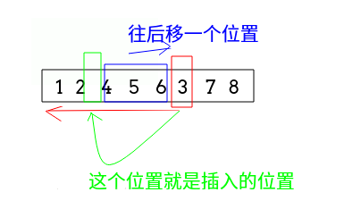

代码:

```java
// 插入排序
static void insertSort(int[] arr) {
    for (int i = 1; i < arr.length; i++) {
        int key = arr[i], j;
        for (j = i - 1; j >= 0 && key < arr[j]; j--) arr[j + 1] = arr[j]; //中间的元素往后面移动
        arr[j + 1] = key;   //将key插入到合适的位置
    }
}
```
更加简单的做法，配上swap函数:(有点类似冒泡了):<font color = red>这里要注意第二层循环的下标j > 0。</font>

```java
static void insertSort2(int[] arr){
    for (int i = 1; i < arr.length; i++){
        for(int j = i; j > 0 && arr[j] < arr[j-1]; j--)swap(arr,j,j-1);
    }
}
```

***
## <font color = red id = "5">二分插入排序
二分插入排序是对插入排序的一个小小的改进：

 - 改进的地方在于<font color = crimson>在前面已经排好序的序列中找当前要插入的元素的时候采用二分查找的方式去找那个插入的位置(大于key的那个位置) ，关于二分查找可以看[这篇博客](https://blog.csdn.net/zxzxzx0119/article/details/82670761#t4)</font>；
 - 找到那个位置之后，再进行元素的移动，已及把那个元素插入到找到的那个位置；

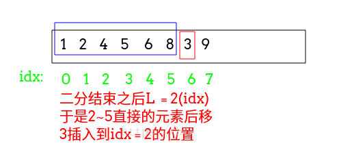

代码:

```java
//二分插入排序
static void insertSort3(int[] arr) {
    for(int i = 1; i < arr.length; i++) {
        int key = arr[i];
        int L = 0, R = i-1;
        while(L <= R) {
            int mid = L + (R-L)/2;
            if(arr[mid] > key)R = mid - 1;
            else L = mid + 1;
        }
        //二分结束之后　L = 刚好大于key(不是等于)的那个位置

        for(int j = i-1; j >= L; j--)arr[j+1] = arr[j];
        arr[L] = key;
    }
}
```
***
## <font color = red id = "6">希尔排序
希尔排序使更高效的插入排序，它的思想在于，

 - 把数组分成几块，每一块进行一个插入排序；
 - 而分块的依据在于<font color = crimson >增量的选择</font>分好块之后，<font color = crimson >从gap开始到n，每一组和它前面的元素（自己组内的）进行插入排序</font>；

**每次和组内的元素比较完之后，最后的元素基本就是有序的了，希尔排序相对于插入排序的优势在于插入排序每次只能将数据移动一位，不过希尔排序时间复杂度的大小还是要取决于步长的合适度，另外希尔排序不是一种稳定的排序算法。**

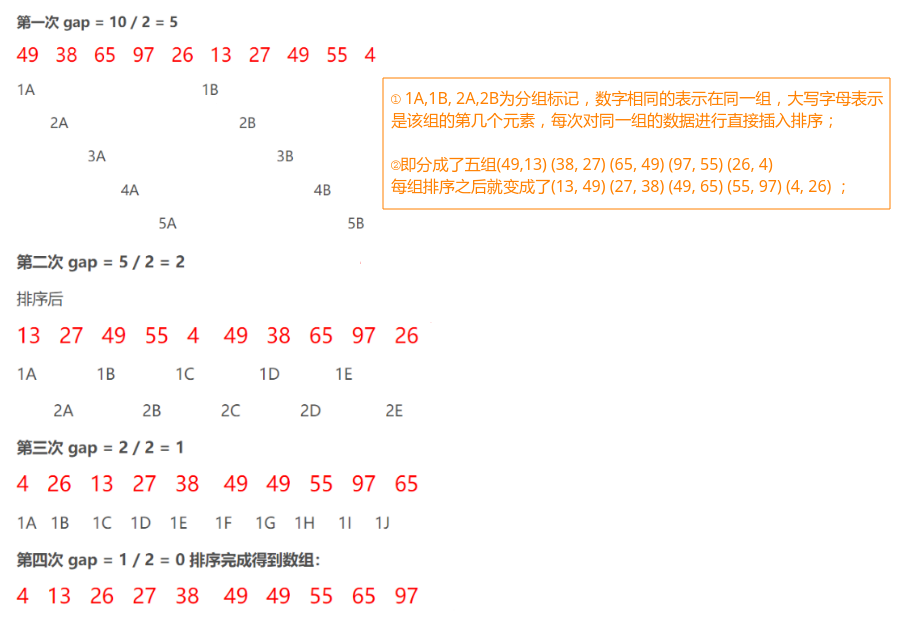

代码:

```java
//步长为n/2....
static void shellSort2(int[] arr) {
    for(int gap = arr.length; gap > 0; gap /= 2) {     //增量序列
        for(int i = gap; i < arr.length; i++) {        //从数组第gap个元素开始
            int key = arr[i],j;                        //每个元素与自己组内的数据进行直接插入排序
            for(j = i-gap; j >= 0 && key < arr[j]; j -= gap) arr[j+gap] = arr[j];
            arr[j+gap] = key;
        }
    }
}
    
//步长为 n*3+1
static void shellSort(int[] arr) {
    int gap = 0; 
    for(; gap <= arr.length; gap = gap*3+1);
    for(; gap > 0; gap = (gap-1)/3) { //增量序列
        for(int i = gap; i < arr.length; i++) {  //从数组第gap个元素开始
            int key = arr[i],j;  //每个元素与自己组内的数据进行直接插入排序
            for(j = i-gap; j >= 0 && key < arr[j]; j -= gap) arr[j+gap] = arr[j];
            arr[j+gap] = key; 
        }
    }
} 
```
***
## <font color = red id = "7">快速排序

快速排序有几种不同的实现方式，先看最简单的，快排的宏观过程就是每次递归左右两边划分，关键是划分的过程，即`partition`过程的写法，先看最原始的`partition`:

* 在`[L, R]`之间，选取`arr[L]`为划分点`key`；
* 然后从`[L, R]`，如果当前`arr[i] < key`，就放到左边部分`swap(arr, i, ++pivot);`，否则就不动；
* 最后将数组划分成了`arr[L...p-1] < arr[p]` ， `arr[p+1...R] > arr[p]`，并返回`p`；


代码:

```java
static void quickSort(int arr[]) {
    if (arr == null || arr.length <= 1)
        return;
    quickProcess(arr, 0, arr.length - 1);
}

static void quickProcess(int[] arr, int L, int R) {
    if (L >= R)
        return;
    int p = partition(arr, L, R);
    quickProcess(arr, L, p - 1);
    quickProcess(arr, p + 1, R);
}

/**
* 对arr[l...r]部分进行partition操作
* 返回p, 使得arr[L...p-1] < arr[p] ; arr[p+1...R] > arr[p]
*/
static int partition(int[] arr, int L, int R) {
    //直接选取 arr[L]作为pivot(中心点)
    int key = arr[L];
    int pivot = L;
    for (int i = L + 1; i <= R; i++) {
        if (arr[i] < key)
            swap(arr, i, ++pivot);
    }
    swap(arr, pivot, L); // 将arr[L]放到pivot位置(中间) --> 完全了按照arr[L]划分数组的目的
    return pivot;
}
```
<font color = green>**第一个优化(随机快排) (解决划分数选取不好的问题)**</font>
上面的快速排序当选取的划分的元素(`pivot = arr[L]`)很小(或者很大)，使得后面划分的数组极度的不平衡的时候，会将快速排序降到<font color = red>O(N<sup>2</sup>)</font>，于是我们使用<font color = red>随机快排</font>，即不是将`arr[L]`作为划分点，而是随机选取一个元素作为(`pivot`)：

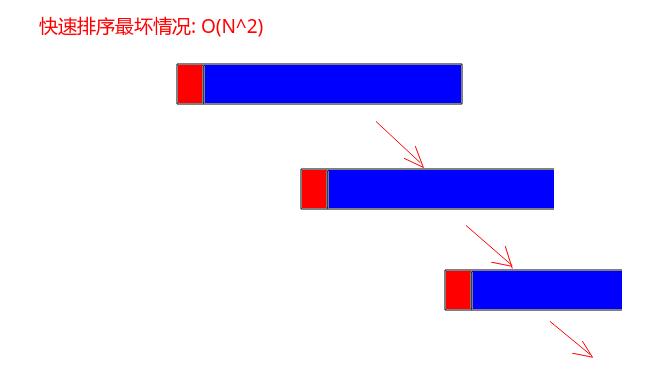

代码:

```java
static void quickSort(int arr[]) {
    if (arr == null || arr.length <= 1)
        return;
    quickProcess(arr, 0, arr.length - 1);
}

static void quickProcess(int[] arr, int L, int R) {
    if (L >= R)
        return;
    swap(arr, L, L + (int) (Math.random() * (R - L + 1))); //随机选取一个pivot
    int p = partition(arr, L, R);
    quickProcess(arr, L, p - 1);
    quickProcess(arr, p + 1, R);
}

static int partition(int[] arr, int L, int R) {
    //直接选取 arr[L]作为pivot(中心点)
    int key = arr[L];
    int pivot = L;
    for (int i = L + 1; i <= R; i++) {
        if (arr[i] < key)
            swap(arr, i, ++pivot);
    }
    swap(arr, pivot, L); // 将arr[L]放到pivot位置(中间) --> 完全了按照arr[L]划分数组的目的
    return pivot;
}
```

<font color = green>**第二个优化(双路快速排序)(解决重复元素多的问题)**</font>

当我们要排序的数组<font color = red>重复元素很多</font>的情况下，还是会使得划分极其的不均匀: 

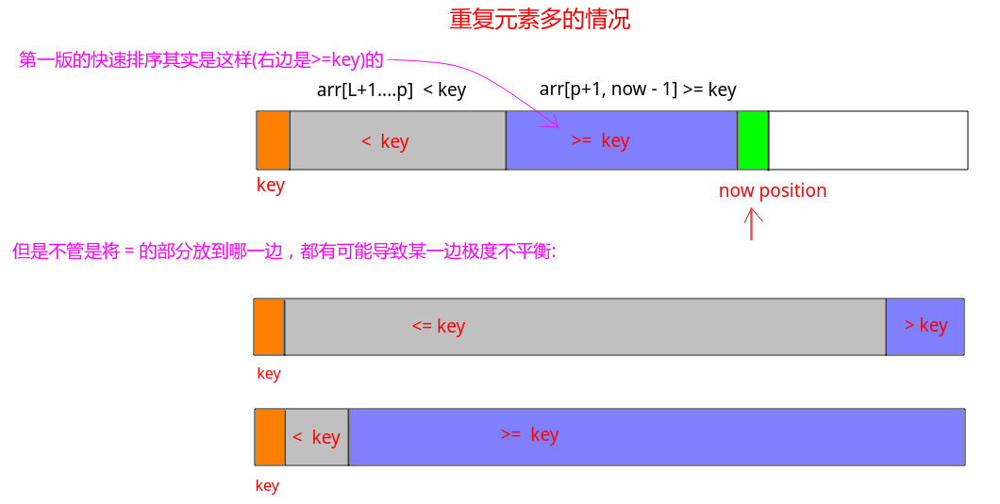

第一个解决的方法: <font color = blue>换一种划分的方式: 

* 将 `<key`和`>key`的元素放在数组的两边，更准确的说是: <font color =red>左端放的是 `<=key`的元素，右端放的是`>=key`的元素；
* 然后设置两个指针(一个从`L`开始，一个从`R`开始)，然后向中间靠拢，分别找到第一个`>=key`(左边)、`<=key`(右边)的元素，就停止扫描，然后交换这两个位置，终止条件是两个指针相碰；
* 为什么这样就可以解决重复元素多的问题呢? 因为两个指针的元素相等且都等于`key`的时候，还是要交换两个位置，这样就不会将重复的元素集中在同一侧。

解决方式: 

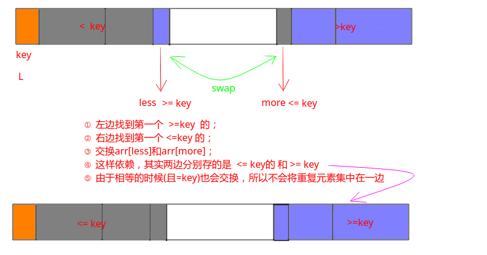

改进代码: 

```java
static void quickSort(int arr[]) {
    if (arr == null || arr.length <= 1)
        return;
    quickProcess(arr, 0, arr.length - 1);
}

static void quickProcess(int[] arr, int L, int R) {
    if (L >= R)
        return;
    swap(arr, L, L + (int) (Math.random() * (R - L + 1))); //随机选取一个pivot
    int p = partition(arr, L, R);
    quickProcess(arr, L, p - 1);
    quickProcess(arr, p + 1, R);
}

static int partition(int[] arr, int L, int R) {
    int key = arr[L];
    int less = L + 1, more = R;
    while (true) {
        while (less < R && arr[less] < key) less++;
        while (more > L && arr[more] > key) more--;
        if (less >= more)// not less > more  
            break;
        swap(arr, less++, more--);
    }
    swap(arr, L, more); // finally let L to the middle 
    return more;
}
```
<font color = green>**第三个优化(三路快速排序)(更好的解决重复元素多的问题)**</font>
三路快排关键在于`partion`的过程(荷兰国旗问题)，也就是将一个数组按照某个数划分成三部分:

 - 先从序列中选取一个数作为基数(`key`)；
 - 分区过程，将`<key`放到左边，`>key`的放在右边，`=key`放到中间；
 - 再对左右区间重复第二步，直到各区间只有一个数；
 - 返回的`p`数组中`p[0]`代表的是等于区域的左边界，`p[1]`代表的是等于区域的右边界；

 过程: 
 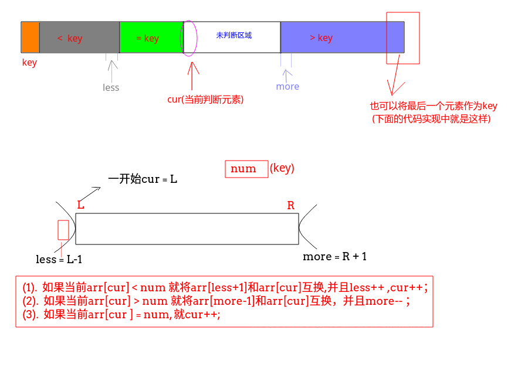

代码:

```java
static int[] partition(int[] arr, int L, int R, int num) {
    int less = L - 1; //小于部分的最后一个数
    int more = R + 1;
    int cur = L;
    while (cur < more) {
        if (arr[cur] < num) {
            swap(arr, ++less, cur++); //把这个比num小的数放到小于区域的下一个，并且把小于区域扩大一个单位
        } else if (arr[cur] > num) {
            swap(arr, --more, cur); //把这个比num大的数放到大于去余的下一个，并且把大于区域扩大一个单位
            //同时，因为从大于区域拿过来的数是未知的，所以不能cur++ 还要再次判断一下arr[cur]
        } else {// 否则的话就直接移动
            cur++;
        }
    }
    return new int[]{less + 1, more - 1};  //返回的是等于区域的两个下标
}
```

<font color = red>荷兰国旗问题的一个[经典应用题LeetCode75-Sort Colors](https://blog.csdn.net/zxzxzx0119/article/details/82715141)。</font>
注意这里的快速排序就是`partition`更改的，默认将`R`中的最后一个作为划分(也可以用`arr[L]`)．
<font color =  red>这里总结一下优化 (**所有的优化都是为了划分的均匀**):  </font>

 - 这里实际上使用的是<font color = red>三路快排</font>，这个是为了<font color = blue>防止数组中有很多重复的元素</font>	；

 - 使用的是<font color = red>随机快排</fon>，时间复杂度是概率级别的`Ologn`(<font color = blue>防止数组近乎有序</font>)；
- 注意下面我写了<font color= red>四种</font>`partition`的过程，达到的效果是一样的，分别使用`arr[L]`和`arr[R]`来作划分，一些细节和边界的不同导致程序不同；

最终三路快排代码如下: (**下面的四个partition都是三路快排，只不过写的稍微有点不同**)
```java
static void quickSort(int arr[]) {
    if (arr == null || arr.length <= 1) return;
    quickProcess(arr, 0, arr.length - 1);
}

/**
 * 使用随机快排 (也就是 时间复杂度是概率的，防止我们选取的划分的数使得左右两边划分的很不均匀)
 * 随机快排的额外空间复杂度为Ologn
 */
static void quickProcess(int[] arr, int L, int R) {
    if (L >= R)
        return;
    /**随机化的排序 期望为Ologn从前面的数中随机选出一个数和最后一个数交换 不至于极端的情况使得两边划分很不对称*/
    swap(arr, R, L + (int) (Math.random() * (R - L + 1))); //例子3~6 --> [0~1)*3 --> 0~2
    int[] p = partition4(arr, L, R); // 分别用partition、partition2、partition3测试都可以
    quickProcess(arr, L, p[0] - 1);
    quickProcess(arr, p[1] + 1, R);
}

/**
 * 划分函数,这里使用的是arr[R]来划分, 左边的都比arr[R]小，右边都比arr[R]大
 * 返回的数组是中间相等的两个下标
 */
static int[] partition(int[] arr, int L, int R) {
    int cur = L, less = L - 1, more = R;
    int key = arr[R];
    while (cur < more) {
        if (arr[cur] < key)
            swap(arr, ++less, cur++);
        else if (arr[cur] > key)
            swap(arr, --more, cur);
        else
            cur++;
    }
    swap(arr, more, R);  //把最后那个数放到中间
    return new int[]{less + 1, more};  //当然如果没有相等的部分  那less+1 = more
}

/**
 * 上面的简写方式
 **/
static int[] partition2(int[] arr, int L, int R) {
    int less = L - 1, more = R;  //把最后这个数当作标准 也可以使用第一个
    while (L < more) {
        if (arr[L] < arr[R])
            swap(arr, ++less, L++);
        else if (arr[L] > arr[R])
            swap(arr, --more, L);
        else
            L++;
    }
    swap(arr, more, R);  //把最后那个数放到中间
    return new int[]{less + 1, more};  //为什么不是 more-1,因为上面又交换了一个, 当然如果没有相等的部分  那less+1 = more
}

/**
 * 正方向：按照 arr[L]来划分
 **/
static int[] partition3(int[] arr, int L, int R) {
    int key = arr[L], cur = L + 1;
    int less = L, more = R + 1; // more在外面(R+1)，等下循环cur < more
    while (cur < more) {
        if (arr[cur] < key)
            swap(arr, ++less, cur++);
        else if (arr[cur] > key)
            swap(arr, --more, cur);
        else cur++;
    }
    swap(arr, L, less);
    return new int[]{less, more - 1};
}

/**
 * 对比partition3的不同
 **/
static int[] partition4(int[] arr, int L, int R) {
    int key = arr[L], cur = L + 1;
    int less = L, more = R; // more = R，等下循环cur <= more
    while (cur <= more) { // not cur < more
        if (arr[cur] < key)
            swap(arr, ++less, cur++);
        else if (arr[cur] > key)
            swap(arr, more--, cur); // 对比上面,不是--more,这些就是边界问题
        else cur++;
    }
    swap(arr, L, less);
    return new int[]{less, more}; //同样返回的也不同
}

static void swap(int[] arr, int a, int b) {
    int temp = arr[a];
    arr[a] = arr[b];
    arr[b] = temp;
}
```

**注意这里和荷兰国旗`partitiion`过程的不同:**

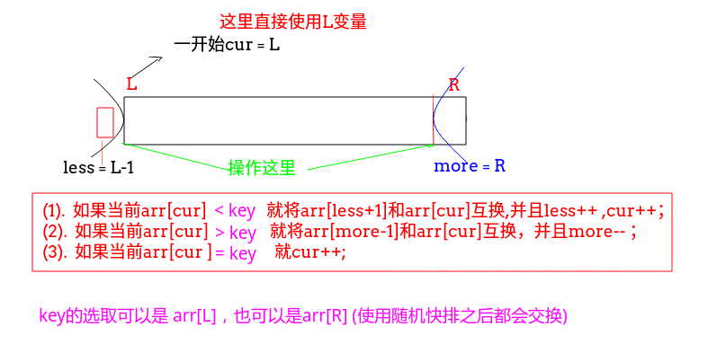

**注意最后的`arr[more]`和`arr[R]`的交换(注意最后的交换和返回的下标位置):**

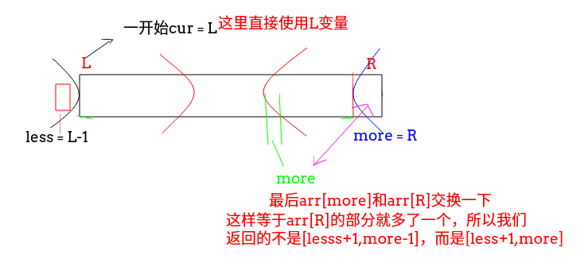 

***
## <font color = red id = "8">归并排序
**归并排序也是分治法一个很好的应用，先递归到最底层，然后从下往上每次两个序列进行归并合起来，是一个由上往下分开，再由下往上合并的过程。**

**而对于每一次合并操作，对于每一次`merge`的操作过程如下：**

*  准备一个额外的数组(`help`)，使其大小为两个已经排序序列之和，该空间用来存放合并后的序列；
* 设定两个指针，最初位置分别为两个已经排序序列的起始位置；
* 比较两个指针所指向的元素，选择相对小的元素放入到合并空间，并移动指针到下一位置；
* 重复步骤3直到某一指针达到序列尾；
* 将另一序列剩下的所有元素直接复制到合并序列尾；

看下面的例子合并过程如下：


```java
static void mergeSort(int[] arr) {
    if (arr == null || arr.length <= 1)
        return;
    mergeProcess(arr, 0, arr.length - 1);
}

static void mergeProcess(int[] arr, int L, int R) {
    if (L >= R)
        return;  //递归条件判断
    int mid = L + ((R - L) >> 1); //这个相当于 (R+L)/2;
    mergeProcess(arr, L, mid);  //T(n/2)
    mergeProcess(arr, mid + 1, R); //T(n/2)
    /**这个是一个优化，因为arr[L,mid]和arr[mid+1,R]已经有序，所以如果满足这个条件，就不要排序了,防止一开始数组有序*/
    if (arr[mid] > arr[mid + 1])
        merge(arr, L, mid, R);  // O(n)
    //整个的表达式  T(n) = 2*T(n/2) + O(n) 使用master公式求出  N*logN
}

static void merge(int[] arr, int L, int mid, int R) {
    int[] help = new int[R - L + 1];
    int k = 0;
    int p1 = L, p2 = mid + 1;
    //while(p1 <= mid && p2 <= R)
    //   help[k++] = arr[p1] < arr[p2]  ? arr[p1++] : arr[p2++];
    while (p1 <= mid && p2 <= R)
        help[k++] = arr[p1] <= arr[p2] ? arr[p1++] : arr[p2++];  //左右两边相等的话，就先拷贝左边的(实现稳定性)
    while (p1 <= mid)  //左边剩余的部分
        help[k++] = arr[p1++];
    while (p2 <= R)   //右边剩余的部分
        help[k++] = arr[p2++];
    for (int i = 0; i < k; i++) //拷贝回原来的数组
        arr[i + L] = help[i];
}
```

注意几点: 

 - **注意上面的代码中`if(arr[mid] > arr[mid+1])`防止一开始数组很有序的情况；**
 - **注意在外排比较的时候，为了保证稳定性，左右相等的时候，先拷贝左边的；**


**另外再补充一个[LintCode532Reverse Pairs归并排序求解逆序数](https://www.lintcode.com/problem/reverse-pairs/description)的问题**:  


这个的关键在于，在合并`l ~ mid`和`mid+1~r`的过程中，只要`arr[p1] > arr[p2]`，则`arr[p2]`和`arr[p1 ~ mid]`都能组成逆序对，所以我们每次都可以加上`mid - p1 + 1`个数，故可以方便求出逆序数对数。

```java
public class Solution {
    /**
     * @param A: an array
     * @return: total of reverse pairs
     */
    
    public long reversePairs(int[] arr){
        if(arr == null || arr.length <= 1)
        	return 0;
        return mergeProcess(arr,0,arr.length-1);
    }

    public long mergeProcess(int[] arr,int L,int R){
        if( L == R)return 0;
        int mid = L + ((R-L) >> 1);
        return mergeProcess(arr,L,mid)
                + mergeProcess(arr,mid+1,R)
                + merge(arr,L,mid,R);//注意merge放在后面
    }
    public long merge(int[] arr,int L,int mid,int R){
        int[] help = new int[R-L+1];
        int k = 0;
        long sum = 0;
        int p1 = L,p2 = mid + 1;
        while(p1 <= mid && p2 <= R){
            if(arr[p1] <= arr[p2]){
                help[k++] = arr[p1++];
            }else {   //arr[p1] > arr[p2] 此时p2都小于arr[p1,mid]之间的元素
                sum += (mid-p1+1);  //加上逆序数的个数
                help[k++] = arr[p2++];
            }
        }
        while(p1 <= mid)
            help[k++] = arr[p1++];
        while(p2 <= R) 
            help[k++] = arr[p2++];
        for(int i = 0; i < k; i++)
            arr[i+L] = help[i];
        return sum;
    }
}
```
**还有一个题目就是小和问题:  具体的问题和上面的逆序数差不多。**

题目:

> 小和问题 
>
> 在一个数组中，每一个数左边比当前数小的数累加起来，叫做这个数组的小和。求一个数组
> 的小和。
>
> 例子;
>
> `[1,3,4 2,5]`
>
> 1左边比1小的数，没有；
>
> 3左边比3小的数，1；
>
> 4左边比4小的数，1、3；
>
> 2左边比2小的数，1；
>
> 5左边比5小的数，1、3、4、2；
> 所以小和为1+1+3+1+1+3+4+2=16

代码类似:

```java
static int mergeSortSum(int[] arr) {
    if (arr == null || arr.length <= 1) return 0;
    return mergeProcess(arr, 0, arr.length - 1);
}

static int mergeProcess(int[] arr, int L, int R) {
    if (L == R) return 0;
    int mid = L + ((R - L) >> 1); 
    return mergeProcess(arr, L, mid) +
            mergeProcess(arr, mid + 1, R) +
            merge(arr, L, mid, R); //左边的小和和右边的小和
}

static int merge(int[] arr, int L, int mid, int R) {
    int[] help = new int[R - L + 1];
    int i = 0, sum = 0;
    int p1 = L, p2 = mid + 1;
    while (p1 <= mid && p2 <= R) {
        if (arr[p1] < arr[p2]) {//如果arr[p1] < arr[p2] 则arr[p1] < arr[p2 ~ R]
            sum += arr[p1] * (R - p2 + 1);
            help[i++] = arr[p1++];
        } else {
            help[i++] = arr[p2++];
        }
    }
    while (p1 <= mid) help[i++] = arr[p1++];
    while (p2 <= R) help[i++] = arr[p2++];
    for (i = 0; i <= R - L; i++) arr[i + L] = help[i];
    return sum;
}
```

***

另外，归并排序也可以<font color = red>自底向上</font>的进行: 

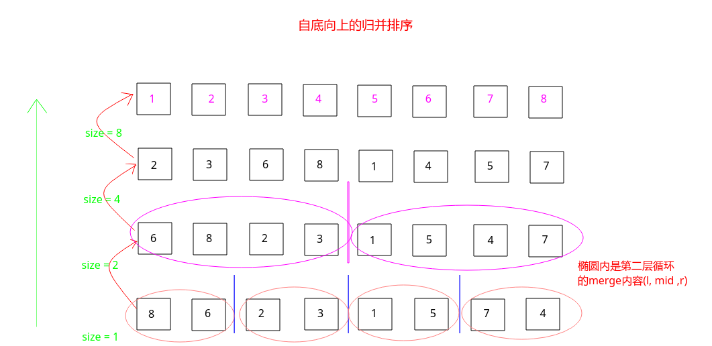

代码实现注意两个细节: 
* 第二层循环: `sz + i -1 = mid` ，注意不要越界，所以在第二层循环中`i+sz < arr.length`；
* 同理，`i+2*sz - 1`也要保证不能越界，所以和`arr.length - 1`取最小值；
```java
static void mergeSortBU(int[] arr){
    for(int sz = 1; sz <= arr.length; sz += sz){ // 区间的个数，1..2..4..8
        for(int i = 0; sz + i < arr.length; i += sz+sz){  // 对[i...i+sz-1]和[i+sz...i+2*sz-1]内归并
            merge(arr, i, i+sz-1, Math.min(arr.length-1, i+2*sz-1)); // min防止越界
        }
    }
}
```

## <font color = red id = "9">堆排序
<font color =red>堆的相关介绍看[这篇博客](https://blog.csdn.net/zxzxzx0119/article/details/79890060)。

堆排序的过程是一个反复调整堆的过程：

  - 利用数组建立一个大根堆（父亲比孩子的值大）；
  - 把堆顶元素和堆尾元素互换；
  -  把堆（无序区）的尺寸缩小`1`，并调用`siftDown(arr, 0,len-1)`从新的堆顶元素开始进行堆调整；
  - 重复步骤，直到堆的大小为`1`；

基本的堆排序 : 
```java
static void heapSort(int[] arr) {
    if (arr == null || arr.length <= 1) return;
    for (int i = 0; i < arr.length; i++) {
        siftUp(arr, i);
    }
    int size = arr.length;
    swap(arr, 0, --size);
    while (size > 0) {
        siftDown(arr, 0, size);
        swap(arr, 0, --size);
    }
}

//上浮的过程  -->  把新插入的数调整为大根堆的过程
static void siftUp(int[] arr, int i) {
    while (arr[i] > arr[(i - 1) / 2]) {
        swap(arr, i, (i - 1) / 2);
        i = (i - 1) / 2;
    }
}

//下沉的过程  -->  这个函数就是一个数变小了，往下沉的函数,改变的数为index  目前的自己指定的堆的大小为heapSize
static void siftDown(int[] arr, int i, int heapSize) {
    int L = 2 * i + 1;
    while (L < heapSize) {
        int maxIndex = L + 1 < heapSize && arr[L + 1] > arr[L] ? L + 1 : L;
        maxIndex = arr[i] > arr[maxIndex] ? i : maxIndex;
        if (maxIndex == i) break; //自己就是最大的， 不用忘下沉
        //否则就要一直往下沉
        swap(arr, i, maxIndex);
        i = maxIndex;
        L = 2 * i + 1; //继续往下
    }
}
```

<font color = red> 下面是将一个数组建成堆的时候的优化过程: </font>

下面的写法就是一个下沉的操作(这里建堆的时候没有使用上浮，而是从第一个非叶子结点开始使用下沉的方式建堆): 
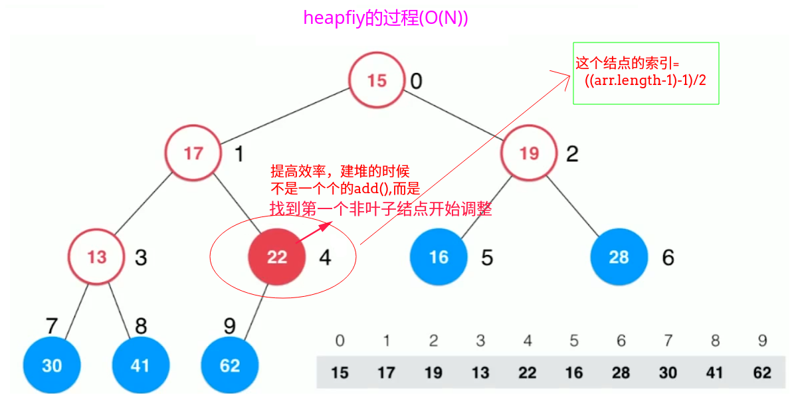

代码:

```java
static void heapSort(int[] arr) {
    if (arr == null || arr.length <= 1) return;
    int size = arr.length - 1;
    for (int i = (size - 1) / 2; i >= 0; i--)
        siftDown(arr, i, size);
    swap(arr, 0, size);
    while (size > 0) {
        siftDown(arr, 0, size);
        swap(arr, 0, --size);
    }
}

/**
 * 往下沉的函数,改变的数为index  目前的自己指定的堆的大小为heapSize
 */
static void siftDown(int[] arr, int i, int heapSize) {
    int L = 2 * i + 1;
    while (L < heapSize) {
        int maxIdx = L + 1 < heapSize && arr[L + 1] > arr[L] ? L + 1 : L;
        maxIdx = arr[i] > arr[maxIdx] ? i : maxIdx;
        if (maxIdx == i) break; //自己就是最大的， 不用忘下沉

        swap(arr, i, maxIdx);
        i = maxIdx;
        L = 2 * i + 1; //继续往下
    }
}
```

**shiftDown的过程也可以递归的换:**
```java
//递归的调整A[i]以下的堆
static void siftDown(int[] arr, int i, int size) { //从A[i] 开始往下调整
    int L = 2 * i + 1; //左孩子的下标
    int R = 2 * i + 2;//右孩子的下标
    int maxIdx = i;
    if (L < size && arr[L] > arr[maxIdx]) maxIdx = L;
    if (R < size && arr[R] > arr[maxIdx]) maxIdx = R;
    if (maxIdx != i) {
        swap(arr, i, maxIdx);  //把当前结点和它的最大(直接)子节点进行交换
        siftDown(arr, maxIdx, size);  //继续调整它的孩子
    }
}

static void heapSort2(int[] arr) {
    int size = arr.length - 1;
    for (int i = (size - 1) / 2; i >= 0; i--)
        siftDown(arr, i, size);
    swap(arr, 0, size);//和最后一个数交换
    while (size > 0) {
        siftDown(arr, 0, size);
        swap(arr, 0, --size);
    }
}
```

***
## <font color = red id = "10">计数排序
计数排序是一种非比较排序： 

 - **利用一个`count`数组，统计每个元素`arr[i]`出现的次数`count[arr[i]]`，`count`数组的大小代表的是能排序的元素的最大的值；**
 - **然后让`count`数组中每一个元素`count[i]`等于其与他前面一项`count[i-1]`相加，这时候`count[arr[i]]`表示的值就是小于等于`arr[i]`的元素的个数，这时就找到了`arr[i]`在输出数组中的位置；**
 - **最后通过<font color =red>反向填充</font>目标数组`tmp`，将数组元素`arr[i]` 放在数组`tmp`的第`count[arr[i]]`个位置(下标为`count[arr[i]]-1`)，每放一个元素就将`count[arr[i]]`递减，可以确保计数排序的稳定性；**

看一个例子


填充过程：


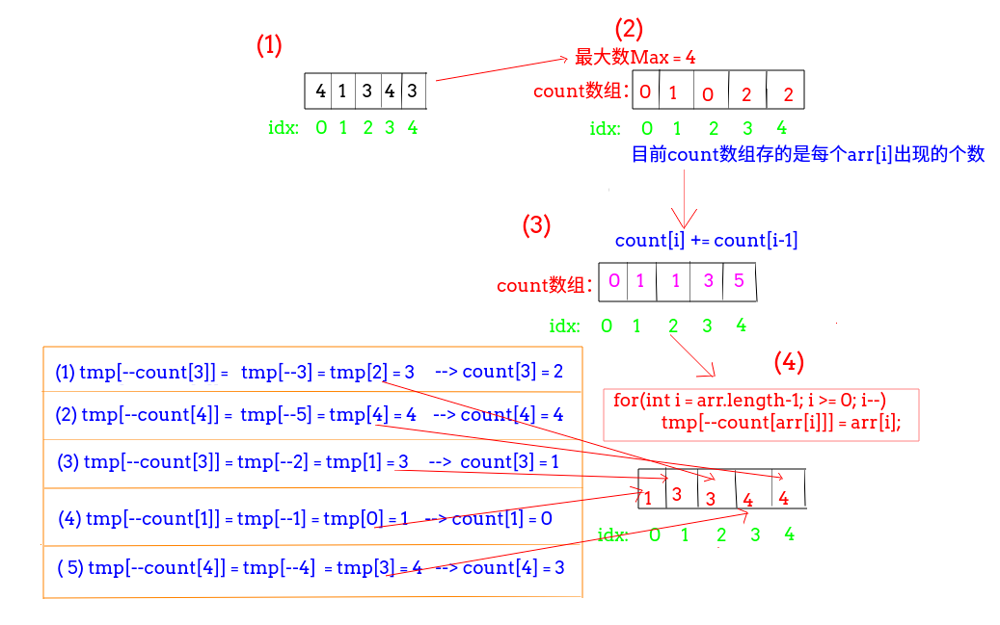

代码:

```java
/**
* 计数排序   count 统计数组， tmp 目标填充数组
*/
static void countSort(int[] arr, int RANGE) { /**数组中最大的元素不能超过 RANGE*/
    int[] count = new int[RANGE + 1];
    int[] tmp = new int[arr.length];
    for (int i = 0; i < arr.length; i++)
        count[arr[i]]++;

    /**现在的count[i]表示小于i的数有count[i]个，排序后元素i就放在第C[i]个输出位置上*/
    for (int i = 1; i <= RANGE; i++)
        count[i] += count[i - 1];
    /**
         * 从后向前扫描保证计数排序的稳定性(重复元素相对次序不变)
         * 当再遇到重复元素时会被放在当前元素的前一个位置上保证计数排序的稳定性
         */
    for (int i = arr.length - 1; i >= 0; i--)
        tmp[--count[arr[i]]] = arr[i];

    //拷贝回原来的数组
    for (int i = 0; i < arr.length; i++)
        arr[i] = tmp[i];
}
```

<font color = red>可以看一个简单的关于计数排序的一个[练习题LeetCode75-Sort Colors](https://blog.csdn.net/zxzxzx0119/article/details/82715141)</font>。
***

## <font color = red id = "11">基数排序
基数排序是按照不同的位数，或者优先级来排列某个元素，其中利用到了计数排序: 

>  基数排序分为两种模式:
>
> Least significant digit (LSD)
>
> 短的关键字被认为是小的，排在前面，然后相同长度的关键字再按照词典顺序或者数字大小等进行排序。比如`1，2，3，4，5，6，7，8，9，10，11`或者`"b, c, d, e, f, g, h, i, j, b, a"` 。
>
> Most significance digit (MSD)
> 直接按照字典的顺序进行排序，对于字符串、单词或者是长度固定的整数排序比较合适。比如: `1, 10, 2, 3, 4, 5, 6, 7, 8, 9`和 `"b, ba, c, d, e, f, g, h, i, j"`。
>
> 假设我们有一些二元组`(a,b)`，要对它们进行以a为首要关键字，b的次要关键字的排序。
>
> 我们可以先把它们先按照首要关键字排序，分成首要关键字相同的若干堆。然后，在按照次要关键值分别对每一堆进行单独排序。最后再把这些堆连到一起，使首要关键字较小的-堆排在上面。按这种方式的基数排序称为MSD(Most Significant Dight)排序。
>
> 第二种方式是从最低有效关键字开始排序，称为LSD(Least Significant Dight)排序。首先对所有的数据按照次要关键字排序，然后对所有的数据按照首要关键字排序。要注意的是，使用的排序算法必须是稳定的，否则就会取消前一次排序的结果。由于不需要分堆对每堆单独排序，LSD方法往往比MSD简单而开销小。

下面的方式是基于LSD的。 

LSD模式: 

 - 基数排序将所有待比较正整数统一为同样的数位长度，**数位较短的数前面补零；**
 - 然后，从最低位开始进行基数为`10`的计数排序，一直到最高位计数排序完后，数列就变成一个有序序列（利用了计数排序的稳定性）；

看下图例子，对`{ 329, 457, 657, 839, 436, 720, 355 }`进行基数排序：

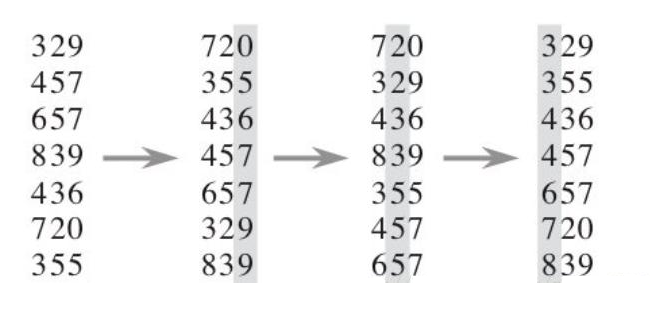

代码:

```java
/**
 * 将整形数按照每位(从低到高)拆分，然后从低位(个位)到高位依次比较各个位，得到所在的位置
 */
//dn表示最大的数的位数 3位的话只能表示到999
static final int dn = 3;

// 获得元素x的第d位数字
static int getDigit(int num, int d) {
    int[] radix = {1, 10, 100}; //这里只排序总共有三位数,分别代表 个位，十位，百位
    return (num / radix[d]) % 10;
}

//根据数组arr中每个元素 的第d位数,来对整个arr数组排序
static void lsdRadixSortInfo(int[] arr, int d) {
    int[] count = new int[10];      //  单独考虑每一个位的时候， 数字都是从[0~9]
    int[] tmp = new int[arr.length];

    for (int i = 0; i < arr.length; i++)
        count[getDigit(arr[i], d)]++;

    for (int i = 1; i < 10; i++) count[i] += count[i - 1];

    for (int i = arr.length - 1; i >= 0; i--) {
        int digit = getDigit(arr[i], d);  //元素arr[i]当前 的d位的数字为dight
        tmp[--count[digit]] = arr[i];    //根据当前位数字digit来排序，把每个元素A[i]放到它在输出数组B中的正确位置上
    }
    for (int i = 0; i < arr.length; i++) arr[i] = tmp[i];
}

static void lsdRadixSort(int[] arr) {
    for (int d = 0; d < dn; d++) //从低位(个位)到高位 按照每一位排序
        lsdRadixSortInfo(arr, d);
}
```

或者另一种写法: 

```java
static int getMax(int[] arr) {
    int max = arr[0];
    for (int i = 1; i < arr.length; i++)
        max = arr[i] > max ? arr[i] : max;
    return max;
}

static void lsdRadixProcess(int[] arr, int exp) {
    int[] count = new int[10];
    int[] tmp = new int[arr.length];

    for (int i = 0; i < arr.length; i++)
        count[(arr[i] / exp) % 10]++;

    for (int i = 1; i < 10; i++) count[i] += count[i - 1];

    for (int i = arr.length - 1; i >= 0; i--) {
        tmp[--count[(arr[i] / exp) % 10]] = arr[i];    //根据当前位数字digit来排序，把每个元素A[i]放到它在输出数组B中的正确位置上
    }
    for (int i = 0; i < arr.length; i++) arr[i] = tmp[i];
}

static void lsdRadixSort2(int[] arr) {
    int max = getMax(arr);
    for (int exp = 1; max / exp > 0; exp *= 10) //从低位到高位
        lsdRadixProcess(arr, exp);
}
```

***
## <font color = red id = "12">桶排序
桶排序的原理可以分为一下三个步骤：

 - 扫描序列，根据每个元素的值所属的区间(可以设置一个映射函数)，放入指定的桶中(顺序放置)；

 - 对每个桶中的元素进行排序，(使用其它排序算法或以递归方式继续使用桶排序）；

看下面对`{ 29, 25, 3, 49, 9, 37, 21, 43 }`进行桶排序；

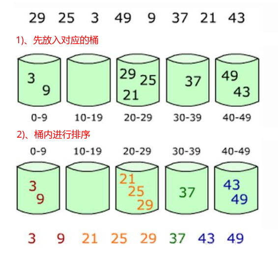

因为每个桶各自的容量可能不同，所以也可以使用链表来储存，但是空间复杂度高；


下面的代码: 


 - 主要是<font color =red>利用计数排序找到每个桶的起始下标和终止下标，然后对每个桶进行系统的排序；
 - `mapToBucket()`采用的是` / bucketNum`(桶的个数) 的操作，如果对`0 ~ 99`排序就设置桶的个数为`10`个，如果是`0~999`就设置为`100`个.....；

代码:

```java
public static final int bucketNum = 100; //桶的个数 0 ～ 9号桶

//桶排序
public static int mapToBucket(int x) {   // 映射函数f(x)
    return x / bucketNum;
}

public static void bucketSort(int[] arr) {
    int[] count = new int[bucketNum];  // 计数数组，存放桶的边界信息
    int[] tmp = new int[arr.length];

    for (int i = 0; i < arr.length; i++)  //count[i]保存着i号桶中元素的个数
        count[mapToBucket(arr[i])]++;

    for (int i = 1; i < bucketNum; i++)  // 定位桶边界初始时，count[i]-1(下标从0开始)为i号桶最后一个元素的位置
        count[i] += count[i - 1];

    //count[0]~count[9]
    for (int i = arr.length - 1; i >= 0; i--)
        tmp[--count[mapToBucket(arr[i])]] = arr[i];

    for (int i = 0; i < arr.length; i++)
        arr[i] = tmp[i];

    //利用计数排序确定各个桶的边界（分桶）
    for (int i = 0; i < bucketNum; i++) {
        int L = count[i];     //count[i]为i号桶第一个元素的位置
        int R = (i == bucketNum - 1 ? arr.length - 1 : count[i + 1] - 1); //count[i+1]-1为i号桶最后一个元素的位置
        //for(int j = L; j <= R; j++)System.out.print( arr[j] + " "); System.out.println();  //print
        if (L < R)  //对每个桶里面进行排序
            Arrays.sort(arr, L, R + 1);//注意这里是R+1，系统库的sort的右边界是开区间
    }
}
```

***
## <font color = red id = "13">测试代码
上述排序都是用下面的程序测试的: 

```java
 public static void main(String[] args) {

        int[] arr = new int[1000];
        Random random = new Random();
        for(int i = 0; i < arr.length; i++)
            arr[i] = random.nextInt(1000);

        //原数组
        System.out.println(Arrays.toString(arr));

//        bubbleSort(arr);
//        cocktailSort(arr);
//        selectSort(arr);
//        insertSort(arr);
//        insertSort2(arr);
//        insertSort3(arr);
//        shellSort(arr);
//        shellSort2(arr);
//        quickSort(arr);
//        heapSort(arr);
//        heapSort2(arr);
//        countSort(arr,1000);
//        lsdRadixSort(arr);
//        lsdRadixSort2(arr);
        bucketSort(arr);

        //test
        boolean good = true;
        for(int i = 1; i < arr.length; i++){
            if(arr[i] < arr[i-1]){
                System.out.println("bad!");
                System.out.println(arr[i-1] + " " + arr[i]);
                good = false;
                break;
            }
        }
        if(good)System.out.println("good!");
        System.out.println(Arrays.toString(arr));
    }
```
***
## 附C++部分代码


```cpp
#include <bits/stdc++.h>

namespace SortTestHelper{

    int *generateRandomArray(int n, int L, int R){
        int *arr = new int[n];
        srand(time(NULL));
        for (int i = 0; i < n; i++)
            arr[i] = rand() % (R - L + 1) + L;
        return arr;
    }

    int *generateNearlyOrderedArray(int n, int swapTimes){
        int *arr = new int[n];
        for (int i = 0; i < n; i++)
            arr[i] = i;
        srand(time(NULL));
        for (int i = 0; i < swapTimes; i++){
            int posx = rand() % n;
            int posy = rand() % n;
            std::swap(arr[posx], arr[posy]);
        }
        return arr;
    }

    int *copyArray(int a[], int n){
        int *arr = new int[n];
        for (int i = 0; i < n; i++)
            arr[i] = a[i];
        return arr;
    }

    template <typename T>
    void printArray(T arr[], int n){
        for (int i = 0; i < n; i++)
            std::cout << arr[i] << " ";
        std::cout << std::endl;
    }

    template <typename T>
    bool isSorted(T arr[], int n){
        for (int i = 0; i < n - 1; i++)
            if (arr[i] > arr[i + 1])
                return false;
        return true;
    }

    template <typename T>
    void testSort(const std::string &sortName, void (*sort)(T[], int), T arr[], int n){
        clock_t startTime = clock();
        sort(arr, n);
        clock_t endTime = clock();
        std::cout << sortName << ":" << double(endTime - startTime)/CLOCKS_PER_SEC << std::endl;
        assert(isSorted(arr, n));
    }
} 

template<typename T>
void bubbleSort(T arr[], int n){
    for(int end = n-1; end > 0; end--){ // n-1次
        int border = 0;
        for(int i = 0; i < end; i++){
            if(arr[i] > arr[i+1]){
                std::swap(arr[i], arr[i+1]);
                border = i+1;
            }
        }
        end = border; // 下一次只交换到这里
    }
}

template<typename T>
void selectionSort(T arr[], int n){
    for(int i = 0; i < n; i++){
        int minIndex = i; 
        for(int j = i+1; j < n; j++)
            minIndex = arr[j] < arr[minIndex] ? j : minIndex;
        std::swap(arr[minIndex], arr[i]);
    }
}

template<typename T>
void insertSort(T arr[], int n){
    for(int i = 0; i < n; i++){
        int j;
        for(j = i-1; j >= 0 && arr[j] > arr[i]; j--) //find the insert position,  notice init j = i is wrong  
            arr[j] = arr[j+1];
        arr[i] = arr[j];
    }
}

template<typename T>
void insertSort2(T arr[], int n){
    for(int i = 0; i < n; i++){
        for(int j = i; j > 0 && arr[j] < arr[j-1]; j--)
            std::swap(arr[j], arr[j-1]);
    }
}

template<typename T>
void __merge(T arr[], int L, int mid, int R){
    T* help = new T[R-L+1];
    int p1 = L, p2 = mid + 1, k = 0; // note p1 = 0
    while(p1 <= mid && p2 <= R)
        help[k++] = arr[p1] <= arr[p2] ? arr[p1++] : arr[p2++];
    while(p1 <= mid)
        help[k++] = arr[p1++];
    while(p2 <= R)
        help[k++] = arr[p2++];
    for(int i = 0; i < k; i++) 
        arr[i+L] = help[i];
    delete[] help;
}

template<typename T>
void __mergeSort(T arr[], int L, int R){
    if(L >= R)
         return;
    // int mid = L + (R-L)/2;
    int mid = (L+R)/2;
    __mergeSort(arr, L, mid);
    __mergeSort(arr, mid+1, R);
    if(arr[mid] > arr[mid+1])  // optimize
        __merge(arr, L, mid, R);
}

template<typename T>
void mergeSort(T arr[], int n){
    __mergeSort(arr, 0, n-1);
}

template<typename T>
void mergeSortBU(T arr[], int n){
    for(int sz = 1; sz <= n; sz += sz){ // 区间的个数，1..2..4..8
        for(int i = 0; i+sz < n; i += sz+sz){  // 对[i...i+sz-1]和[i+sz...i+2*sz-1]内归并
            __merge(arr, i, i+sz-1, std::min(n-1, i+sz+sz-1)); // min防止越界
        }
    }
}

// 对arr[l...r]部分进行partition操作
// 返回p, 使得arr[l...p-1] < arr[p] ; arr[p+1...r] > arr[p]
template <typename T>
int __partition1(T arr[], int L, int R){
    std::swap( arr[L] , arr[rand()%(R-L+1)+L] );// 随机在arr[l...r]的范围中, 选择一个数值作为标定点pivot
    T key = arr[L];
    int pivot = L;
    for(int i = L+1 ; i <= R; i++)
        if(arr[i] < key)
            std::swap(arr[++pivot] , arr[i]);
    std::swap( arr[L] , arr[pivot]);
    return pivot;
}

template <typename T>
void __quickSort1(T arr[], int L, int R){
    if( L >= R )
        return;
    int p = __partition1(arr, L, R);
    __quickSort1(arr, L, p-1 );
    __quickSort1(arr, p+1, R);
}

template <typename T>
void quickSort1(T arr[], int n){
    srand(time(NULL)); // 设置随机种子
    __quickSort1(arr, 0, n-1);
}


template <typename T>
int __partition2(T arr[], int L, int R){
    std::swap( arr[L] , arr[rand()%(R-L+1)+L] );// 随机在arr[l...r]的范围中, 选择一个数值作为标定点pivot
    T key = arr[L];
    int less = L+1, more = R;
    while(true){
        while(less < R && arr[less] < key) less++;
        while(more > L && arr[more] > key) more--;
        if(less >= more)
            break;
        std::swap(arr[less++], arr[more--]);
    }
    std::swap(arr[L], arr[more]);
    return more;
}

template <typename T>
void __quickSort2(T arr[], int L, int R){
    if( L >= R )
        return;
    int p = __partition2(arr, L, R);
    __quickSort2(arr, L, p-1 );
    __quickSort2(arr, p+1, R);
}

template <typename T>
void quickSort2(T arr[], int n){
    srand(time(NULL)); // 设置随机种子
    __quickSort2(arr, 0, n-1);
}

template <typename T>
int* __partition3(T arr[], int L, int R){
    std::swap( arr[L] , arr[rand()%(R-L+1)+L] );// 随机在arr[l...r]的范围中, 选择一个数值作为标定点pivot
    T key = arr[L]; // 将arr[L]作为划分
    int cur = L+1, less = L, more = R+1; // more 也可以写成R, 但是下面的程序要改
    while(cur < more){
        if(arr[cur] < key)
            std::swap(arr[++less], arr[cur++]);
        else if(arr[cur] > key)
            std::swap(arr[--more], arr[cur]); // cur不能--
        else    
            cur++;
    }
    std::swap(arr[L], arr[less]);
    return new int[2]{less, more-1};
}

template <typename T>
void __quickSort3(T arr[], int L, int R){
    if( L >= R )
        return;
    int* p = __partition3(arr, L, R);
    __quickSort3(arr, L, p[0]-1);
    __quickSort3(arr, p[1]+1, R);
}

template <typename T>
void quickSort3(T arr[], int n){
    srand(time(NULL)); // 设置随机种子
    __quickSort3(arr, 0, n-1);
}

int main(int argc, char const **argv)
{
    int n = 2000;
    int *arr1 = SortTestHelper::generateRandomArray(n,0,n);
    // SortTestHelper::testSort("BubbleSort", bubbleSort, arr1, n);
    // SortTestHelper::testSort("selectionSort", selectionSort, arr1, n);
    // SortTestHelper::testSort("insertSort", insertSort, arr1, n);
    // SortTestHelper::testSort("insertSort2", insertSort2, arr1, n);
    // SortTestHelper::testSort("mergeSort", mergeSort, arr1, n);
    // SortTestHelper::testSort("mergeSortBU", mergeSortBU, arr1, n);
    // SortTestHelper::testSort("quickSort1", quickSort1, arr1, n);
    // SortTestHelper::testSort("quickSort2", quickSort2, arr1, n);
    SortTestHelper::testSort("quickSort3", quickSort3, arr1, n);
    return 0;
}
```

