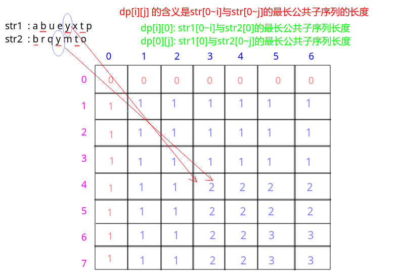
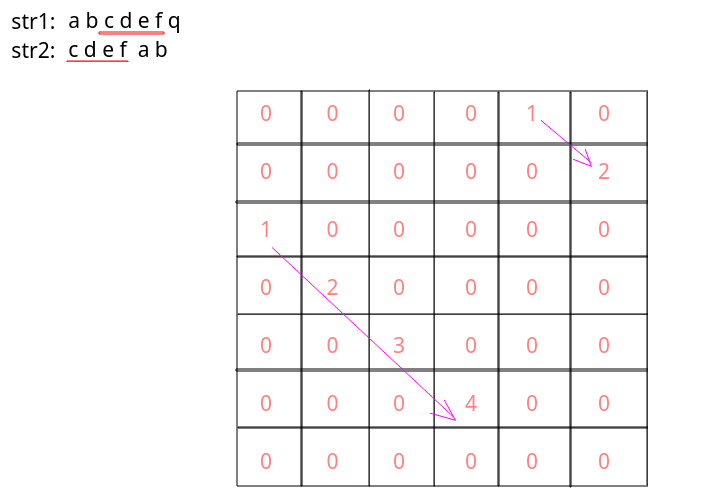
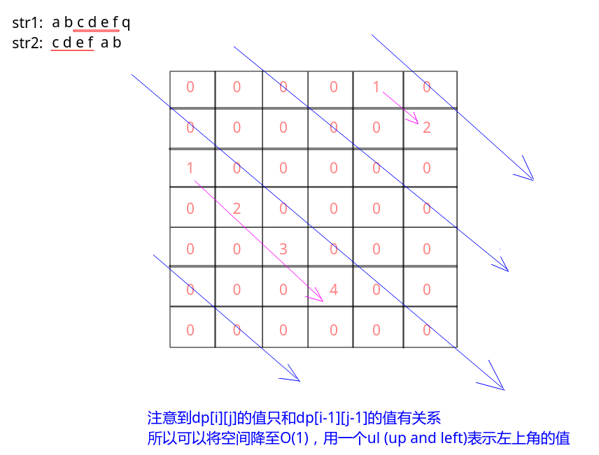

## 51Nod - 1006. 最长公共子序列LCS 和 最长公众子串

* [51Nod-1006-最长公共子序列LCS](#51nod-1006-最长公共子序列lcs)
* [最长公众子串](#最长公众子串)

***
### <font color =red id = "1">51Nod-1006-最长公共子序列LCS 
#### [题目链接](http://www.51nod.com/Challenge/Problem.html#!#problemId=1006)

> http://www.51nod.com/Challenge/Problem.html#!#problemId=1006

#### 题目
就是输入两个字符串`str1`、`str2`，输出任意一个最长公共子序列。
#### 解析

`dp[i][j]`代表的是 : 必须以`str1[i]`、`str2[j]`结尾的最长公共子序列，`dp[i][j]`来源: 

* 可能是`dp[i-1][j]`，代表`str1[0~i-1]`与`str2[0~j]`的最长公共子序列。
* 可能是`dp[i][j-1]`，代表`str1[0~i]`与`str2[0~j-1]`的最长公共子序列。
* 如果`str1[i] == str2[j]`，还可能是`dp[i-1][j-1] + 1`。

这三种情况中取最大值。



构造结果的过程(利用`dp`数组即可)

* 从矩阵的右下角开始，有三种移动方式: <font color = blue>向上、向左、向左上。</font>
* 如果`dp[i][j] > dp[i-1][j] && dp[i][j] > dp[i][j-1]`，说明之前在计算`dp[i][j]`的时候，一定是选择了`dp[i-1][j-1]+1`，所以可以确定`str1[i] = str2[j]`，并且这个字符一定输入最长公共子序列，把这个字符放进结果字符串，然后向左上方移动；
* 如果`dp[i][j] == dp[i-1][j]`，说明之前计算`dp[i][j]`的时候，`dp[i-1][j-1]+1`不是必须的选择，向 <font color = blue>上方</fonT>移动即可；
*  如果`dp[i][j] == dp[i][j-1]`，向 <font color = blue>左方</fonT>移动即可；
* 如果`dp[i][j]`同时等于`dp[i-1][j]`和`dp[i][j-1]`，向上向左都可以，选择一个即可，不会错过必须选择的字符；

```java
import java.io.*;
import java.util.*;

public class Main {

    /** dp[i][j]代表的是 str[0..i]与str[0...j]的最长公共子序列 */
    static int[][] getDp(char[] sa, char[] sb) {
        int n1 = sa.length, n2 = sb.length;
        int[][] dp = new int[n1][n2];
        dp[0][0] = sa[0] == sb[0] ? 1 : 0;
        for (int i = 1; i < n1; i++)  // 一旦dp[i][0]被设置成1,则dp[i~N-1][0]都为1
            dp[i][0] = Math.max(dp[i - 1][0], sa[i] == sb[0] ? 1 : 0);
        for (int j = 1; j < n2; j++)
            dp[0][j] = Math.max(dp[0][j - 1], sb[j] == sa[0] ? 1 : 0);
        for (int i = 1; i < n1; i++) {
            for (int j = 1; j < n2; j++) {
                dp[i][j] = Math.max(dp[i - 1][j], dp[i][j - 1]);
                if (sa[i] == sb[j]) {
                    dp[i][j] = Math.max(dp[i][j], dp[i - 1][j - 1] + 1);
                }
            }
        }
        return dp;
    }

    /** 求出最长公共子序列 */
    static String getLCS(String sa, String sb, int[][] dp) {
        if (sa == null || sb == null || sa.equals("") || sb.equals(""))
            return "";
        char[] chs1 = sa.toCharArray();
        char[] chs2 = sb.toCharArray();
        int i = chs1.length - 1;
        int j = chs2.length - 1;
        char[] res = new char[dp[i][j]]; //生成答案的数组
        int index = dp[i][j] - 1;
        while (index >= 0) {
            if (i > 0 && dp[i][j] == dp[i - 1][j]) {
                i--;
            } else if (j > 0 && dp[i][j] == dp[i][j - 1]) {
                j--;
            } else { // dp[i][j] = dp[i-1][j-1]+1
                res[index--] = chs1[i];
                i--;
                j--;
            }
        }
        return String.valueOf(res);
    }

    public static void main(String[] args) {
        Scanner cin = new Scanner(new BufferedInputStream(System.in));
        String sa = cin.next();
        String sb = cin.next();
        int[][] dp = getDp(sa.toCharArray(), sb.toCharArray());
//        System.out.println(dp[sa.length()-1][sb.length()-1]); //length of lcs
        System.out.println(getLCS(sa, sb, dp));
    }
}
```

***
### <font color =red id = "2">最长公众子串
#### [题目链接](https://www.nowcoder.com/questionTerminal/02e7cc263f8a49e8b1e1dc9c116f7602?toCommentId=1532408)

> https://www.nowcoder.com/questionTerminal/02e7cc263f8a49e8b1e1dc9c116f7602?toCommentId=1532408

#### 解析
* `dp`矩阵第一列即`dp[0~N-1][0]`，对某一个位置`(i,0)`来说，如果`str1[i] == str2[0]`，令`dp[i][0] = 1`，否则令`dp[i][0] = 0`；
* 矩阵`dp`第一行，即`dp[0][0~M-1]`，对某个位置`(0,j)`来说，如果`str1[0] == str2[j]`，令`dp[0][j] = 1`，否则令`dp[0][j] = 0`；
* 一般的位置有两种情况，如果`str1[i] != str2[j]`，说明在必须把`str1[i]`和`str2[j]`当做公共子串最后一个字符是不可能的，所以`dp[i][j] = 0`； 如果`str1[i] = str2[j]`，说明可以将`str1[i]`和`str2[j]`作为公共子串的最后一个字符，其长度就是`dp[i-1][j-1] + 1`；




```java
import java.util.*;

public class LongestSubstring {
    public int findLongest(String A, int n, String B, int m) {
        char[] sa = A.toCharArray();
        char[] sb = B.toCharArray();
        int[][] dp = new int[sa.length][sb.length];
        for(int i = 0; i < sa.length; i++) //注意和最长公共子序列有点不同
            dp[i][0] = sa[i] == sb[0] ? 1 : 0;
        for(int j = 0; j < sb.length; j++)
            dp[0][j] = sa[0] == sb[j] ? 1 : 0;
        int res = 0;
        for(int i = 1; i < sa.length; i++){
            for(int j = 1; j < sb.length; j++){
                if(sa[i] == sb[j]) {
                    dp[i][j] = dp[i - 1][j - 1] + 1;
                    res = Math.max(res, dp[i][j]);
                }
            }
        }
        return res;  //dp数组中的最大值，就是最大公共字串的长度
    }
}
```

由`dp`表生成答案字符串也是不难的，找到最大值，然后往左边的`res`个字符就是答案。

测试程序: 
```java
public class LCSub {

    public static int[][] getDp(char[] sa,char[] sb){
        int[][] dp = new int[sa.length][sb.length];
        for(int i = 0; i < sa.length; i++) //注意和最长公共子序列有点不同
            dp[i][0] = sa[i] == sb[0] ? 1 : 0;
        for(int j = 0; j < sb.length; j++)
            dp[0][j] = sa[0] == sb[j] ? 1 : 0;
        int res = 0;
        for(int i = 1; i < sa.length; i++){
            for(int j = 1; j < sb.length; j++){
                if(sa[i] == sb[j]) {
                    dp[i][j] = dp[i - 1][j - 1] + 1;
                    res = Math.max(res, dp[i][j]);
                }
            }
        }
        System.out.println(res);  //4
        return dp;  //dp数组中的最大值，就是最大公共字串的长度
    }

    /** 根据dp表得到答案*/
    public static String getLongestSubstring(String sa, String sb, int[][] dp){
        if(sa == null || sb == null || sa.length() == 0 || sb.length() == 0)
            return "";
        int max = 0, end = 0;
        for(int i = 0; i < dp.length; i++){
            for(int j = 0; j < dp[0].length; j++){
                if(dp[i][j] > max){
                    max = dp[i][j];
                    end = i;
                }
            }
        }
        return sa.substring(end - max + 1, end+1);
    }

    public static void main(String[] args) {
        String sa = "abcdefq";
        String sb = "cdefab";
        int[][] dp = getDp(sa.toCharArray(), sb.toCharArray()); 
        System.out.println(getLongestSubstring(sa, sb, dp)); // cdef
        System.out.println(getLongestSubstring(sa, sb, dp).length()); //4
    }
}

```
另外，还有一种可以优化空间的做法:
* 因为`dp[i][j]`只依赖于左上角位置的`dp[i-1][j-1]`，所以用一个变量记录左上角的值即可。

* 遍历方向从右上角的斜线开始，一直遍历到左下角，中间记录最大值`max`和结束位置`end`即可。



代码如下: 

```java
    public static String getLongestSubstring2(String sa,String sb){
        if(sa == null || sb == null || sa.length() == 0 || sb.length() == 0)
            return "";
        char[] chs1 = sa.toCharArray();
        char[] chs2 = sb.toCharArray();
        int row = 0, col = chs2.length-1; //从右上角开始
        int max = 0, end = 0; //记录最大长度和结束位置
        while(row < chs1.length){
            int i = row, j = col;
            int ul = 0;
            while(i < chs1.length && j < chs2.length){ //从(i,j)向右下方开始遍历
                if(chs1[i] == chs2[j])
                    ul++;
                else
                    ul = 0;
                if(ul > max){ //记录最大值以及结尾字符的位置
                    max = ul;
                    end = i;
                }
                i++;
                j++;
            }
            if(col > 0) // 斜线还没到最左边 -->　往左移动
                col--;
            else
                row++;  //到了最左  --> 往下移动
        }
        System.out.println(max);
        return sa.substring(end-max+1, end+1); // [end-max+1, end]
    }
```

***
