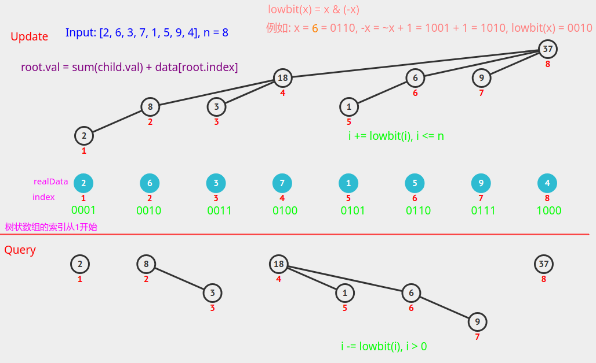

## 树状数组总结

最容易懂的工具: [**点这里**](https://visualgo.net/en/fenwicktree)。

一张图概括:



具体演示可以看上面的链接。

[**LeetCode - 307. Range Sum Query - Mutable**](https://leetcode.com/problems/range-sum-query-mutable/)例题:

题目:


树状数组代码:

```java
class NumArray {

    private int[] sums;// 树状数组中求和的数组
    private int[] data;//真实存放数据的数组
    private int n;

    private int lowbit(int x) {return x & (-x);}

    private int query(int i){
        int s = 0;
        while(i > 0){//树状数组中索引是1~n
            s += sums[i];
            i -= lowbit(i);
        }
        return s;
    }

    // fenWick update
    private void renewal(int i, int delta){// delta是增量，不是新值
        while(i <= n){//树状数组中索引是1~n
            sums[i] += delta;
            i += lowbit(i);
        }
    }

    public NumArray(int[] nums) {
        n = nums.length;
        sums = new int[n+1];
        data = new int[n];s
        for(int i = 0; i < n; i++) {
            data[i] = nums[i];
            renewal(i+1, nums[i]);
        }
    }

    public void update(int i, int val) {
        renewal(i+1, val - data[i]);
        data[i] = val;
    }

    public int sumRange(int i, int j) {
        return query(j+1) - query(i);
    }
}
```

再看一个例题[**POJ - 2352. Stars**](http://poj.org/problem?id=2352)

题目意思就是给你一些星星的坐标，每个星星的级别是他左下方的星星的数量，要你求出各个级别的星星有多少个，看样例就懂了。


题目中一个重要的信息就是输入**是按照`y`递增，如果`y`相同则`x`递增的顺序**给出的，所以，对于第`i`颗星星，它的`level`就是之前出现过的星星中，横坐标小于等于`i`的星星的数量。这里用树状数组来记录所有星星的`x`值。

代码中有个小细节就是`x++`这是因为`lowbit`不能传值为`0`，否则会陷入死循环。

```cpp															     
import java.io.*;
import java.util.*;

public class Main {

    static PrintStream out = System.out;

    static class FastReader {
        public BufferedReader br;
        public StringTokenizer token;

        public FastReader(InputStream in) {
            br = new BufferedReader(new InputStreamReader(in), 32768);
            token = null;
        }

        public String next() {
            while (token == null || !token.hasMoreTokens()) {
                try {
                    token = new StringTokenizer(br.readLine());
                } catch (IOException e) {
                    throw new RuntimeException(e);
                }
            }
            return token.nextToken();
        }

        public int nextInt() {
            return Integer.parseInt(next());
        }
    }

    static int[] sums; // 注意树状数组中 索引从1开始

    static int n;

    static int lowbit(int x) {
        return x & (-x);
    }

    static int query(int i) {
        int res = 0;
        while (i > 0) {
            res += sums[i];
            i -= lowbit(i);
        }
        return res;
    }

    // delta是增量， 不是新值
    static void update(int i, int delta) {
        while (i <= 32010) {   //注意这里是最大的x,没有记录所以用 32010,不能用n
            sums[i] += delta;
            i += lowbit(i);
        }
    }

    // write code
    static void solve(InputStream stream) {
        FastReader in = new FastReader(stream);
        n = in.nextInt();
        sums = new int[32010]; // 用x作为索引
        int[] level = new int[n];
        for (int i = 1; i <= n; i++) {
            int x = in.nextInt() + 1; //防止 x == 0的情况，lowbit会陷入死循环
            int y = in.nextInt();
            level[query(x)]++; // 求的是左边的和, 然后这个和就是一个级别，这个级别多了一个
            update(x, 1);// 从x向上都+1
        }
        for (int i = 0; i < n; i++) System.out.println(level[i]);
    }

    public static void main(String[] args) {
        solve(System.in);
    }
}
```