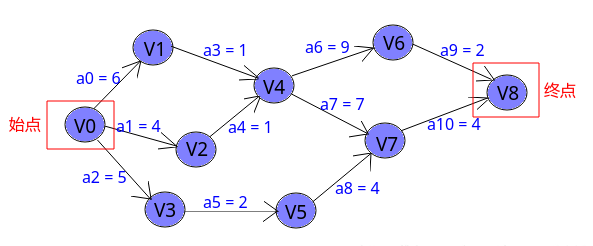
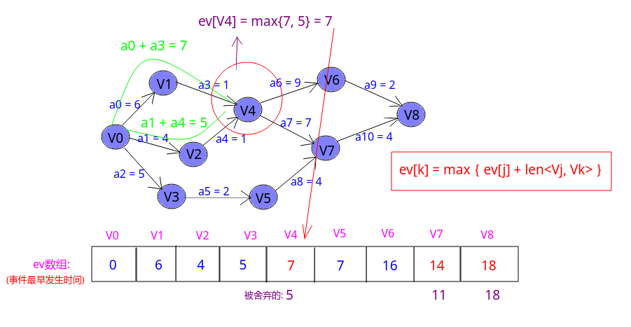
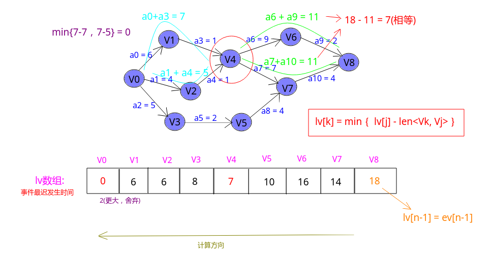
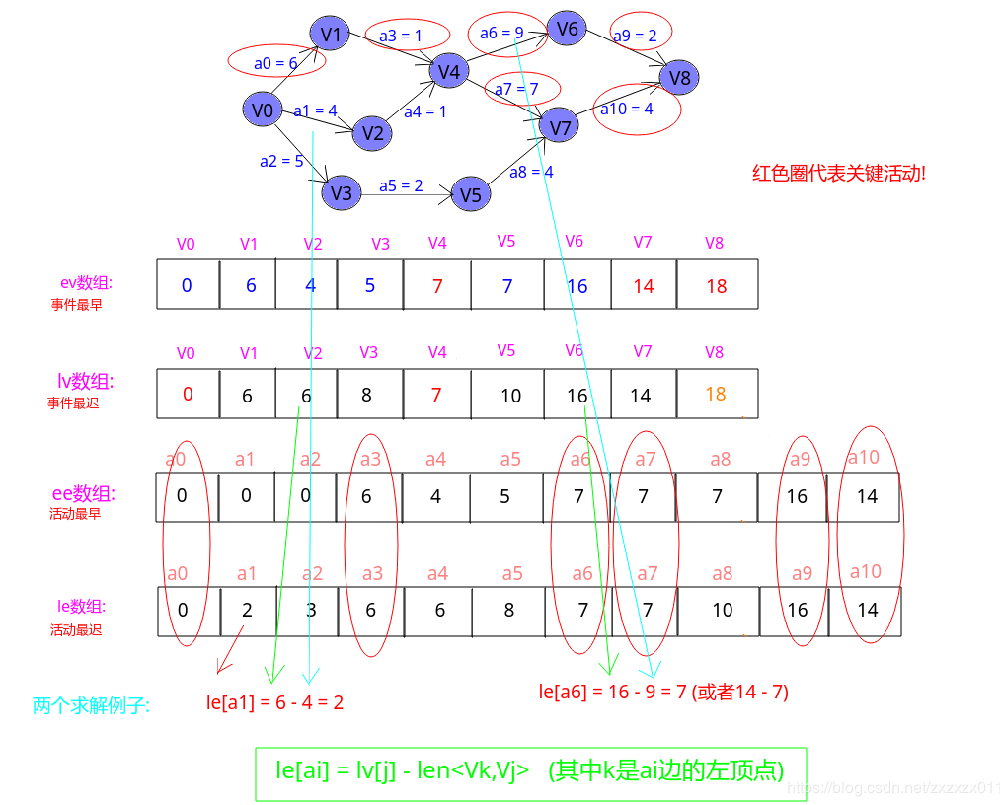
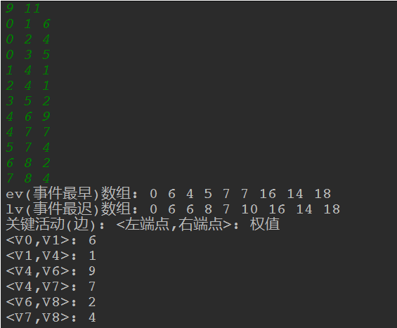
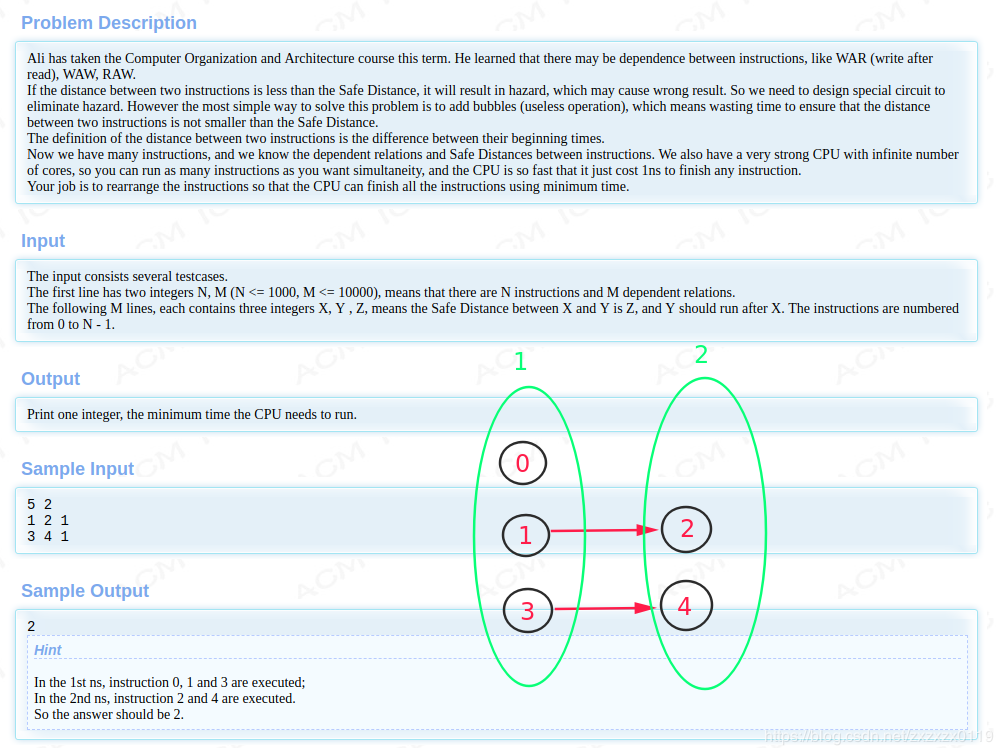

## Hdu - 4109.Instrction Arrangement以及关键路径详解

* [关键路径详解](#关键路径详解)
* [Hdu4109-Instrction Arrangement题解](#hdu4109-instrction-arrangement题解)

***
### <font color  = red id = "1">关键路径详解

##### `AOE`网
<font color = purple>概念: 

* 在一个表示工程的带权有向图中，<font color = red>用顶点表示事件，用有向边表示活动</fonT>，边上的权值表示活动的持续时间，称这样的有向图叫做边表示活动的网，简称`AOE`(`Activity On Edge`)网。AOE网中没有入边的顶点称为始点（或源点），没有出边的顶点称为终点（或汇点）。

如下图的 `V...`表示事件，`a...`表示活动。

> 对比`AOV` (`Activity On Vertex Network`)网: 用顶点表示活动，用弧表示活动间的优先关系的有向图。


* `AOE`网可用来估算工程的完成时间，对于`AOE`网，有两个关键的问题:
	* ① 完成整个工程至少需要多少时间？
	* ② 哪些活动是影响工程进度的关键？（或者说，为缩短完成工程所需要的时间，应该加快哪些活动 ?）


<font color = purple>性质:

* 只有在某顶点所代表的事件发生后，从该顶点出发的各活动才能开始；

* 只有在进入某顶点的各活动都结束，该顶点所代表的事件才能发生。

##### 关键路径

* 在`AOE`网中，从始点到终点具有<font color = red>最大路径长度（该路径上的各个活动所持续的时间之和）的路径称为关键路径</font> (`ee[ai]=le[ai]`(<font color = blue>活动最早开始时间和最晚开始时间相等（没有一点商量的余地）</font>))，在关键路径上的活动叫关键活动。

* 由于`AOE`网中的某些活动能够同时进行，故完成整个工程所必须花费的时间应该为<font color = red>始点到终点的最大路径长度。关键路径长度是整个工程所需的最短工期。</font>


##### 关键路径相关的四个量

* 事件的最早发生时间`ev`(`earliest time of vertex`): 即顶点`Vk`的最早发生时间。
* 事件的最晚发生时间`lv`(`latest time of vertex`)  : 即顶点`Vk`的最晚发生时间。(<font color = green>也就是每个顶点对应的事件最晚需要开始的时间，超出此时间将会延误整个工期。</font>)
* 活动的最早开工时间`ee`(`earliest time of edge`): 即边`ak`的最早发生时间。
* 活动的最晚开工时间`le`(`latest time of edge`): 即弧`ak`的最晚发生时间。(<font color = green>也就是不推迟工期的最晚开工时间。</font>)

<font color = blue>只要求出了这四个量。然后根据活动最早开工时间`ee[ak]`和活动最晚开工时间`le[ak]`相等判断`ak`是否是关键活动(确定关键路径)。</font>


##### 四个量的求解

<font color = purple>**①事件的最早发生时间`ev`**

* `ev[k]`是指从始点开始到顶点`vk`的<font color = blue>最大路径长度</font>。这个长度决定了所有从顶点`vk`发出的活动能够开工的最早时间。
* 要想求得当前的`ev[k]`，必须保证之前经过的顶点也是最大的路径，所以这是一个动态规划问题，转移方程`ev[k] = max{ev[j] + lev<Vj, Vk> }`（其中`Vj`就是`Vk`的所有前一个事件(顶点)）。
* 要想求出上面的`ev`数组，由于`Vk`发生之前要发生`Vj`，所以我们可以使用拓扑排序来辅助这一过程，也就是说， 求事件的最早发生时间`ev`的过程，就是从头至尾找拓扑序列，然后顺便维护`ev`数组的过程。


看一个求解的例子: 

* `V0`最早发生时间是`0`时刻，即`ev[0] = 0`；
* `V1`最早发生时间是当`a0`完成后，也就是`ev[1] = 0 + a0 = 6`；
* 同`V1`，`V2 = 4、V3 = 5`；
* `V4`和前四个不同，前面有两条路径`V0 ~ V1 ~ V4`、`V0 ~ V2 ~ V4`到达`V4`，但是更长的一条是第一条`V0 ~ V1 ~ V4`，所以取更大`max`的，即`ev[4] = 7`；
* 后面的`V7`、`V8`和`V4`同理。


 <font color = purple>**②事件的最晚发生时间`lv`**

 * `lv[k]`是指在不推迟整个工期的前提下,事件`vk`允许的最晚发生时间。
* 和`ev`相反，求`lv`数组是从<font color = blue>终点</font>开始求，`lv[n-1] = ev[n-1]`，然后对于前面的顶点，也是采用动态规划的方式，`lv[k] = min{ lv[j] - len<Vk, Vj>}`；



<font color = purple>**③活动的最早发生时间`ee`**

这个最简单：　

* 因为活动`ai`是由弧`<vk , vj>`表示，则活动`ai`的最早开始时间应等于事件`vk`的最早发生时间。因此，有：`ee[i]=ev[k]`

<font color = purple>**④活动的最早发生时间`le`**

* 活动`ai`的最晚开始时间是指，在不推迟整个工期的前提下， `ai`必须开始的最晚时间。
* 若`ai`由弧`<vk，vj>`表示，则`ai`的最晚开始时间要保证事件`vj`的最迟发生时间不拖后。因此，有：`le[ai]=lv[j]-len<vk,vj>`；



##### 实现代码

这里是按照上面的图(索引从`0`开始)，也可以按照索引从`1`开始: 
```java
import java.io.BufferedInputStream;
import java.util.*;

public class CriticalPathMethod2 {

    private static class Graph{
        public int n;
        public int[] in;     // 入度
        public int[] ev, lv; // 事件(顶点)的最早，最晚时间
        public ArrayList<Edge> g[];
        public Stack<Integer>vStack; //存拓扑排序的顶点

        public Graph(int n) {
            this.n = n;
            in = new int[n];
            g = new ArrayList[n];
            ev = new int[n];
            lv = new int[n];
            vStack = new Stack<>();
            for(int i = 0; i < n; i++){
                g[i] = new ArrayList<>();
                ev[i] = 0;
                lv[i] = 0;
                in[i] = 0;
            }
        }
    }
    private static class Edge{
        public int to;
        public int w;

        public Edge(int to, int w) {
            this.to = to;
            this.w = w;
        }
    }

    /**求事件的最早发生时间ev的过程，就是从头至尾找拓扑序列的过程。**/
    private static void sortedTopology(Graph G) {
        Queue<Integer> queue = new LinkedList<>();
        for(int i = 0; i < G.n; i++){
            if(G.in[i] == 0)
                queue.add(i);
        }
        while(!queue.isEmpty()){
            int curNode = queue.poll();
            G.vStack.push(curNode);
            for(int i = 0; i < G.g[curNode].size(); i++){
                int to = G.g[curNode].get(i).to;
                int w = G.g[curNode].get(i).w;
                if(--G.in[to] == 0)
                    queue.add(to);
                //ev事件最早发生: ve[to] = max{ev[curNode] + len<V[curNode],V[to]>)}
                if(G.ev[curNode] + w > G.ev[to])  // 更新的不是curNode，而是to
                    G.ev[to] = G.ev[curNode] + w;
            }
        }

        System.out.print("ev(事件最早)数组: ");
        for(int i = 0; i < G.n; i++)
            System.out.print(G.ev[i] + " ");
        System.out.println();
    }

    public static void criticalPath(Graph G){
        for(int i = 0; i < G.n; i++)
            G.lv[i] = G.ev[G.n-1];
        while(!G.vStack.isEmpty()){
            int curNode = G.vStack.pop();
            //lv[curNode] = min{lv[to] - len<V[curNode],V[to]>}
            for(int i = 0; i < G.g[curNode].size(); i++){
                int to = G.g[curNode].get(i).to;
                int w = G.g[curNode].get(i).w;
                if(G.lv[to] - w < G.lv[curNode]) //注意更新的不是 to 而是 curNode
                    G.lv[curNode] = G.lv[to] - w;
            }
        }

        System.out.print("lv(事件最迟)数组: ");
        for(int i = 0; i < G.n; i++)
            System.out.print(G.lv[i] + " ");
        System.out.println();

        //求解活动最早、最晚发生时间

        int ee, le; //活动(边)最早、晚发生时间
        System.out.println("关键活动(边): <左端点,右端点>: 权值");

        for(int v = 0; v < G.n; v++){
            for(int i = 0; i < G.g[v].size(); i++){
                ee = G.ev[v];       // 活动ai 由<Vk, Vj>组成，则ai(ee) = ev[k] --> 活动最早发生就是前面的事件最早发生

                int to = G.g[v].get(i).to;
                int w = G.g[v].get(i).w;

                le = G.lv[to] - w;  // 活动ai 由<Vk, Vj>组成，则ai(le) = lv[j] - len<Vk, Vj>
                if(ee == le)   //关键活动
                    System.out.format("<V%d,V%d>: %d\n", v, to, w);
            }
        }

    }

    public static void main(String[] args){
        Scanner cin = new Scanner(new BufferedInputStream(System.in));
        int n = cin.nextInt();
        int m = cin.nextInt();

        Graph G = new Graph(n);
        for(int i = 0; i < m; i++){
            int from = cin.nextInt();
            int to = cin.nextInt();
            int w = cin.nextInt();
            G.g[from].add(new Edge(to, w));
            G.in[to]++;
        }
        sortedTopology(G); //拓扑排序求 G.ev : 每个顶点(事件)的最早发生时间
        criticalPath(G); // 求解关键路径
    }
}
```
上图的测试结果: 

***
###  <font color  = red id = "2">Hdu4109-Instrction Arrangement题解
#### [题目链接](http://acm.hdu.edu.cn/showproblem.php?pid=4109)
#### 题目大意
给你`n`和`m`代表编号`0 ~ n-1`个任务(顶点)，和`m`条关系(边)，每条关系由`X、Y、Z`，代表想要完成`Y`必须先完成`X`并花费`Z`个时间、`CPU`可以同时完成多个任务处理，一次花费一个单位时间。问完成`0 ~ n-1`个任务需要多少时间。


#### 解析

* 这个比关键路径更加简单，其实就是求一个`ev`数组的最大值；
* 也就是求这个图(<font color = red>可能不连通，但是我们求一个最大值即可</font>)这些连通分量的最长路径长度的最大值.
* 所以我们只需要通过拓扑排序求出`ev`数组即可。
* 值得注意的是，因为这里不是<font color = red>"时刻"</font>，所以起点不是`0`，而是`1`；
```java
import java.io.BufferedInputStream;
import java.util.*;

public class Main {

    private static class Graph{
        public int n;
        public int[] in;
        public int[] ev;
        public ArrayList<Edge> g[];

        public Graph(int n) {
            this.n = n;
            in = new int[n];
            g = new ArrayList[n];
            ev = new int[n];
            for(int i = 0; i < n; i++){
                in[i] = 0;
                g[i] = new ArrayList<>();
                ev[i] = 0;
            }
        }
    }

    private static class Edge{
        public int to;
        public int w;

        public Edge(int to, int w) {
            this.to = to;
            this.w = w;
        }
    }

    /**求事件的最早发生时间ev的过程，就是从头至尾找拓扑序列的过程。**/
    private static void sortedTopology(Graph G) {
        Queue<Integer> queue = new LinkedList<>();
        for(int i = 0; i < G.n; i++){
            if(G.in[i] == 0) {
                queue.add(i);
                G.ev[i] = 1; // this is important   不是时间，而是CPU的花费，所以初始化不是0而是1
            }
        }
        while(!queue.isEmpty()){
            int curNode = queue.poll();
            for(int i = 0; i < G.g[curNode].size(); i++){
                int to = G.g[curNode].get(i).to;
                int w = G.g[curNode].get(i).w;
                if(--G.in[to] == 0)
                    queue.add(to);
                //ev事件最早发生: ve[to] = max{ev[curNode] + len<V[curNode],V[to]>)}
                if(G.ev[curNode] + w > G.ev[to])  // 更新的不是curNode，而是to
                    G.ev[to] = G.ev[curNode] + w;
            }
        }
    }

    public static void main(String[] args){
        Scanner cin = new Scanner(new BufferedInputStream(System.in));
        while(cin.hasNext()) {
            int n = cin.nextInt();
            int m = cin.nextInt();
            Graph G = new Graph(n);
            for (int i = 0; i < m; i++) {
                int from = cin.nextInt();
                int to = cin.nextInt();
                int w = cin.nextInt();
                G.g[from].add(new Edge(to, w));
                G.in[to]++;
            }
            sortedTopology(G);
            int res = 0;
            for (int i = 0; i < G.n; i++)
                res = Math.max(res, G.ev[i]);
            System.out.println(res);
        }
    }
}
```

