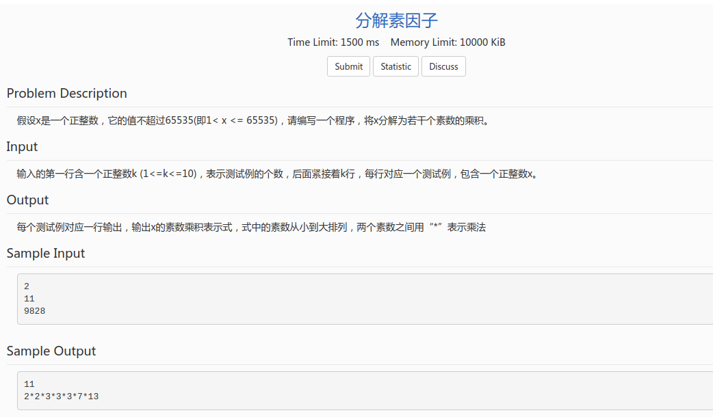
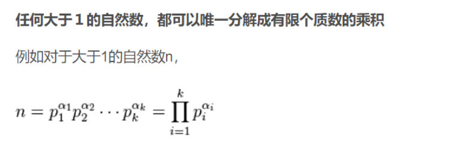
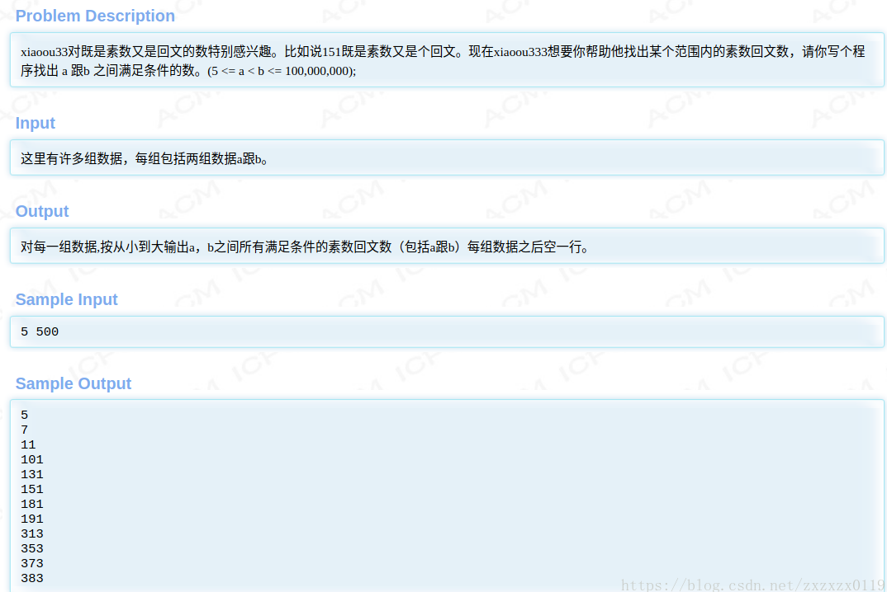

## Hdu - 1431素数回文以及素数相关总结
* 普通筛素数法
* 埃式筛法
* 优化筛法
* 整数分解(唯一分解定理)
* 约数枚举
* Hdu - 1431. 素数回文

***

### 普通筛素数法
这个也是普通的素数判定的方法，这个方法判定素数时间复杂度为`O (sqrt(n))。`


```java
    static ArrayList<Integer> sieve(boolean[] is_prime, int MAX) {
        ArrayList<Integer> prime = new ArrayList<>();
        is_prime[0] = is_prime[1] = false; // 01 不是素数
        boolean flag;
        for (int i = 2; i <= MAX; i++) {
            flag = true;
            for (int j = 2; j * j <= i; j++) {// 根号i的时间复杂度
                if (i % j == 0) {
                    is_prime[i] = false;
                    flag = false;
                    break;
                }
            }
            if (flag) {
                prime.add(i);
                is_prime[i] = true;
            }
        }
        return prime;
    }
```
***
### 埃式筛法

```java
     //经典的埃式筛法
    static ArrayList<Integer> sieve(boolean[] is_prime, int MAX) {
        ArrayList<Integer> prime = new ArrayList<>();
        Arrays.fill(is_prime, true);
        is_prime[0] = is_prime[0] = false;
        for (int i = 2; i <= MAX; i++) {
            if (is_prime[i]) {
                prime.add(i);

                for (int j = 2 * i; j <= MAX; j += i)
                    is_prime[j] = false;
            }
        }
        return prime;
    }
```
***
### 优化筛法
* 上面的方法还是有一些重复的计算，比如说在搞定素数`2`的时候，筛选掉`6 (2 + 2 + 2)`；而在搞定素数`3`的时候，也要筛选掉`6 (3 + 3)` ，所以此时重复筛选；

* 解决办法是 只筛选<font color = red>小于等于`i`的素数和`i`的乘积</font>，这样可以<font color = red>尽量的</font>的减少重复的筛选，也不会遗漏；

  

  
```java
     //优化筛法
     static ArrayList<Integer> sieve2(boolean[] is_prime, int MAX) {
        ArrayList<Integer> prime = new ArrayList<>();
        Arrays.fill(is_prime, true);
        is_prime[0] = is_prime[0] = false;
        for (int i = 2; i <= MAX; i++) {
            if (is_prime[i])
                prime.add(i);

            for (int j = 0; j < prime.size() && prime.get(j) <= MAX / i; j++) {// MAX/i防止溢出
                is_prime[prime.get(j) * i] = false; //筛掉  (小于等于i的素数 * i)  构成的合数
                if (i % prime.get(j) == 0) //如果 i是 < i的素数的倍数 就不用筛了
                    break;
            }
        }
        return prime;
    }
```
***
### 整数分解(唯一分解定理)
#### [题目链接](https://acm.sdut.edu.cn/onlinejudge2/index.php/Home/Index/problemdetail/pid/1634.html)

> https://acm.sdut.edu.cn/onlinejudge2/index.php/Home/Index/problemdetail/pid/1634.html

#### 题目

#### 解析

```java
import java.io.BufferedInputStream;
import java.util.*;

public class Main {

    static ArrayList<Integer> sieve(int MAX) {
        ArrayList<Integer> prime = new ArrayList<>();
        boolean[] is_prime = new boolean[MAX + 1];

        Arrays.fill(is_prime, true);
        is_prime[0] = is_prime[1] = false;

        for (int i = 2; i <= MAX; i++) {
            if (is_prime[i]) {
                prime.add(i);

                for (int j = 2 * i; j <= MAX; j += i) {
                    is_prime[j] = false;
                }
            }
        }
        return prime;
    }

    public static void main(String[] args) {
        Scanner cin = new Scanner(new BufferedInputStream(System.in));

        int T = cin.nextInt();

        while (T-- > 0) {
            int n = cin.nextInt();

            ArrayList<Integer> prime = sieve(n);

            boolean isFirst = true;

            for (int i = 0; i < prime.size(); i++) {

                int num = prime.get(i);
                while (n % num == 0) {
                    if (isFirst) {
                        System.out.print(num);
                        isFirst = false;
                    } else
                        System.out.print("*" + num);

                    n /= num;
                }
            }
            System.out.println();
        }
    }
}
```
***
### 约数枚举
就是得到某个数的约数，和普通筛法有点像: 


这里把上面的整数分解的保存也贴在这个代码里面: 

```java
import java.util.ArrayList;
import java.util.HashMap;

public class TestPrime {

    //约数枚举
    static ArrayList<Integer> divisor(int n){
        ArrayList<Integer> res = new ArrayList<>();
        for (int i = 1; i * i <= n; i++){
            if(n % i == 0)
                res.add(i);
            if(i != n/i)
                res.add(n/i);
        }
        return res;
    }

    //整数分解
    static HashMap<Integer,Integer> prime_factor(int n){
        HashMap<Integer,Integer> map = new HashMap<>();

        for(int i = 2; i * i <= n; i++){
            while(n % i == 0){
                if(map.containsKey(i)) {
                    map.put(i, map.get(i) + 1);
                }else {
                    map.put(i,1);
                }
                n /= i;
            }
        }
        if(n != 1)
            map.put(n,1);
        return map;
    }

    public static void main(String[] args){

        System.out.println(divisor(12));

        System.out.println("----测试分解素因子(唯一分解定理)-----");
        HashMap<Integer,Integer>map = prime_factor(12);

        for(Integer num : map.keySet()){
            System.out.println(num  + " " + map.get(num));
        }
    }
}

```
运行结果: 


***
### Hdu - 1431. 素数回文
#### [题目链接](http://acm.hdu.edu.cn/showproblem.php?pid=1431)

> http://acm.hdu.edu.cn/showproblem.php?pid=1431

#### 题目


#### 解析

* 先用素数筛法筛出`0~9989899`之间的素数，然后再遍历一遍，判断一下是不是回文，最后判断是不是在那个区间即可；
* 注意这里使用的三种筛法，第一种会超时，第二种和第三种可以通过；
```java
import java.io.BufferedInputStream;
import java.util.*;

/**
 * 题目链接:  http://acm.hdu.edu.cn/showproblem.php?pid=1431
 */
public class Main { //提交时改成main

    // 经典筛法，超时
    static ArrayList<Integer> primary(boolean[] is_prime,int MAX){

        ArrayList<Integer> prime = new ArrayList<>();
        is_prime[0] = is_prime[1] = false; // 01 不是素数
        boolean flag;
        for(int i = 2; i <= MAX; i++){ //范围是1000 我筛选 0~2000内的素数
            flag = true;
            for(int j = 2; j * j <= i; j++){// 根号i的时间复杂度
                if(i % j == 0){
                    is_prime[i] = false;
                    flag = false;
                    break;
                }
            }
            if(flag){
                prime.add(i);
                is_prime[i] = true;
            }
        }
        return prime;
    }


    //经典的埃式筛法
    static ArrayList<Integer> sieve(boolean[] is_prime,int MAX){

        ArrayList<Integer> prime = new ArrayList<>();
        Arrays.fill(is_prime,true);

        is_prime[0] = is_prime[0] = false;

        for(int i = 2; i <= MAX; i++){
            if(is_prime[i]){
                prime.add(i);

                for(int j = 2 * i; j <= MAX; j+=i)
                    is_prime[j] = false;
            }
        }

        return prime;
    }

    //优化筛法
    static ArrayList<Integer> sieve2(boolean[] is_prime,int MAX){

        ArrayList<Integer> prime = new ArrayList<>();
        Arrays.fill(is_prime,true);

        is_prime[0] = is_prime[0] = false;

        for(int i = 2; i <= MAX; i++){
            if(is_prime[i])
                prime.add(i);

            for(int j = 0; j < prime.size() && prime.get(j) <= MAX / i; j++) {
                is_prime[prime.get(j) * i] = false; //筛掉  (小于等于i的素数 * i)  构成的合数
                if(i % prime.get(j) == 0) //如果 i是 < i的素数的倍数 就不用筛了
                    break;
            }
        }

        return prime;
    }

    
    static boolean isPalindrome(int num){
        int oldNum = num;
        int newNum = 0;
        //反过来计算
        while(num > 0){
            newNum = newNum * 10 + num % 10;
            num /= 10;
        }
        return newNum == oldNum;
    }


    static final int maxn = 9989899; //题目中最大的回文素数

    public static void main(String[] args) {
        
        Scanner cin = new Scanner(new BufferedInputStream(System.in));

        boolean[] is_prime = new boolean[maxn + 1];
//        primary(is_prime,maxn); //超时
//        sieve(is_prime,maxn); // ok
        sieve2(is_prime,maxn); // ok  fast
        ArrayList<Integer> res = new ArrayList<>();

        for(int i = 0; i <= maxn; i++ ){
            if(is_prime[i] && isPalindrome(i))
                res.add(i);
        }

        while(cin.hasNext()){
            int a = cin.nextInt();
            int b = cin.nextInt();

            int num = 0;
            for(int i = 0; i < res.size(); i++){
                num = res.get(i);
                if(num < a)
                    continue;
                else if(num > b)
                    break; // 直接退出
                else
                    System.out.println(num);
            }
            System.out.println();
        }
    }
}

```

