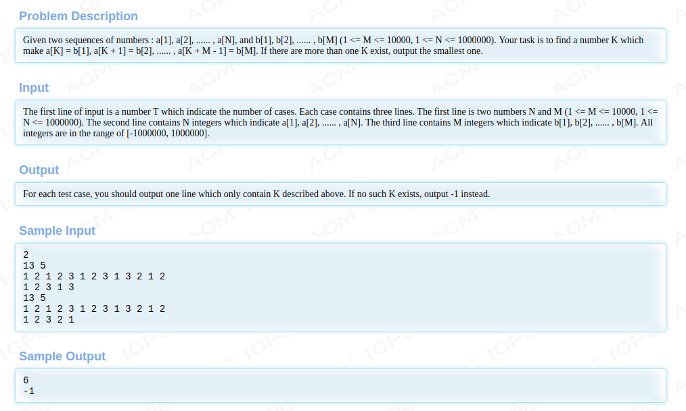
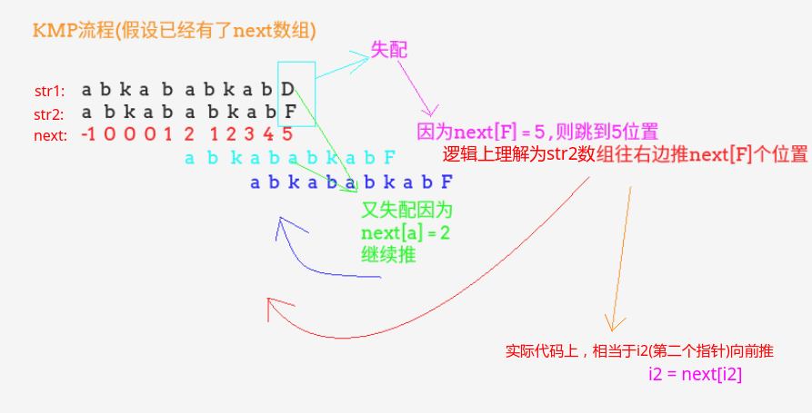
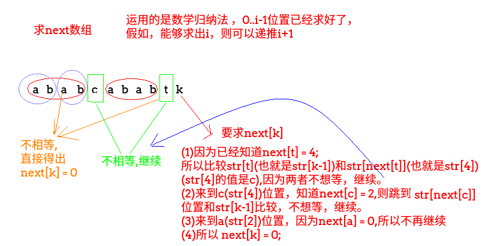
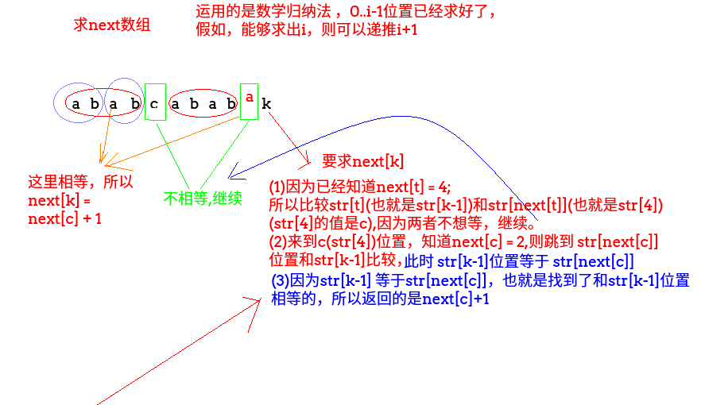

## Hdu - 1711. Number Sequence以及KMP算法总结

 - KMP求解流程
 - KMP next数组求解
 - Hdu - 1711. Number Sequence模板题
***
#### [题目链接](http://acm.hdu.edu.cn/showproblem.php?pid=1711)

> http://acm.hdu.edu.cn/showproblem.php?pid=1711


#### 题目




### KMP求解流程

**这里先说明`next`数组的含义。**

 - <font color = red> `next[i]`的含义是在`str[i]`之前的字符串`str[0...i]`中，必须以`str[i-1]`结尾的后缀子串(不能包含`str[0]`)与必须以`str[0]`开头的前缀子串(不能包含`str[i-1]`)的最大匹配长度</font>；
 - 这里我们先认为已经求得了匹配串的这个`next`数组(后面讲`next`数组求解)。

然后再看KMP求解流程:

 - 当主串的指针`i1`和匹配串的指针`i2`所在位置`str1[i1] == str2[i2]`的时候，`i1++，i2++`；
 - 否则，让`i2`直接跳到`i2`位置的next数组的值的位置，也就是`i2 = next[i2]`，这个过程相当于`str2`向右推动，看下图的两个失配的做法；
 - 当然，如果`next[i2] = -1`了，说明`i2`到了`0`位置，开头都配不上，那`i1++`吧；




***
### KMP next数组求解

 `next`数组使用的数学归纳法，不断的分开往前面匹配的过程: 

看下面求解`k`位置的`next`的做法 -->得出的结论是`next[k] = 0`；





再看一个普通的情况: (可以匹配成功的情况)




根据上面的分析写出代码

```java
import java.io.BufferedInputStream;
import java.util.Scanner;

public class Kmp {

    static int kmp(String s,String p){
        if(s == null || p == null || p.length() < 1 || s.length() < p.length() )return -1;
        char[] str1 = s.toCharArray();
        char[] str2 = p.toCharArray();

        int i1 = 0,i2 = 0; //甲乙
        int[] next = getNext(str2);
        while(i1 < str1.length && i2 < str2.length){
            if(str1[i1] == str2[i2]){ //能配上，继续
                i1++; i2++;
            }else {
                if(next[i2] == -1) { //我str2到了第一个你都配不上,那你str1就下一个吧
                    i1++;
                }else {//逻辑概念是str2往右边推
                    i2 = next[i2]; //来到next数组指示(最长公共前缀后缀)
                }
            }
        }
        return i2 == str2.length ? i1 - i2 : -1;
    }

    /**
     * next数组的求法
     * @param str2
     * @return
     */
    static int[] getNext(char[] str2) {
        if(str2.length == 1)return new int[]{-1};
        int[] next = new int[str2.length];
        next[0] = -1;
        next[1] = 0;
        int cn = 0;
        for(int i = 2; i < str2.length;){
            if(str2[i-1] == str2[cn]){
                next[i++] = ++cn; //就是cn+1
            }else {
                if(cn > 0) cn = next[cn];
                else next[i++] = 0;
            }
        }
        return next;
    }
    public static void main(String[] args) {
        Scanner cin = new Scanner(new BufferedInputStream(System.in));
        int n = cin.nextInt();
        while(n-- > 0){
            String s = cin.next();//主串
            String p = cin.next();//匹配串
            System.out.println(kmp(s,p));
        }
    }
}
```
### Hdu - 1711. Number Sequence模板题

这个就是一个KMP最简单的模板题，将字符串改成数组就ok了。
```java
import java.io.BufferedInputStream;
import java.util.Scanner;

public class Main {

    static int kmp(int[] s,int[] p){
        if(s == null || p == null || s.length < p.length || p.length == 0)
        	return -1;
        int[] next = getNext(p);
        int i1 = 0,i2 = 0;
        while(i1 < s.length && i2 < p.length){
            if(s[i1] == p[i2]) {
                i1++; i2++;
            }else {
                if(next[i2] == -1){
                    i1++;
                }else {
                    i2 = next[i2];
                }
            }
        }
        return i2 == p.length ? i1 - i2 : -1;

    }

    static int[] getNext(int[] arr){
        if(arr.length == 1)return new int[]{-1};
        int[] next = new int[arr.length];
        next[0] = -1;
        next[1] = 0;
        int cn = 0;
        for(int i = 2; i < arr.length; ){
            if( arr[i-1] == arr[cn]){
                next[i++] = ++cn;
            }else {
                if(cn > 0){
                    cn = next[cn];
                }else {
                    next[i++] = 0;
                }
            }
        }
        return next;
    }

    public static void main(String[] args) {
        Scanner cin = new Scanner(new BufferedInputStream(System.in));
        int k = cin.nextInt();
        while (k-- > 0) {
            int n = cin.nextInt();
            int m = cin.nextInt();
            int[] s = new int[n], p = new int[m];//切记ACM题中这个长度是很重要的，不能随便new int[n+1]因为后面用length代替了n
            for(int i = 0; i < n; i++)s[i] = cin.nextInt();
            for(int i = 0; i < m; i++)p[i] = cin.nextInt();
            int res = kmp(s,p);
            System.out.println(res == -1 ? -1 : res+1);
        }
    }
}
```

