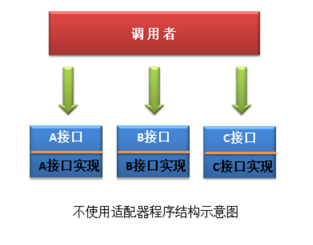
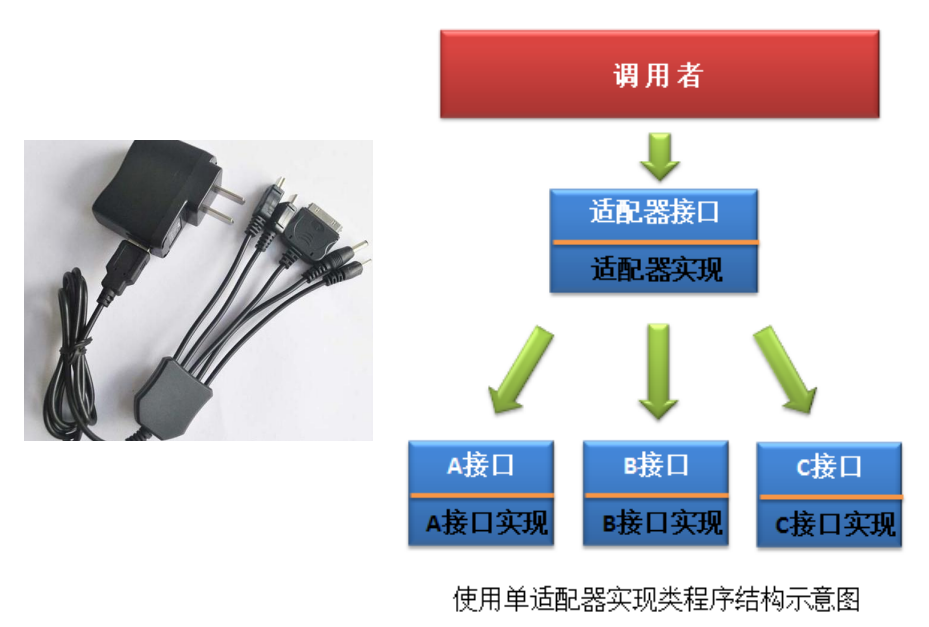
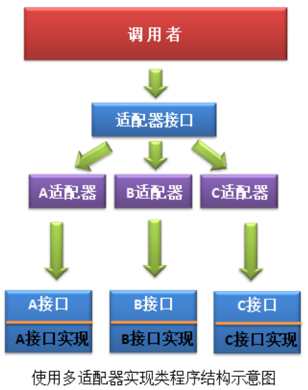

# 适配器模式(二)

* [一、基本介绍](#一基本介绍)
* [二、案例](#二案例)
  * [1、不使用适配器模式](#1不使用适配器模式)
  * [2、只定义一个适配器实现类](#2只定义一个适配器实现类)
  * [3、为每个工种定义一个适配器类](#3为每个工种定义一个适配器类)
* [三、总结](#三总结)

## 一、基本介绍

是所以要写适配器模式（二），是因为想强化一下练习。

而且在SpringMVC中有很多处理器适配器。

里面的源码包括一些特定的代码结构，例如`isSupport()`方法。

也就是说适配器还可以这么来用: **使得原本由于接口不兼容而不能一起工作、不能统一管理的那些类可以在一起工作、可以进行统一管理**。

## 二、案例

> 需求: 厨师的工作是 `cook()`，程序员的工作是 `program()`，司机的工作是 `drive()`，教师的工作是 `teach()`，不同的工种，其具体工作内容不同。现在程序要将这些**很多个** 不同工种的工作内容全部输出。

两种解决方案，其中使用适配器的又可以分为两种。

* 解决方案一: 逐个访问每个工种对象的相应工作方法。无法循环遍历，无法统一管理。
* 解决方案二: 使用适配器模式，将这些不兼容的具体工作转换成一个统一的工作。实现循环遍历。

为了代码简单，这里只写两个工种。`cooker`和`programer`。

### 1、不使用适配器模式

若不使用适配器模式，则调用者需要定义出所有的工种对象, 然后逐个工种对象的工作方法进行调用。有 30 个工种，就应调用 30 个工作方法。很麻烦。

结构如下:



先看两个工种和实现类代码:

```java
public interface ICooker {
    String cook();
}

/**
 * ICooker的实现类 ：黄焖鸡厨师
 */
public class HmJCooker implements ICooker{
    @Override
    public String cook() {
        return "制作黄焖鸡!";
    }
}
```

```java
public interface IProgrammer {
    String programme();
}

/**
 * 程序员的实现类:  京东的程序员
 */
public class JDProgrammer implements IProgrammer {
    @Override
    public String programme() {
        return "编写京东的网站!";
    }
}

```

测试:

```java
/**
 * 这就是为什么要使用 适配器模式
 * 这样的话  如果有很多接口的话,就会使得遍历非常的麻烦
 */
public class MyTest {
    public static void main(String[] args) {
        ICooker iCooker = new HmJCooker();
        IProgrammer iProgrammer = new JDProgrammer();

        //上报自己的职责  不能循环遍历
        System.out.println(iCooker.cook());
        System.out.println(iProgrammer.programme());
    }
}
```

### 2、只定义一个适配器实现类

这种方式类似于多功能充电器，一个电源插头上接着多种类型的充电接口。用户在使用时需要使用电器接口与多功能充电器上的充电接口逐个进行对比，接口匹配，则可以充电。



代码:

```java
public class WorkAdapter{

    public String work(Object worker) {
        String workContent = "";

        // 若传来的对象是厨师，就调用cook()方法
        if(worker instanceof ICooker){
            workContent = ((ICooker)worker).cook();
        }
        if(worker instanceof IProgrammer){
            workContent = ((IProgrammer)worker).programme();
        }
        return workContent;
    }
}

```

测试类（可以实现循环遍历）:

```java
public class MyTest {
    public static void main(String[] args) {
        //这个是两个工作者
        ICooker iCooker = new HmJCooker();
        IProgrammer iProgrammer = new JDProgrammer();

        Object[] workers = {iCooker, iProgrammer};
        //创建设配器对象
        WorkAdapter adapter = new WorkAdapter();

        //让每个工种对象在设配器中进行匹配
        for (Object worker :  workers) {
            String workContent = adapter.work(worker);
            System.out.println(workContent);
        }
    }
}
```

输出:

```java
制作黄焖鸡!
编写京东的网站!
```

### 3、为每个工种定义一个适配器类

这种用的最多。因为不同的电器需要不同的充电器。(很少上面这种组合充电器)，而且SpringMVC里面也是用的这种方式。



代码:

```java
/** 统一的 接口适配器 */
public interface IWorkerAdapter {
    String work(Object worker); //只能放Object，因为传进来的可以实现不同的接口

    boolean isSupport(Object worker);
}
```

厨师的适配器:

```java
public class CookerAdapter implements IWorkerAdapter{
    @Override
    public String work(Object obj) {
        return ((ICooker)obj).cook();
    }

    @Override
    public boolean isSupport(Object worker) {
        return (worker instanceof ICooker);
    }
}
```

程序员的适配器:

```java
public class ProgrammerAdapter implements IWorkerAdapter {
    @Override
    public String work(Object worker) {
        return ((IProgrammer)worker).programme();
    }

    @Override
    public boolean isSupport(Object worker) {
        return worker instanceof IProgrammer;
    }
}
```

测试:

```java
public class MyTest {

    static List<IWorkerAdapter> adapters;

    public static void main(String[] args) {
        //这个是两个工作者
        ICooker iCooker = new HmJCooker();
        IProgrammer iProgrammer = new JDProgrammer();

        Object[] workers = {iCooker, iProgrammer};

        //添加所有的适配器
        adapters = new ArrayList<>();
        adapters.add(new CookerAdapter());
        adapters.add(new ProgrammerAdapter());

        //让每个工种对象在设配器中进行匹配
        for (Object worker : workers) {
            IWorkerAdapter adapter = getAdapter(worker);   //   获取对应的适配器
            String workContent = adapter.work(worker);     //  对应的适配器进行对应的充电吧
            System.out.println(workContent);
        }
    }

    //获取指定的某个适配器
    static IWorkerAdapter getAdapter(Object worker) {
        for (IWorkerAdapter adapter : adapters) {
            if (adapter.isSupport(worker)) {
                return adapter;
            }
        }
        return null;
    }
}
```

输出和上面一样。

## 三、总结

从这种角度来看，**适配器不是冒充，而是实现统一管理**。