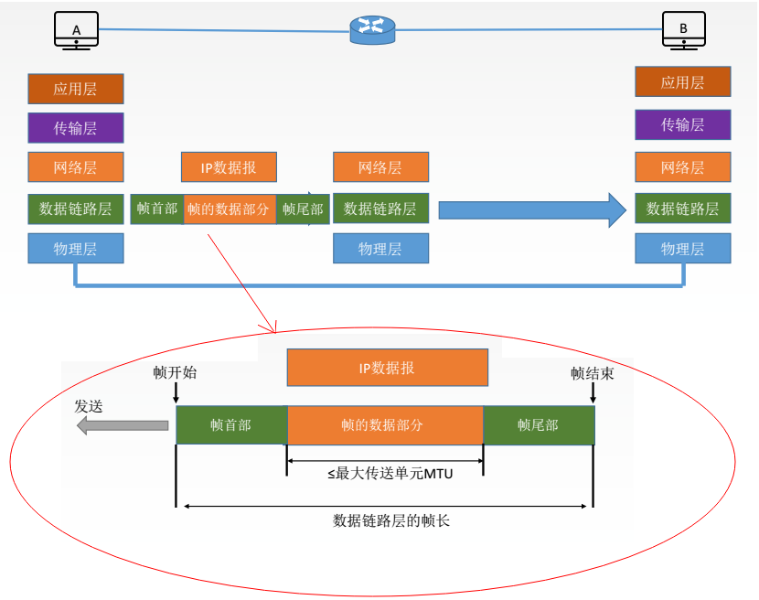

## 计网总结(三)一数据链路层
* 一、概括
* 二、链路层的功能
* 点到点信道的数据链路-PPP协议
* 广播信道的数据链路
* 扩展以太网
* 高速以太网
***
### 一、概括
七层模型中所处位置以及涉及知识概括: 

数据链路层使用的信道主要有以下两种类型：
* **点对点信道**。这种信道使用一对一的点对点通信方式。
* **广播信道**。这种信道使用一对多的广播通信方式，因此过程比较复杂。广播信道上连接的主机很多，因此必须使用专用的共享信道协议来协调这些主机的数据发送。
> 结点：主机、路由器；
>
> 帧：链路层的协议数据单元、封装网络层数据报；

**区分链路与数据链路:**
* 链路(`link`):  是一条点到点的物理线路段，中间没有任何其他的交换结点。一条链路只是一条通路的一个组成部分。
* 数据链路(`data link`) : 除了物理线路外，还必须有通信协议来控制这些数据的传输(**逻辑链路**)。若把实现这些协议的硬件和软件加到链路上，就构成了数据链路。现最常用的方法是使用适配器(即网卡)来实现这些协议的硬件和软件。一般的适配器都包括了数据链路层和物理层这两层的功能。

### 二、链路层的功能

三个基本功能: **封装成帧、透明传输、差错检测**

数据链路层在物理层提供服务的基础上向网络层提供服务，其最基本的服务是将源自网络层来的数据**可靠地传输到**
**相邻节点的目标机网络**层。

其主要作用是**加强物理层传输原始比特流的功能**，将物理层提供的可能出错的物理连接改造成为**逻辑上无差错的数据链路**，使之对网络层表现为一条无差错的链路。

* 功能一 : 为网络层提供服务。无确认无连接服务，有确认无连接服务，有确认面向连接服务；
* 功能二 : 链路管理，即连接的建立、维持、释放(用于面向连接的服务) ；
* 功能三 : 组帧 (封装成帧)；
* 功能四 : 流量控制；
* 功能五 : 差错控制(帧错/位错)；

### 1、封装成帧

**点到点信道的数据链路层的协议数据单元 一 帧**

封装成帧:

* 封装成帧(framing)就是**在一段数据的前后分别添加首部和尾部**，然后就构成了一个帧。接收端在收到物理层上交的比特流后，就能根据首部和尾部的标记，从收到的比特流中识别帧的开始和结束。
* 首部和尾部包含许多的控制信息，他们的重要作用就是进行帧定界；

帧同步: 接收方应当能从接收到的二进制比特流中区分出帧的起始和终止。

**组帧的四种方法: 1.字符计数法，2.字符(节) 填充法，3.零比特填充法，4.违规编码法**。

